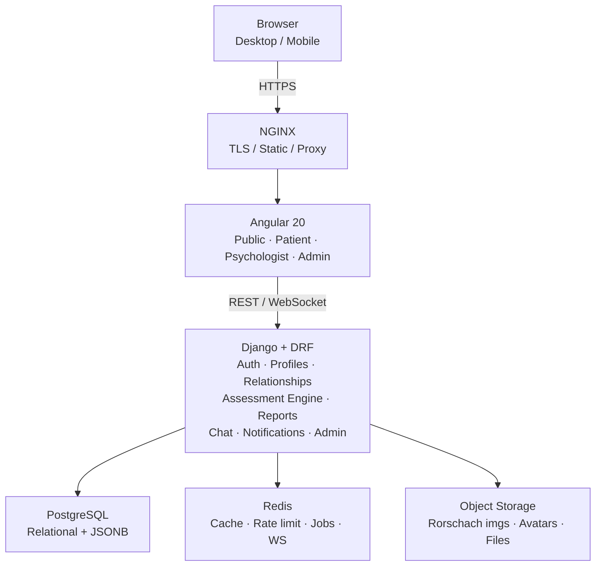
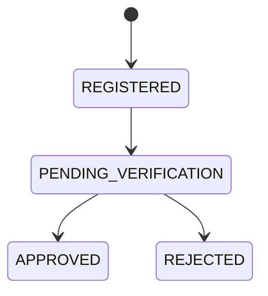
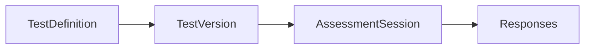
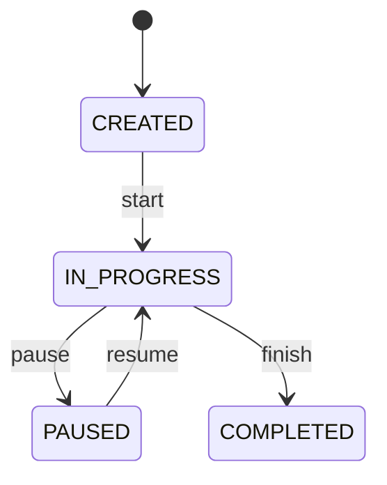
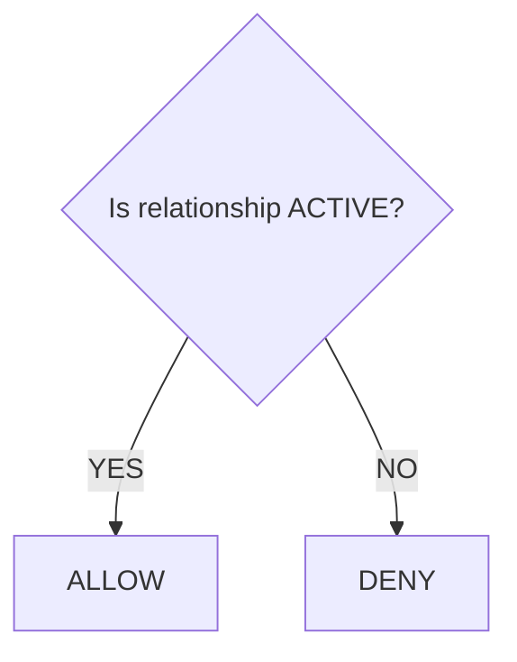

# ۰۰ — نمای کلی پروژه

## ۱. معرفی

پلتفرم وب اجرای آزمون روان‌شناختی **رورشاخ** با سه نقش بیمار، روان‌شناس و ادمین. بیمار آزمون را آنلاین اجرا می‌کند، داده‌های خام و اندازه‌گیری‌ها ذخیره می‌شوند و نتیجه در اختیار روان‌شناس مرتبط قرار می‌گیرد.

**مهم‌ترین تصمیم معماری:** Assessment Engine از بقیه‌ی اپلیکیشن جدا و versionable طراحی می‌شود، نه چند صفحه‌ی Angular با چند API ساده. اگر بعدها منابع آزمون، پارامترها، مراحل، scoring یا methodology تغییر کند، هسته‌ی سیستم نباید بازنویسی شود.

## ۲. معماری در یک نگاه

سبک معماری: **Modular Monolith** — یک Django application با domainهای کاملاً جدا (accounts، relationships، assessments، messaging، notifications، admin). Microservice در این مرحله فقط networking و consistency را سخت‌تر می‌کند؛ اگر بعداً Chat یا Assessment scale متفاوتی پیدا کرد، همان domain جدا می‌شود.

## ۳. Bounded Contextها

| Context | مسئولیت‌ها |
|---|---|
| Identity & Access | User، Authentication، Authorization، Role |
| Patient / Psychologist | Profiles، Achievements |
| Relationship | ارتباط Patient ↔ Psychologist، Access control |
| Assessment | Test Definition، Versioning، Session، Phase، Card، Response، Measurements، Scoring |
| Communication | Conversation، Message |
| Notification | Site notices، User notifications |
| Administration | تأیید روان‌شناس، پیکربندی آزمون، مدیریت کاربران، اطلاعیه‌ها، Audit logs |

## ۴. نقش‌ها

در مستندات اولیه دو role وجود داشت (PATIENT، PSYCHOLOGIST)، اما معماری role سوم را هم لازم دارد: **ADMIN** — که کاربر عادی سایت نیست.

تأیید روان‌شناس mandatory است؛ هر کسی نمی‌تواند خودش را روان‌شناس معرفی کند:

## ۵. هسته‌ی Assessment

هر TestVersion شامل Phase و Card است، و هر Assessment نسخه‌ای که با آن اجرا شده را **immutable** نگه می‌دارد (v1.0 / v1.1 / v2.0).

آزمون stateful است:

وضعیت‌ها: `CREATED`، `IN_PROGRESS`، `PAUSED`، `COMPLETED`، `ABANDONED`، `CANCELLED`. **Backend مرجع تعیین current state است**؛ Frontend نمی‌تواند به‌تنهایی بگوید «برو Card 7».

داده‌ی خام از تحلیل جدا نگه داشته می‌شود: `Raw Data → Measurements → Scoring → Interpretation`. سه دسته داده وجود دارد — user-generated (`response_text`)، system-measured (duration، timing، interaction count) و domain-specific coded (location، determinants، content). پاسخ پس از submit **overwrite نمی‌شود**.

## ۶. Relationship و Authorization

Authorization بر اساس رابطه‌ی Patient ↔ Psychologist انجام می‌شود (`PENDING` / `ACTIVE` / `REJECTED` / `REVOKED`):

مهم‌ترین Security Rule: ‏`GET /assessments/{id}` هرگز نباید صرفاً `Assessment.objects.get(id=id)` باشد؛ باید بررسی شود کاربر مالک assessment است، روان‌شناس مرتبط است، یا ادمین.

session تاریخی provenance خود را حفظ می‌کند: حتی اگر relationship بعداً revoked شود، assessment قدیمی orphan نمی‌شود. پیش‌فرض معماری `ACTIVE relationship → current access` است و سیاست دسترسی تاریخی یک تصمیم business است، نه چیزی که backend حدس بزند.

## ۷. جریان‌های اصلی

**ثبت‌نام:** `Landing → Register → (Patient | Psychologist) → Verification`

**بیمار:** `Login → Dashboard → Start Assessment → Select Psychologist → Relationship → Intro → Phase 1 → Phase 2 → Complete`

**روان‌شناس:** داشبورد با Profile، Achievements، Patients، Assessments، History، Messages؛ و `Patient → Assessment List → Assessment Detail` شامل Raw Responses، Measurements، Calculated Parameters، Report.

**ادمین:** Users، Psychologists، Patients، Relationships، Assessments، Test Definitions/Versions، Announcements، Media، Audit Logs.

> raw/coded assessment data فقط برای psychologist نمایش داده می‌شود؛ بیمار پس از completion صرفاً «Assessment completed successfully» را می‌بیند.

جزئیات در [[01-requirements]] و [[05-sequence-diagrams]].

## ۸. تصمیمات معماری قطعی‌شده

| بخش | انتخاب |
|---|---|
| Frontend / UI | Angular 20 · Tailwind CSS |
| Backend / API | Django · Django REST Framework |
| Architecture | Modular Monolith |
| Primary DB / Flexible data | PostgreSQL · JSONB |
| Cache / Jobs / Realtime | Redis · Celery · WebSocket (Django Channels) |
| File Storage / Proxy | S3-compatible Object Storage · NGINX |
| Auth / Roles | Access + Refresh Token · Patient / Psychologist / Admin |
| Assessment | Versioned State Machine |
| Audit / Deployment / Versioning | Dedicated Audit Log · Docker · `/api/v1/` |

قاعده‌ی انتخاب مدل داده: `Stable business entity → Relational table` و `Dynamic / versioned / variable data → JSONB`. MongoDB برای ساختار `Phase → Card → Responses` طبیعی است، اما در کنار Users، Relationships، Permissions، Chat، Notifications و Audit، یک PostgreSQL واحد با JSONB انتخاب متعادل‌تری است.

## ۹. فازبندی

| Sprint | تمرکز |
|---|---|
| 1 | Foundation — Repository، Docker، Django، Angular، PostgreSQL، Redis، NGINX، CI |
| 2 | Identity — User، Register، Login، Role، Profile، Verification |
| 3 | Relationships — Search، Request، Approve، Revoke، Permissions |
| 4 | Test Engine — TestDefinition/Version، Phase، Card، Session، State Machine |
| 5 | Rorschach Flow — Card rendering، Response boxes، Timing، Autosave، Resume، Completion |
| 6 | Psychologist — Patients، History، Assessment detail، Analysis، Report |
| 7 | Communication — Conversation، Message، WebSocket، Notification |
| 8 | Admin — User/Test management، تأیید روان‌شناس، Announcements، Audit |
| 9 | Hardening — Security، Performance، Testing، Monitoring، Backup، Deployment |

ترتیب مستندسازی پیش از نوشتن اولین model: [[01-requirements]] → [[02-architecture]] → [[03-data-model-er]].

## ۱۰. مورد باز

schema دقیق پارامترهای رورشاخ (Location، Determinant، Form Quality، Content، Popularity، Special Scores) نهایی نشده است. اینکه هرکدام column، JSONB یا جدول جداگانه باشند، پس از مشخص شدن منابع علمی تصمیم‌گیری می‌شود. مرز میان **Software Architecture** و **Psychological Methodology** عمداً حفظ شده است.
