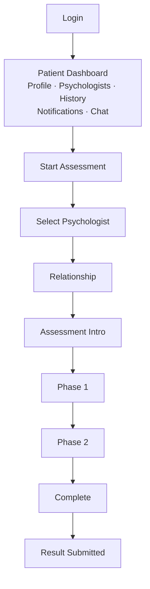
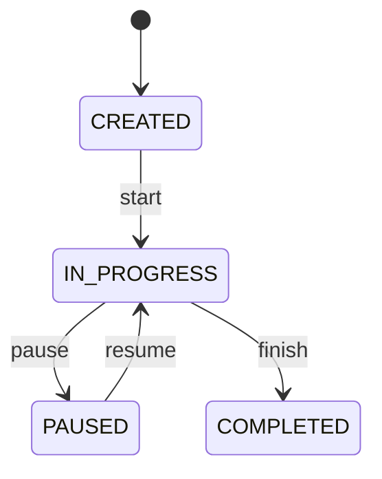

# ۰۱ — نیازمندی‌ها

> فاز ۱ پروژه: پیش از نوشتن اولین model باید نهایی شود. ساختار سند همان ده بخش تعیین‌شده در معماری است.

## ۱. Actors

| Actor | شرح |
|---|---|
| PATIENT | آزمون را اجرا می‌کند |
| PSYCHOLOGIST | پس از تأیید ادمین، بیماران مرتبط و نتایج آزمون آن‌ها را می‌بیند |
| ADMIN | تأیید روان‌شناس، پیکربندی آزمون، مدیریت کاربران، اطلاعیه‌ها، Audit — کاربر عادی سایت نیست |

هویت (`User`) کوچک نگه داشته می‌شود و اطلاعات هر نقش در profile جداگانه است تا authentication با domain profile قاطی نشود.

## ۲. Use Cases

| گروه | موارد |
|---|---|
| Identity | ثبت‌نام بیمار / روان‌شناس، ورود و خروج، تمدید نشست با refresh token، مدیریت پروفایل |
| Relationship | جست‌وجوی روان‌شناس، ارسال درخواست، تأیید/رد، لغو (revoke)، مشاهده فهرست بیماران |
| Assessment (بیمار) | ایجاد session، start، ثبت پاسخ، next، pause، resume، complete |
| Assessment (روان‌شناس) | مشاهده فهرست و جزئیات assessment شامل Raw Responses، Measurements، Calculated Parameters، Report |
| Communication | مشاهده گفت‌وگوها و پیام‌ها، ارسال پیام، رویدادهای بلادرنگ، اعلان شخصی، اطلاعیه‌ی سایت |
| Administration | بررسی مدارک و Approve/Reject/Suspend روان‌شناس، مدیریت کاربران و روابط، مدیریت Test Definition/Version، انتشار اطلاعیه، مشاهده Media و Audit Logs |

## ۳. Business Rules

| کد | قاعده |
|---|---|
| BR-01 | تأیید روان‌شناس **mandatory** است و توسط ادمین انجام می‌شود؛ کسی خودش را روان‌شناس معرفی نمی‌کند. |
| BR-02 | Authorization بر پایه‌ی رابطه‌ی Patient ↔ Psychologist است؛ دسترسی فقط در حالت `ACTIVE`. |
| BR-03 | `users.email` و ترکیب `(patient_id, psychologist_id)` باید در سطح DB یکتا باشند، نه فقط در Python. |
| BR-04 | هر session علاوه بر `test_definition_id` حتماً `test_version_id` دارد؛ نسخه‌ی اجراشده immutable است. |
| BR-05 | Backend مرجع تعیین current state آزمون است. |
| BR-06 | پاسخ پس از submit **overwrite نمی‌شود**؛ داده‌ی اولیه حفظ می‌شود. |
| BR-07 | ثبت پاسخ **idempotent** است (`client_response_id` + constraint دیتابیس). |
| BR-08 | `COMPLETED` یک state **terminal** است؛ تکرار `/complete/` دو report یا دو notification نمی‌سازد. |
| BR-09 | Completion **atomic** است: update session + analysis event + notification event در یک transaction، وگرنه ROLLBACK. |
| BR-10 | Assessment و Chat/Notification در یک transaction قرار نمی‌گیرند. |
| BR-11 | سرور مرجع نهایی timestamp است؛ client timing فقط measurement کمکی. |
| BR-12 | session تاریخی provenance خود را حفظ می‌کند؛ با revoke شدن رابطه، assessment قدیمی orphan نمی‌شود. |
| BR-13 | پیش‌فرض: `ACTIVE relationship → current access`؛ سیاست دسترسی تاریخی یک تصمیم business است. |
| BR-14 | raw/coded assessment data فقط برای psychologist نمایش داده می‌شود. |
| BR-15 | تصاویر رورشاخ در DB ذخیره نمی‌شوند؛ فقط metadata در DB و فایل در Object Storage. |
| BR-16 | پیام‌ها به‌صورت array داخل Conversation ذخیره نمی‌شوند. |
| BR-17 | پارامترهای واقعی Rorschach تا دریافت منابع علمی hard-code نمی‌شوند. |
| BR-18 | سیستم ادعای تشخیص روان‌شناختی ندارد. |

## ۴. User Flows

**ثبت‌نام:** `Landing → Register → (Patient | Psychologist) → Verification`

**بیمار:**



**روان‌شناس:** داشبورد (Profile، Achievements، Patients، Assessments، History، Messages) و مسیر `Patient → Assessment List → Assessment Detail` شامل Raw Responses، Measurements، Calculated Parameters، Report.

**ادمین:** Users، Psychologists، Patients، Relationships، Assessments، Test Definitions، Test Versions، Site Announcements، Media، Audit Logs.

## ۵. Assessment Flow

ساختار منطقی: `TestDefinition → TestVersion → Phase → Card`.

جریان اجرا: ایجاد session → `start` → برای هر Card ثبت پاسخ (با `client_response_id`) و `next` → `complete`. سناریوهای کامل در [[05-sequence-diagrams]].

نکات:

- **Autosave** — draft نگه داشته می‌شود اما هر چند صد میلی‌ثانیه request فرستاده نمی‌شود؛ debounced یا transition-based (`response entered → save draft → submit`).
- **Timing** — `server_started_at`، `client_started_at`، `server_submitted_at`، `client_submitted_at`، `duration_ms`.
- **Refresh / crash** — کاربر روی Card 4، مرورگر بسته می‌شود؛ پس از login گزینه‌ی «Continue Assessment» و بازگشت backend به `Phase 1 / Card 4 / Step 2`.
- **پس از completion** — رویدادهای notification و report پس از commit و به‌صورت async.

## ۶. Permissions

Authentication فقط identity را تعیین می‌کند؛ permission جداگانه و پیش از اجرای منطق view، access را مشخص می‌کند و object-level access همیشه بررسی می‌شود.

قاعده‌ی اصلی — به‌جای `Assessment.objects.get(id=id)` باید بررسی شود:

```
Does this user own this assessment?
OR Is this user the linked psychologist?
OR Is this admin?
```

نه صرفاً `is_authenticated == True`.

| منبع | PATIENT | PSYCHOLOGIST | ADMIN |
|---|---|---|---|
| پروفایل خود | خواندن / نوشتن | خواندن / نوشتن | خواندن / نوشتن |
| رابطه | ایجاد، لغو | تأیید، رد، لغو | مدیریت کامل |
| AssessmentSession | اجرای session خود | خواندن sessionهای بیماران مرتبط | خواندن |
| Raw / coded data و Report | ندارد | خواندن | خواندن |
| Test Definition / Version | ندارد | ندارد | مدیریت کامل |
| Audit Log | ندارد | ندارد | خواندن |

## ۷. States

| موضوع | وضعیت‌ها |
|---|---|
| تأیید روان‌شناس | `REGISTERED → PENDING_VERIFICATION → APPROVED / REJECTED` (+ Suspend توسط ادمین) |
| رابطه | `PENDING` · `ACTIVE` · `REJECTED` · `REVOKED` |
| AssessmentSession | `CREATED` · `IN_PROGRESS` · `PAUSED` · `COMPLETED` · `ABANDONED` · `CANCELLED` |



وضعیت جاری با `current_phase`، `current_card` و `current_step` تکمیل می‌شود.

## ۸. Error Cases

این موارد هم نیازمندی‌اند و هم test caseهای بحرانی:

| مورد | رفتار مورد انتظار |
|---|---|
| Resume / Refresh browser | بازگشت به همان phase / card / step |
| Duplicate submission | بی‌اثر با `client_response_id` |
| Submit empty response | اعتبارسنجی و خطای مشخص |
| Submit multiple responses | پشتیبانی طبق `configuration` کارت |
| Skip card | کنترل طبق قواعد آزمون |
| Unauthorized / Wrong psychologist access | DENY با object-level permission |
| Expired session | مدیریت انقضا |
| Network failure | حفظ draft و ارسال مجدد امن |
| Complete session twice | بی‌اثر؛ `COMPLETED` ترمینال است |

## ۹. Functional Requirements

| کد | نیازمندی |
|---|---|
| FR-01 | ثبت‌نام و ورود با سه نقش؛ هویت در `User` و اطلاعات نقش در profile |
| FR-02 | فرآیند verification روان‌شناس با مدارک و تصمیم ادمین |
| FR-03 | جست‌وجو، درخواست، تأیید، رد و لغو رابطه |
| FR-04 | تعریف آزمون به‌صورت TestDefinition → TestVersion → Phase → Card با `configuration` (JSONB) |
| FR-05 | اجرای stateful آزمون با state machine و تعیین وضعیت از سمت backend |
| FR-06 | ثبت پاسخ با `sequence`، `response_text`، زمان‌ها، `client_metadata` و `measurement_data` |
| FR-07 | ثبت idempotent پاسخ‌ها و autosave داده‌های میانی |
| FR-08 | ادامه‌ی آزمون پس از refresh / crash |
| FR-09 | تکمیل atomic آزمون و صدور رویدادهای پس از commit |
| FR-10 | تفکیک Raw Data، Measurements، Scoring و Interpretation |
| FR-11 | تولید `AssessmentAnalysis` با `algorithm_version` و `AssessmentReport` نسخه‌دار |
| FR-12 | نمایش Raw Responses، Measurements، Calculated Parameters و Report به روان‌شناس |
| FR-13 | چت با REST + WebSocket (پیام جدید، typing، read receipt، online status) |
| FR-14 | تفکیک اعلان شخصی از اطلاعیه‌ی عمومی سایت |
| FR-15 | نگهداری فایل‌ها در Object Storage و metadata در `MediaAsset` |
| FR-16 | پنل ادمین برای کاربران، روان‌شناسان، روابط، آزمون‌ها، اطلاعیه‌ها، رسانه و Audit |
| FR-17 | ثبت رویدادهای حساس در Audit Log |
| FR-18 | نسخه‌بندی API زیر `/api/v1/` |

## ۱۰. Non-functional Requirements

| دسته | نیازمندی |
|---|---|
| Security | HTTPS، Authentication، Authorization، object-level permissions، Rate limiting، CSRF، CORS، Input validation، Audit logging |
| Authentication | access token کوتاه‌عمر + refresh امن؛ بدون قرار دادن بی‌دلیل در localStorage؛ کوکی `Secure` / `HttpOnly` / `SameSite` |
| Data integrity | `UniqueConstraint` و `CheckConstraint` در سطح DB |
| Performance | index روی فیلدهای پرکاربرد؛ index روی JSONB فقط پس از مشخص شدن query pattern |
| Reliability | atomic بودن completion، idempotency، مقاومت در برابر قطعی شبکه |
| Observability | تفکیک Application Logs، Audit Logs و Security Logs |
| Scalability | Modular Monolith با امکان جداسازی domain؛ Load Balancer و چند instance در production |
| Portability | Docker و تفکیک محیط‌های development / staging / production؛ secrets خارج از repository |
| Maintainability | `View → Serializer → Service → Model` و selector برای queryهای پیچیده |
| Testability | unit، service، API، permission، state machine و end-to-end برای critical path |
| UX | Assessment در focus mode؛ داشبورد با layout معمولی و bottom navigation در موبایل |

## ۱۱. موارد باز

- سیاست دسترسی روان‌شناس به داده‌های تاریخی پس از `REVOKED` شدن رابطه (BR-13)
- schema دقیق پارامترهای رورشاخ: Location، Determinant، Form Quality، Content، Popularity، Special Scores
- نمایش یا عدم نمایش interpretation به بیمار — پیش‌فرض: نمایش داده نمی‌شود (BR-14)
