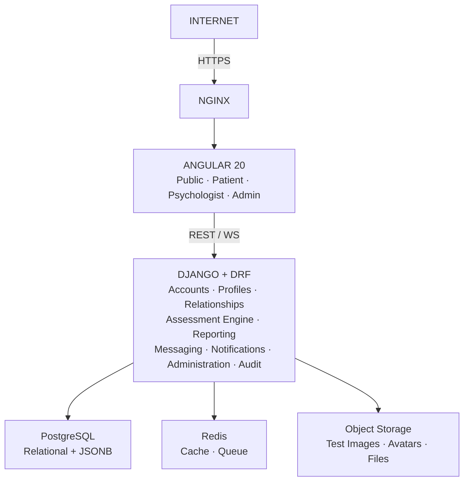
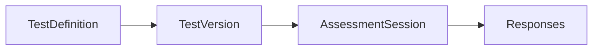
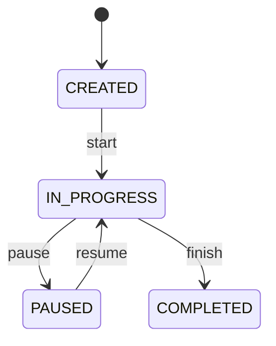
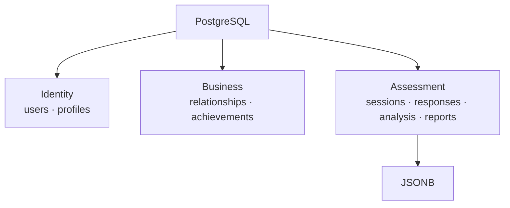
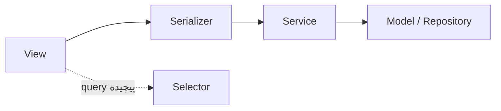
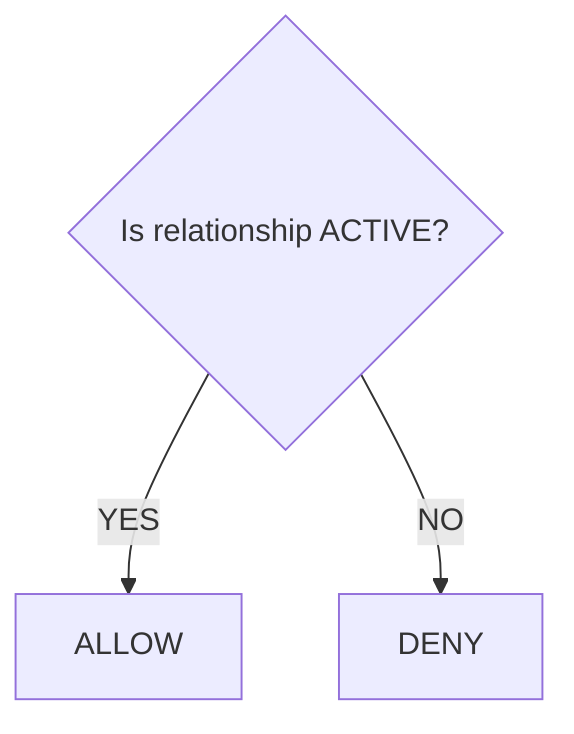

# ۰۲ — معماری سیستم

> جزئیات ERD در [[03-data-model-er]]، قرارداد endpointها در [[04-api-design]]، ساختار کد در [[06-development-guide]] و استقرار در [[07-deployment-operations]].

## ۱. System Architecture



سبک معماری: **Modular Monolith** — یک Django application با domainهای کاملاً جدا. Microservice در این مرحله فقط networking و consistency را سخت‌تر می‌کند؛ اگر بعداً Chat یا Assessment scale متفاوتی پیدا کرد، همان domain جدا می‌شود.

**مهم‌ترین تصمیم معماری:** Assessment Engine جدا و versionable طراحی می‌شود، نه چند صفحه‌ی Angular با چند API ساده. اگر منابع آزمون، پارامترها، مراحل، scoring یا methodology تغییر کند، هسته‌ی سیستم نباید بازنویسی شود.

## ۲. Domain Model

| Bounded Context | محتوا |
|---|---|
| Identity & Access | User، Authentication، Authorization، Role |
| Patient / Psychologist | Profiles، Achievements |
| Relationship | Patient ↔ Psychologist، Access control |
| Assessment | Test Definition، Versioning، Session، Phase، Card، Response، Measurements، Scoring |
| Communication | Conversation، Message |
| Notification | Site notices، User notifications |
| Administration | تأیید روان‌شناس، پیکربندی آزمون، مدیریت کاربران، اطلاعیه‌ها، Audit logs |

`User` کوچک نگه داشته می‌شود و اطلاعات نقش در `PatientProfile` / `PsychologistProfile` قرار می‌گیرد تا authentication با domain profile قاطی نشود.

## ۳. Assessment Architecture



- **TestDefinition** — تعریف منطقی آزمون (مثلاً `RORSCHACH`) به‌همراه metadata روش‌شناسی.
- **TestVersion** — session هرگز فقط نمی‌گوید «test = Rorschach»؛ همیشه `test_definition_id` + `test_version_id`، و نسخه‌ی اجراشده immutable است.
- **Phase / Card** — هر Card یک `configuration` (JSONB) دارد، به‌جای ساختن ده‌ها ستون nullable برای پارامترهایی که فقط بعضی کارت‌ها دارند.
- **AssessmentSession** — مهم‌ترین entity runtime؛ نگهدارنده‌ی `status`، `current_phase`، `current_card`، `current_step`.

### State Machine



وضعیت‌ها: `CREATED`، `IN_PROGRESS`، `PAUSED`، `COMPLETED`، `ABANDONED`، `CANCELLED`. **Backend مرجع تعیین current state است**؛ Frontend نمی‌تواند به‌تنهایی بگوید «برو Card 7».

### تفکیک داده

`Raw Data → Measurements → Scoring → Interpretation` عمداً از هم جدا می‌شوند. سه دسته داده: user-generated (`response_text`)، system-measured (duration، interaction count، timing) و domain-specific coded (location، determinants، content). پاسخ پس از submit overwrite نمی‌شود. تحلیل با `algorithm_version` نسخه‌دار می‌شود و گزارش در نسخه‌ی اول می‌تواند صرفاً «Raw Parameters + Calculated Metrics» را به روان‌شناس نشان دهد.

### Transaction و Idempotency

```
BEGIN
  update session → COMPLETED
  create analysis job/event
  create notification event
COMMIT      (در صورت خطا: ROLLBACK)
```

Assessment و Chat/Notification در یک transaction قرار نمی‌گیرند؛ notification، report generation و websocket update پس از commit و به‌صورت async انجام می‌شوند. `COMPLETED` ترمینال است تا تکرار `/complete/` دو report یا دو notification نسازد. ثبت پاسخ نیز با `client_response_id` و constraint دیتابیس idempotent می‌شود.

## ۴. Data Architecture



قاعده: `Stable business entity → Relational table` و `Dynamic / versioned / highly variable data → JSONB`. مثلاً `assessment_sessions` رابطه‌ای است اما `assessment_responses.measurement_data` از نوع JSONB.

MongoDB برای ساختار `Phase → Card → Responses → Metadata` طبیعی است، اما در کنار Users، Relationships، Permissions، Chat، Notifications، Profiles، Achievements و Audit، یک PostgreSQL واحد با JSONB انتخاب متعادل‌تری است. Redis دیتابیس اصلی نیست و برای Cache، Rate Limiting، Temporary state، Background jobs و پشتیبانی WebSocket به کار می‌رود؛ فایل‌ها در Object Storage و فقط metadata در DB نگه داشته می‌شوند.

قواعد integrity در سطح DB اعمال می‌شوند (`UniqueConstraint`، `CheckConstraint`) و index روی JSONB فقط پس از مشخص شدن query pattern زده می‌شود.

## ۵. Backend Architecture

```
backend/
├── config/{settings/{base,development,production}.py, urls.py, asgi.py, wsgi.py}
├── apps/{accounts, profiles, relationships, assessments, tests,
│         messaging, notifications, media, audit, administration}
├── common/{permissions, exceptions, pagination, utils}
└── requirements/
```

هر app: `models.py`، `serializers.py`، `views.py`، `permissions.py`، `urls.py`، `services.py`، `selectors.py`، `tasks.py`، `tests/`، `migrations/`.

business logic داخل view ریخته نمی‌شود:



برای CRUDهای معمول ViewSet استفاده می‌شود، اما Assessment execution الزاماً `ModelViewSet` نیست؛ `AssessmentSessionViewSet` با actionهای مشخص: `start`، `pause`، `resume`، `submit_response`، `next_step`، `complete`.

Background jobs با Celery: send notification، generate report، process media، maintenance jobs — در MVP می‌تواند minimal بماند.

## ۶. Frontend Architecture

Angular 20 با **Standalone Components** و ساختار `core/` (auth، guards، interceptors، api، services)، `shared/` و `features/` (landing، auth، patient، psychologist، assessment، chat، notifications، admin). هر feature شامل `pages/`، `components/`، `services/`، `models/` و فایل routes خودش است.

State آزمون در سمت کلاینت شامل `sessionId`، `status`، `currentPhase`، `currentCard`، `currentStep`، `responses`، `startedAt` است، اما باید با backend سینک شود: `Frontend State ↕ Backend State` — نه اینکه frontend حقیقت نهایی باشد. autosave به‌صورت debounced یا transition-based انجام می‌شود، نه هر چند صد میلی‌ثانیه.

**UI:** داشبورد یک UX معمولی دارد (Header + Sidebar + Main Content؛ در موبایل Bottom Navigation)، اما Assessment باید **focus mode** باشد: بدون sidebar مزاحم، بدون اعلان غیرضروری و بدون ناوبری نامرتبط. جزئیات ساختار و routes در [[06-development-guide]].

## ۷. API Architecture

نسخه‌بندی زیر `/api/v1/` با گروه‌های auth، users، patients، psychologists، relationships، tests، assessments، conversations، messages، notifications، admin.

**Authentication:** Access Token + Refresh Token؛ access token کوتاه‌عمر با refresh mechanism امن، روی HTTPS، با کوکی `Secure` / `HttpOnly` / `SameSite` و استراتژی CSRF مناسب — و بدون قرار دادن بی‌دلیل در localStorage. Authentication فقط identity را تعیین می‌کند؛ **permission جداگانه access را مشخص می‌کند** و پیش از اجرای منطق view اعمال می‌شود.

**Chat transport (MVP):** REST برای conversations / messages و WebSocket برای new message، typing، read receipt و online status — با Django ASGI + Channels.

## ۸. Security Architecture

`Browser → HTTPS → NGINX → Django`، با لایه‌های Authentication، Authorization، Object-level permissions، Rate limiting، CSRF، CORS، Input validation و Audit logging.

**مهم‌ترین قاعده:** ‏`GET /assessments/{id}` هرگز نباید صرفاً `Assessment.objects.get(id=id)` باشد. باید بررسی شود:

```
Does this user own this assessment?
OR Is this user the linked psychologist?
OR Is this admin?
```

نه صرفاً `is_authenticated == True`.



**Historical consistency:** هنگام ساخت session، سه‌گانه‌ی patient / psychologist / relationship ثبت می‌شود؛ اگر رابطه بعداً revoked شود، assessment قدیمی orphan نمی‌شود. پیش‌فرض `ACTIVE relationship → current access` است و سیاست دسترسی تاریخی باید به‌عنوان تصمیم business ثبت شود.

**Audit و Logging:** رویدادهای حساس در `AuditLog` ثبت می‌شوند و سه لایه‌ی Application Logs، Audit Logs و Security Logs با هم یکی نمی‌شوند. جزئیات در [[07-deployment-operations]].

## ۹. Deployment (خلاصه)

`Internet → NGINX → {Angular static, Django API} → {PostgreSQL, Redis, Object Storage}`؛ در production امکان افزودن Load Balancer و چند instance از Django وجود دارد و کل پروژه با Docker containerize می‌شود. جزئیات در [[07-deployment-operations]].

## ۱۰. تصمیمات قطعی‌شده

| بخش | انتخاب |
|---|---|
| Frontend / UI | Angular 20 · Tailwind CSS |
| Backend / API | Django · Django REST Framework |
| Architecture | Modular Monolith |
| Primary DB / Flexible data | PostgreSQL · JSONB |
| Cache / Jobs / Realtime | Redis · Celery · WebSocket (Django Channels) |
| File Storage / Proxy | S3-compatible Object Storage · NGINX |
| Auth / Roles | Access + Refresh Token · Patient / Psychologist / Admin |
| Assessment | Versioned State Machine |
| Audit / Deployment / Versioning | Dedicated Audit Log · Docker · `/api/v1/` |

## ۱۱. مرز عمداً باز

`TestDefinition` می‌تواند metadata روش‌شناسی داشته باشد (`methodology_reference`، `version`، `source_document`)، اما پارامترهای واقعی رورشاخ — Location، Determinant، Form Quality، Content، Popularity، Special Scores — تا دریافت منابع hard-code نمی‌شوند. اینکه هرکدام column، JSONB یا جدول جداگانه باشند پس از مشخص شدن methodology تصمیم‌گیری می‌شود؛ این مرز میان **Software Architecture** و **Psychological Methodology** است.
