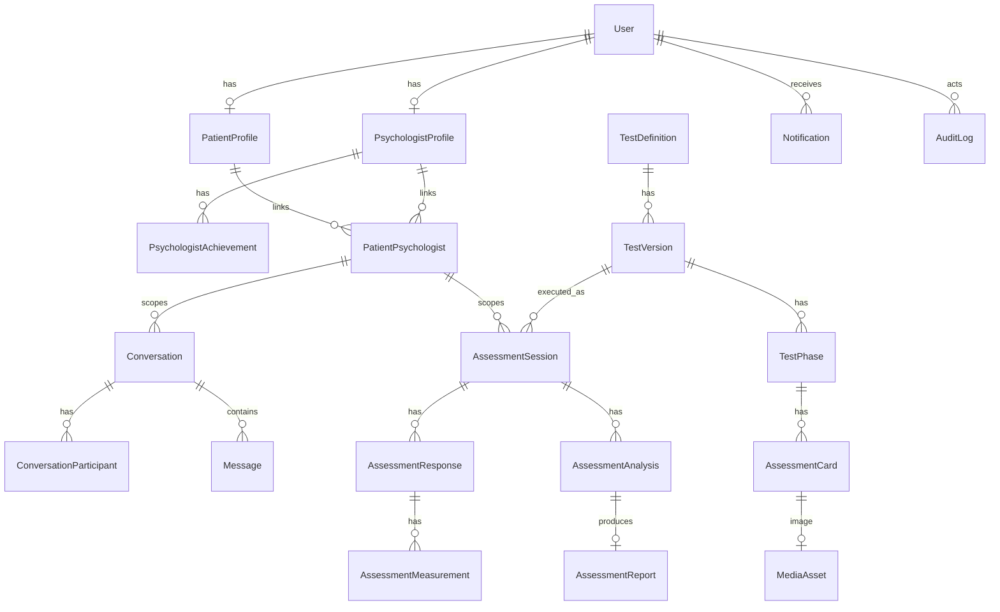
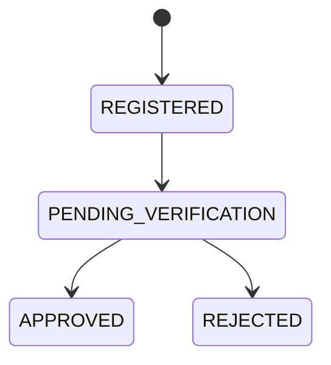
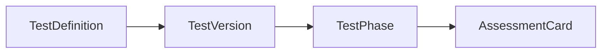
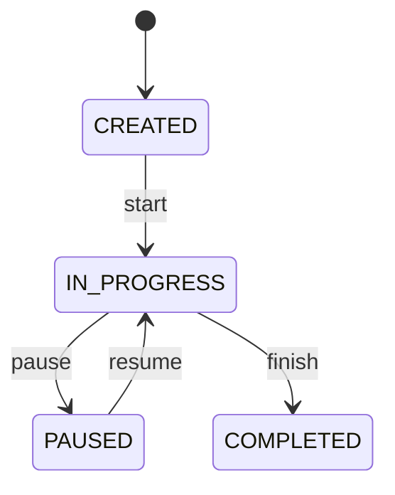
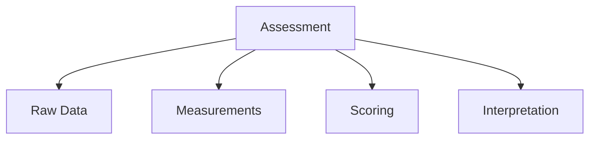

# ۰۳ — مدل داده و ERD

## ۱. ERD



## ۲. فهرست جداول (logical schema)

```
users · user_sessions
patient_profiles · psychologist_profiles · psychologist_achievements
patient_psychologist_relationships
test_definitions · test_versions · test_phases · test_cards
assessment_sessions · assessment_responses · assessment_measurements
assessment_analyses · assessment_reports
conversations · conversation_participants · messages
notifications · site_announcements
audit_logs · media_assets
```

## ۳. Identity

**User** (کوچک نگه داشته می‌شود تا authentication با domain profile قاطی نشود)

`id`، `email`، `password_hash`، `phone`، `role`، `is_active`، `is_verified`، `created_at`، `updated_at`، `last_login_at`

**PatientProfile** — `user_id`، `first_name`، `last_name`، `birth_date`، `gender`، `avatar`، `bio`، ...

**PsychologistProfile** — `user_id`، `first_name`، `last_name`، `avatar`، `bio`، `specialty`، `professional_code`، `verification_status`، ...

وضعیت verification:



## ۴. Relationship

**PatientPsychologist** — `id`، `patient_id`، `psychologist_id`، `status`، `requested_at`، `approved_at`، `revoked_at`، `created_at`، `updated_at`

`status`: `PENDING` | `ACTIVE` | `REJECTED` | `REVOKED`

این entity مبنای authorization است؛ دسترسی روان‌شناس به داده‌ی بیمار از روی `ACTIVE` بودن رابطه تعیین می‌شود.

## ۵. Test Definition



| Entity | ستون‌ها |
|---|---|
| TestDefinition | `id`، `code`، `name`، `description`، `status` (مثلاً `RORSCHACH` / Rorschach Psychological Test)؛ به‌علاوه metadata روش‌شناسی: `methodology_reference`، `version`، `source_document` |
| TestVersion | نسخه‌بندی ساختار آزمون (v1.0، v1.1، v2.0) — نسخه‌ی اجراشده immutable است |
| TestPhase | مراحل آزمون زیر هر نسخه |
| AssessmentCard | `id`، `test_version_id`، `card_number`، `title`، `image_asset`، `display_order`، `configuration` (JSONB) |

`configuration` به‌جای ساختن ده‌ها ستون nullable (`parameter_a`، `parameter_b`، ...) استفاده می‌شود، چون ممکن است Card 1 پارامترهایی داشته باشد که Card 7 ندارد:

```json
{
  "required": true,
  "allowed_responses": [],
  "metadata": {}
}
```

## ۶. Assessment Runtime

**AssessmentSession** (مهم‌ترین entity runtime) — `id`، `patient_id`، `psychologist_id`، `test_definition_id`، `test_version_id`، `status`، `current_phase`، `current_card`، `current_step`، `started_at`، `paused_at`، `completed_at`، `created_at`، `updated_at`

`status`: `CREATED` | `IN_PROGRESS` | `PAUSED` | `COMPLETED` | `ABANDONED` | `CANCELLED`



هنگام ساخت session، سه‌گانه‌ی patient / psychologist / relationship ثبت می‌شود تا اگر رابطه بعداً `REVOKED` شد، session تاریخی orphan نشود و provenance خود را حفظ کند.

**AssessmentResponse** — `id`، `assessment_id`، `phase_id`، `card_id`، `sequence`، `response_text`، `started_at`، `submitted_at`، `duration_ms`، `client_metadata` (JSONB)، `measurement_data` (JSONB)، `created_at`، `updated_at`

به‌علاوه برای idempotency: `client_response_id` که با constraint دیتابیس از duplicate جلوگیری می‌کند.

زمان‌سنجی: `server_started_at`، `client_started_at`، `server_submitted_at`، `client_submitted_at`، `duration_ms` — سرور مرجع نهایی timestamp است و client timing فقط measurement کمکی.

پاسخ پس از submit **overwrite نمی‌شود**؛ یا رویدادهای `ResponseSubmitted` / `ResponseCorrected` / `ResponseUpdated` نگه داشته می‌شوند یا حداقل `original_response` و `edited_response`.

## ۷. Analysis و Report



**AssessmentAnalysis** — `id`، `assessment_id`، `algorithm_version`، `status`، `raw_analysis_data` (JSONB)، `calculated_data` (JSONB)، `generated_at`، `updated_at`

**AssessmentReport** — `assessment_id`، `summary`، `structured_result` (JSONB)، `generated_at`، `generated_by`، `version`

سیستم ادعای تشخیص روان‌شناختی ندارد؛ نسخه‌ی اول گزارش می‌تواند صرفاً «Raw Parameters + Calculated Metrics» را به روان‌شناس نشان دهد.

## ۸. Communication و Notification

| Entity | ستون‌ها |
|---|---|
| Conversation | `id`، `created_at`، `updated_at` |
| ConversationParticipant | `conversation_id`، `user_id` |
| Message | `id`، `conversation_id`، `sender_id`، `message_type`، `content`، `created_at`، `read_at` |
| SiteAnnouncement | `title`، `body`، `published_at`، `expires_at`، `is_published` |
| Notification | `user_id`، `type`، `title`، `body`، `is_read`، `data` (JSONB)، `created_at` |

پیام‌ها داخل Conversation به‌صورت array ذخیره نمی‌شوند؛ آرایه‌های unbounded حتی در MongoDB هم توصیه نمی‌شوند.

نمونه‌ی `data` در Notification:

```json
{ "type": "ASSESSMENT_COMPLETED", "data": { "assessment_id": "..." } }
```

## ۹. Media و Audit

**MediaAsset** — `id`، `storage_key`، `mime_type`، `size`، `checksum`، `created_at`

فایل‌ها در Object Storage نگه داشته می‌شوند (`tests/rorschach/v1/card-01.webp`، `avatars/`، `attachments/`) و دیتابیس فقط metadata دارد.

**AuditLog** — `id`، `actor_id`، `action`، `target_type`، `target_id`، `ip_address`، `user_agent`، `metadata` (JSONB)، `created_at`

نمونه actionها: `PATIENT_STARTED_ASSESSMENT`، `PATIENT_COMPLETED_ASSESSMENT`، `PSYCHOLOGIST_VIEWED_ASSESSMENT`، `RELATIONSHIP_CREATED`، `RELATIONSHIP_APPROVED`، `PSYCHOLOGIST_PROFILE_APPROVED`

## ۱۰. قاعده‌ی Relational در برابر JSONB

```
Stable business entity                → Relational table
Dynamic / versioned / variable data   → JSONB
```

نه همه چیز relational است و نه همه چیز JSONB. مثلاً `assessment_sessions` رابطه‌ای است، اما `assessment_responses.measurement_data` از نوع JSONB. Django از `JSONField` روی PostgreSQL پشتیبانی می‌کند و این داده به‌صورت `jsonb` ذخیره می‌شود که قابلیت indexing هم دارد.

## ۱۱. Constraintها

بعضی قواعد نباید فقط در Python باشند:

| Constraint | توضیح |
|---|---|
| `users.email` UNIQUE | یکتایی ایمیل در سطح DB |
| `patient_psychologist (patient_id, psychologist_id)` UNIQUE | جلوگیری از رابطه‌ی تکراری |
| `assessment_responses (assessment_id, client_response_id)` UNIQUE | idempotency ثبت پاسخ |
| CheckConstraint روی `status` | اعتبارسنجی مقادیر مجاز وضعیت‌ها و داده‌های لازم |

Django از `UniqueConstraint` و `CheckConstraint` برای اعمال این integrity در DB پشتیبانی می‌کند.

## ۱۲. Indexها

حداقل موارد زیر:

```
users.email
patient_psychologist_relationships.patient_id
patient_psychologist_relationships.psychologist_id
assessment_sessions.patient_id
assessment_sessions.psychologist_id
assessment_sessions.status
assessment_sessions.created_at
assessment_responses.assessment_id
assessment_responses.card_id
messages.conversation_id
messages.created_at
notifications.user_id
notifications.is_read
```

برای JSONB فقط پس از مشخص شدن query pattern ایندکس زده می‌شود؛ همه‌ی فیلدهای JSON نباید کورکورانه index شوند.

## ۱۳. خروجی مورد انتظار: database-schema

برای هر جدول باید مشخص شود: `column`، `type`، `nullable`، `default`، `index`، `unique`، `FK`، `purpose`.

