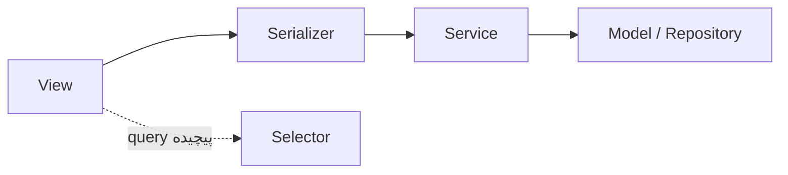
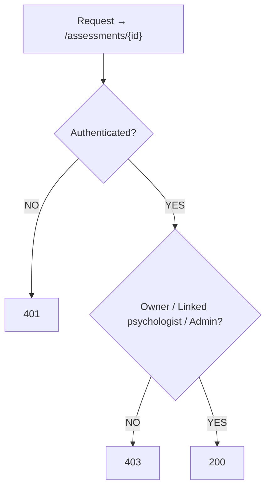
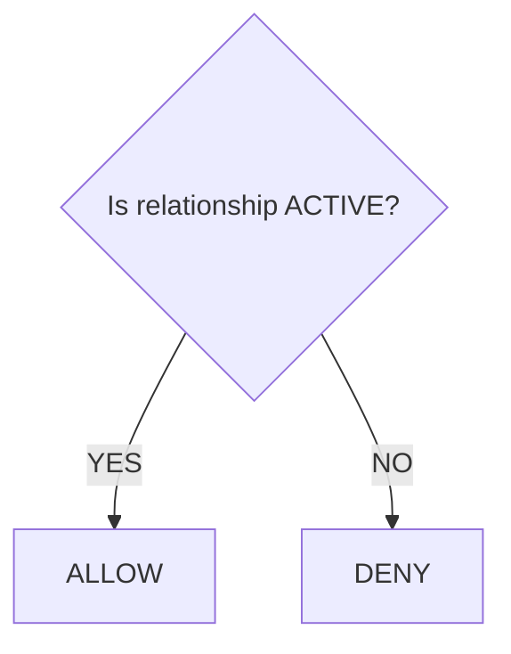

# ۰۴ — طراحی API

## ۱. Versioning و ساختار

همه‌ی endpointها زیر `/api/v1/` قرار می‌گیرند:

```
/api/v1/auth/            /api/v1/tests/
/api/v1/users/           /api/v1/assessments/
/api/v1/patients/        /api/v1/conversations/
/api/v1/psychologists/   /api/v1/messages/
/api/v1/relationships/   /api/v1/notifications/
                         /api/v1/admin/
```

## ۲. Authentication

الگوی پیشنهادی: **Access Token + Refresh Token**.

- access token کوتاه‌عمر + refresh mechanism امن
- access token بی‌دلیل در `localStorage` گذاشته نشود
- انتقال فقط روی HTTPS، با کوکی‌های `Secure` / `HttpOnly` / `SameSite` و استراتژی CSRF مناسب

**Authentication فقط identity را تعیین می‌کند؛ permission باید جداگانه access را مشخص کند.** DRF نیز این تفکیک را صراحتاً دارد و permission پیش از اجرای منطق view اعمال می‌شود.

## ۳. لایه‌بندی پیاده‌سازی



business logic داخل view ریخته نمی‌شود.

## ۴. ViewSetها

برای CRUDهای معمول از ViewSet استفاده می‌شود — ViewSet در DRF برای مجموعه‌ای از related operations طراحی شده و router هم می‌تواند URLها را مدیریت کند:

- `PsychologistViewSet`
- `AchievementViewSet`
- `NotificationViewSet`

اما **Assessment execution الزاماً `ModelViewSet` نیست**؛ `AssessmentSessionViewSet` با actionهای مشخص: `start`، `pause`، `resume`، `submit_response`، `next_step`، `complete`.

## ۵. Assessment API

| Method | Endpoint | شرح |
|---|---|---|
| POST | `/api/v1/assessments/sessions/` | شروع (ایجاد) session |
| GET | `/api/v1/assessments/sessions/{id}/` | دریافت وضعیت session |
| POST | `/api/v1/assessments/sessions/{id}/start/` | انتقال به `IN_PROGRESS` |
| POST | `/api/v1/assessments/sessions/{id}/pause/` | انتقال به `PAUSED` |
| POST | `/api/v1/assessments/sessions/{id}/resume/` | بازگشت به `IN_PROGRESS` |
| POST | `/api/v1/assessments/sessions/{id}/responses/` | ثبت پاسخ |
| POST | `/api/v1/assessments/sessions/{id}/next/` | حرکت به گام بعد |
| POST | `/api/v1/assessments/sessions/{id}/complete/` | تکمیل آزمون |

پاسخ `GET session` باید وضعیت جاری را برگرداند (`status`، `current_phase`، `current_card`، `current_step`)، چون **Backend مرجع تعیین current state است** و Frontend نمی‌تواند به‌تنهایی بگوید «برو Card 7».

### Idempotency در ثبت پاسخ

اگر اینترنت کاربر مشکل بخورد، ممکن است `POST response` دو بار ارسال شود. بنابراین بدنه‌ی درخواست شامل `client_response_id` است و دیتابیس با constraint روی `(assessment_id, client_response_id)` جلوی duplicate را می‌گیرد.

### Timing

فیلدهای ارسالی/ثبت‌شده: `server_started_at`، `client_started_at`، `server_submitted_at`، `client_submitted_at`، `duration_ms`. **سرور مرجع نهایی timestamp است**؛ client timing فقط measurement کمکی است.

### Autosave

برای داده‌های میانی draft نگه داشته می‌شود، اما هر چند صد میلی‌ثانیه request فرستاده نمی‌شود؛ یا debounced autosave یا transition-based save:

```
response entered → save draft → submit
```

### Completion

```
BEGIN
  update session → COMPLETED
  create analysis job/event
  create notification event
COMMIT     (در صورت failure: ROLLBACK)
```

`COMPLETED` یک state **terminal** است: زدن دوباره‌ی `POST /complete/` نباید دو report یا دو notification بسازد. رویدادهای پس از commit (notification، report generation، websocket update) به‌صورت async انجام می‌شوند و آزمون منتظر آن‌ها نمی‌ماند.

## ۶. Chat API

برای MVP ترکیب REST + WebSocket:

| REST | WebSocket |
|---|---|
| `GET conversations` | new message |
| `GET messages` | typing |
| `POST message` | read receipt |
| | online status |

Django ASGI + Channels برای این بخش مناسب است.

## ۷. Authorization در سطح Endpoint

مهم‌ترین Security Rule سیستم — این endpoint:

```
GET /assessments/{id}
```

هرگز نباید بگوید `Assessment.objects.get(id=id)` و تمام. باید بررسی شود:

```
Does this user own this assessment?
OR Is this user the linked psychologist?
OR Is this admin?
```

نه صرفاً `is_authenticated == True`.



بررسی رابطه:



## ۸. سایر ملاحظات

- Rate limiting با Redis
- CORS و CSRF مطابق استراتژی امنیتی
- Input validation در لایه‌ی serializer
- ثبت رویدادهای حساس در Audit Log (مثلاً `PSYCHOLOGIST_VIEWED_ASSESSMENT`)
- pagination و exception handling مشترک در `common/`
