# ۰۵ — دیاگرام‌های رفتاری

## ۱. ثبت‌نام و تأیید روان‌شناس

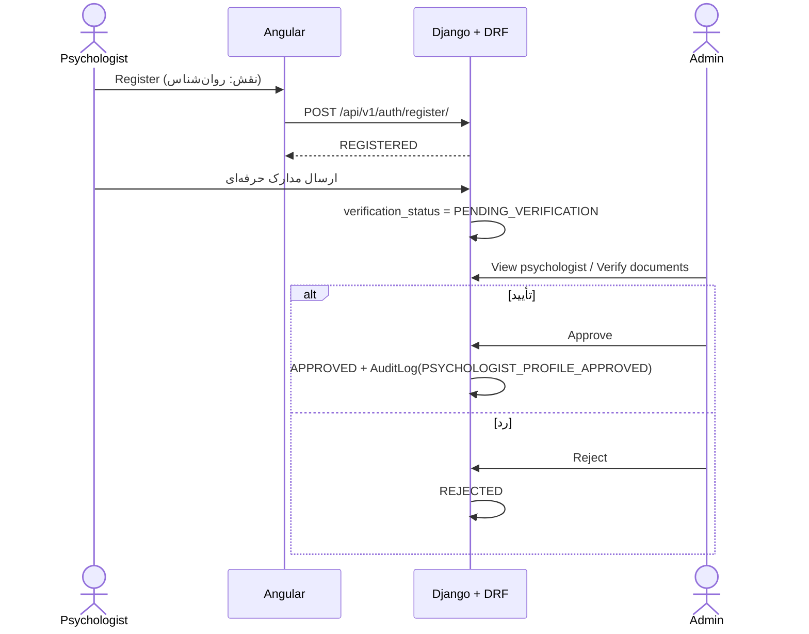

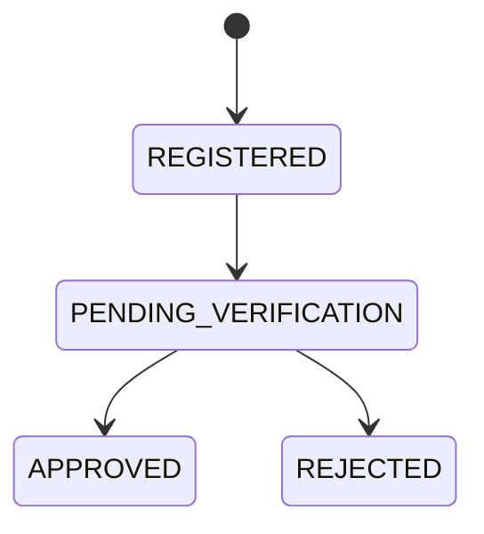

هر کسی نمی‌تواند خودش را روان‌شناس معرفی کند؛ این مرحله mandatory است. عملیات ادمین: View، Verify documents، Approve، Reject، Suspend.

## ۲. برقراری رابطه Patient ↔ Psychologist

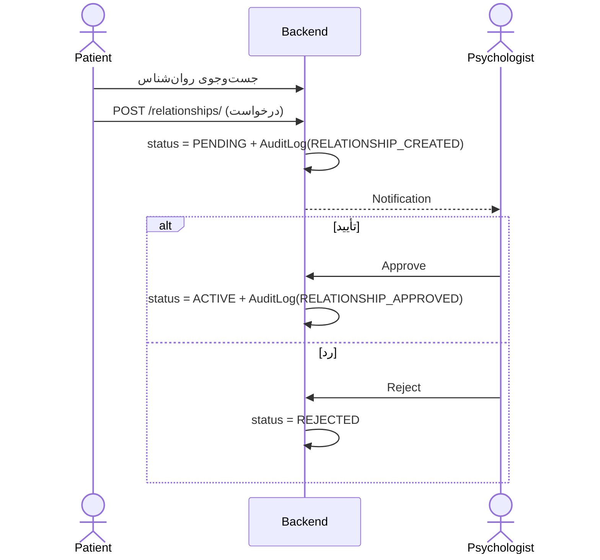

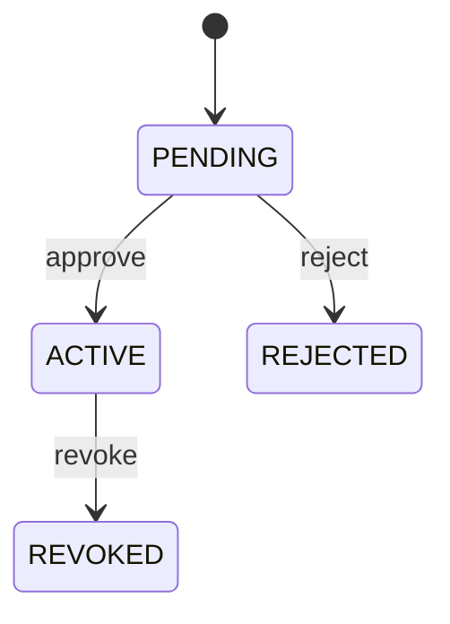

## ۳. اجرای کامل آزمون

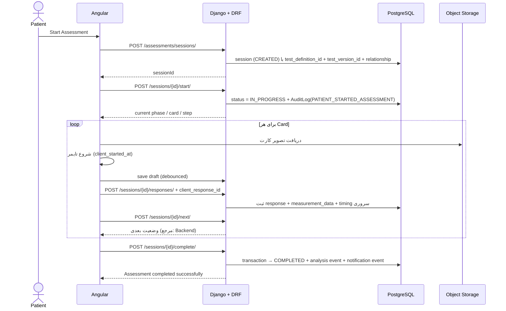

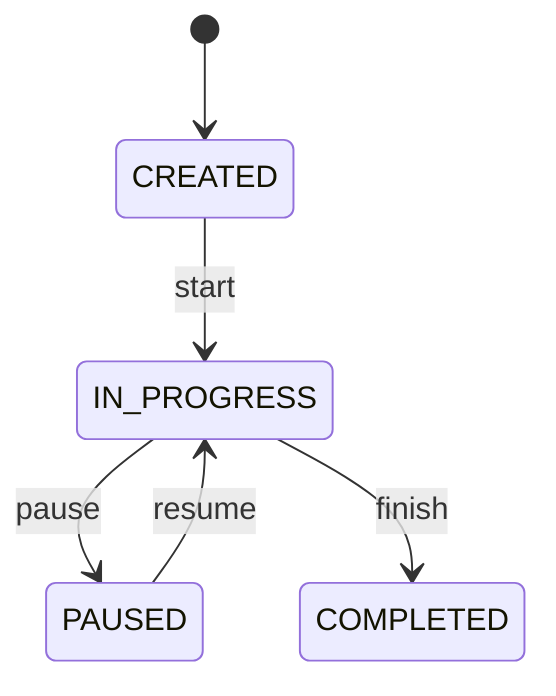

وضعیت‌های کامل: `CREATED`، `IN_PROGRESS`، `PAUSED`، `COMPLETED`، `ABANDONED`، `CANCELLED`.

## ۴. Pause / Resume و بازیابی پس از crash

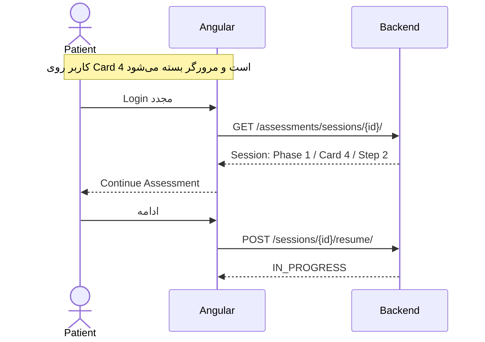

Frontend باید state را با Backend سینک کند (`Frontend State ↕ Backend State`)، نه اینکه frontend حقیقت نهایی باشد.

## ۵. ثبت پاسخ تکراری (Idempotency)

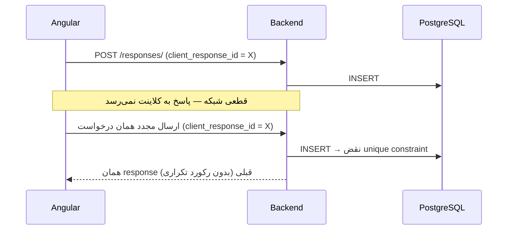

## ۶. تکمیل آزمون: transaction و رویدادها

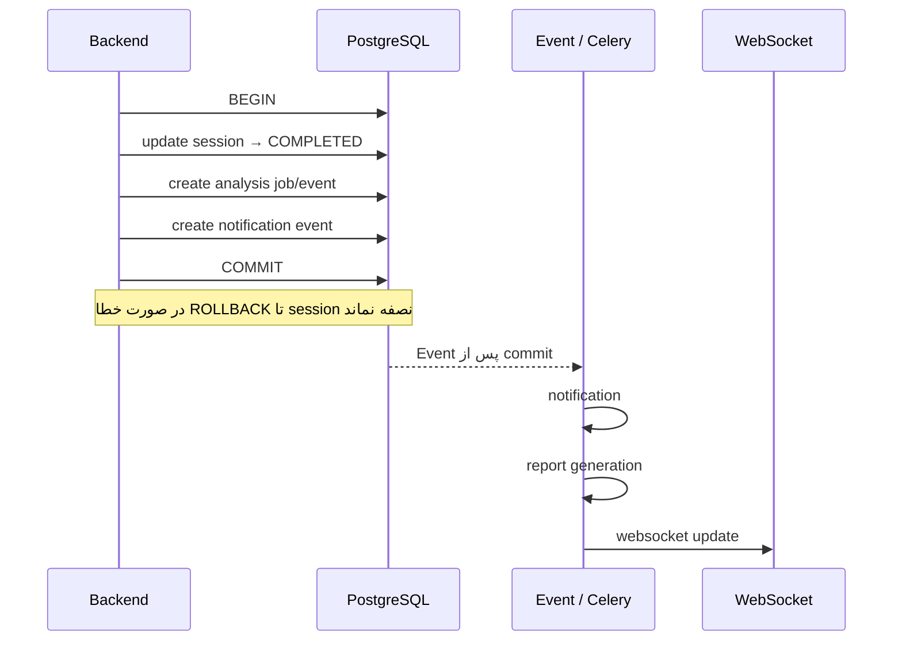

Assessment و Chat/Notification در یک transaction قرار نمی‌گیرند؛ تکمیل آزمون نباید منتظر ارسال اعلان یا رویداد چت بماند. `COMPLETED` ترمینال است تا تکرار درخواست دو report یا دو notification نسازد.

## ۷. مشاهده نتیجه توسط روان‌شناس

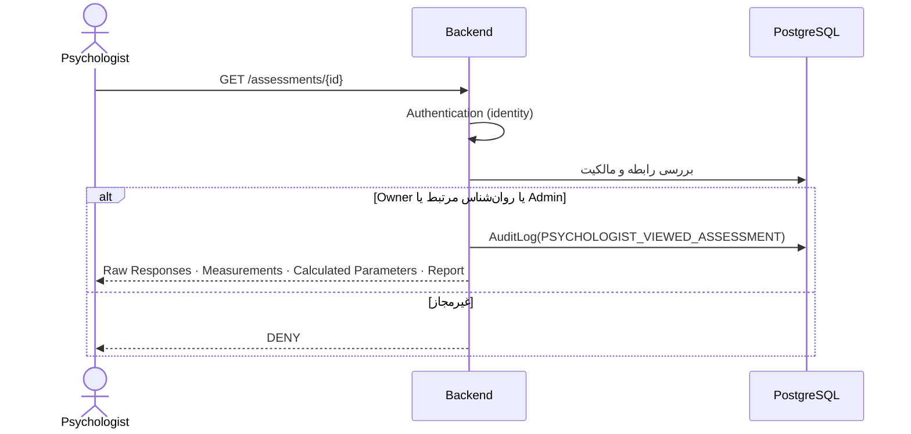

بیمار پس از completion فقط «Assessment completed successfully» را می‌بیند؛ raw/coded data صرفاً برای روان‌شناس نمایش داده می‌شود.

## ۸. چت و اعلان

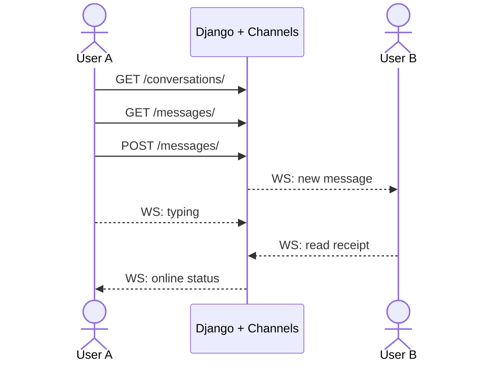

## ۹. Critical Path (End-to-End)

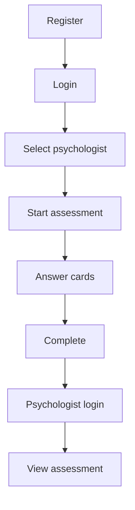

این مسیر، critical path سیستم است و باید به‌صورت end-to-end تست شود.
