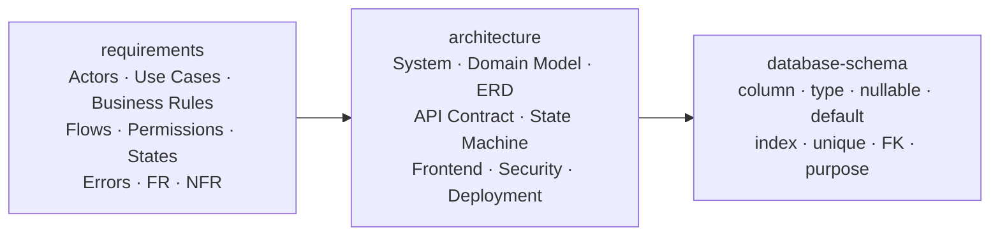
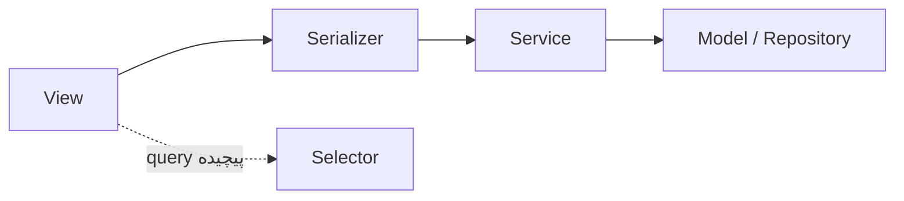
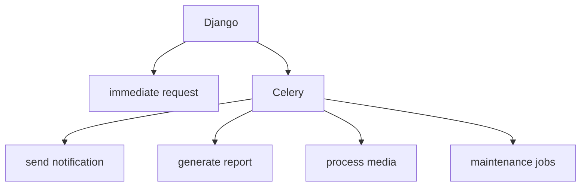
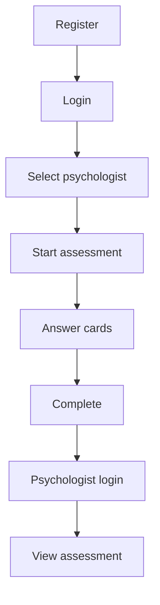
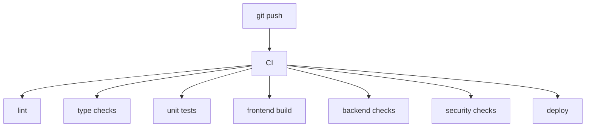

# ۰۶ — راهنمای توسعه

## ۱. ترتیب کار

پیش از آنکه توسعه‌دهنده حتی یک model بنویسد، باید این اسناد نهایی شوند:



پس از مدل داده می‌توان API contract و user flow را دقیقاً روی همان مدل سوار کرد.

## ۲. ساختار Backend

```
backend/
├── config/
│   ├── settings/{base.py, development.py, production.py}
│   ├── urls.py
│   ├── asgi.py
│   └── wsgi.py
├── apps/
│   ├── accounts/       profiles/       relationships/
│   ├── assessments/    tests/
│   ├── messaging/      notifications/  media/
│   ├── audit/          administration/
├── common/{permissions/, exceptions/, pagination/, utils/}
├── manage.py
└── requirements/
```

ساختار هر Django app:

```
assessments/
├── models.py       serializers.py   views.py
├── permissions.py  urls.py
├── services.py     selectors.py     tasks.py
├── tests/
└── migrations/
```

### قاعده‌ی لایه‌بندی



business logic داخل view ریخته نمی‌شود. برای CRUDهای معمول ViewSet استفاده می‌شود (`PsychologistViewSet`، `AchievementViewSet`، `NotificationViewSet`)، اما اجرای آزمون با actionهای صریح پیاده می‌شود: `start`، `pause`، `resume`، `submit_response`، `next_step`، `complete`.

## ۳. ساختار Frontend

Angular 20 با **Standalone Components**.

```
src/app/
├── core/     {auth/, guards/, interceptors/, api/, services/}
├── shared/   {components/, directives/, pipes/, ui/}
├── features/ {landing/, auth/, patient/, psychologist/,
│              assessment/, chat/, notifications/, admin/}
└── app.routes.ts
```

ساختار یک feature (نمونه: assessment):

```
assessment/
├── pages/      {assessment-intro, assessment-session,
│                assessment-paused, assessment-complete}
├── components/ {test-card, response-box, response-list,
│                assessment-progress, timer}
├── services/   {assessment-api, assessment-state, assessment-timer}
├── models/     assessment.models.ts
└── assessment.routes.ts
```

### State آزمون

```ts
AssessmentState {
  sessionId, status, currentPhase, currentCard,
  currentStep, responses, startedAt
}
```

Frontend باید state را از Backend سینک کند: `Frontend State ↕ Backend State` — نه اینکه frontend حقیقت نهایی باشد.

### Routes

```
/landing  /login  /register
/patient/{dashboard, profile, psychologists, history,
          notifications, chat, assessments}
/psychologist/{dashboard, profile, patients, patients/:id,
               assessments/:id, chat, achievements}
/assessment/:sessionId
/admin/{dashboard, users, psychologists, tests, assessments,
        announcements, audit-logs}
```

### UI

داشبورد: Header + Sidebar (Dashboard، Assessment، History، Doctors، Chat، Profile، Notify) + Main Content؛ موبایل: Header + Content + Bottom Navigation.

اما Assessment باید **focus mode** باشد:

```
┌──────────────────────────────┐
│  Card                        │
│         [ IMAGE ]            │
│  What do you see?            │
│  ┌────────────────────────┐  │
│  │  Response              │  │
│  └────────────────────────┘  │
│                    Continue  │
└──────────────────────────────┘
```

بدون sidebar مزاحم، بدون اعلان غیرضروری، بدون ناوبری نامرتبط.

## ۴. قواعد پیاده‌سازی که باید رعایت شوند

| # | قاعده |
|---|---|
| ۱ | Backend مرجع تعیین current state آزمون است؛ frontend خودش گام بعدی را تعیین نمی‌کند. |
| ۲ | ثبت پاسخ idempotent باشد (`client_response_id` + unique constraint). |
| ۳ | پاسخ پس از submit overwrite نشود. |
| ۴ | Completion در یک transaction اتمیک انجام شود و رویدادها پس از commit منتشر شوند. |
| ۵ | Assessment و Chat/Notification در یک transaction نباشند. |
| ۶ | object-level permission همیشه بررسی شود، نه صرفاً `is_authenticated`. |
| ۷ | integrity در سطح DB با `UniqueConstraint` و `CheckConstraint` اعمال شود. |
| ۸ | JSONB فقط برای داده‌ی پویا/نسخه‌دار؛ index روی JSONB بعد از مشخص شدن query pattern. |
| ۹ | autosave به‌صورت debounced یا transition-based، نه هر چند صد میلی‌ثانیه. |
| ۱۰ | سرور مرجع نهایی timestamp است. |
| ۱۱ | secrets داخل repository نباشند. |
| ۱۲ | پارامترهای واقعی Rorschach تا دریافت منابع hard-code نشوند. |

## ۵. Background Jobs

با Celery:



در MVP اگر report processing سنگین نباشد، Celery را می‌توان minimal نگه داشت.

## ۶. Testing Strategy

**Backend:** Unit tests، Service tests، API tests، Permission tests، State machine tests
**Frontend:** Component tests، Service tests، Assessment flow tests

**مهم‌تر از همه — End-to-end:**



این critical path است.

### Test caseهای بسیار مهم Assessment

Start session · Resume session · Pause session · Refresh browser · Duplicate submission · Submit empty response · Submit multiple responses · Skip card · Unauthorized access · Wrong psychologist access · Expired session · Network failure · Complete session twice

## ۷. فازبندی Sprintها

| Sprint | محتوا |
|---|---|
| 1 — Foundation | Repository، Docker، Django، Angular، PostgreSQL، Redis، NGINX، CI |
| 2 — Identity | User، Register، Login، Role، Profile، Verification |
| 3 — Relationships | Patient، Psychologist، Search، Request، Approve، Revoke، Permissions |
| 4 — Test Engine | TestDefinition، TestVersion، Phase، Card، AssessmentSession، State Machine |
| 5 — Rorschach Flow | Card rendering، Response boxes، Dynamic responses، Timing، Autosave، Resume، Completion |
| 6 — Psychologist | Patients، History، Assessment detail، Analysis، Report |
| 7 — Communication | Conversation، Message، WebSocket، Notification |
| 8 — Admin | User management، Psychologist approval، Test management، Announcements، Audit |
| 9 — Hardening | Security، Performance، Testing، Monitoring، Backup، Deployment |

## ۸. CI



جزئیات محیط‌ها و استقرار در [[07-deployment-operations]].
