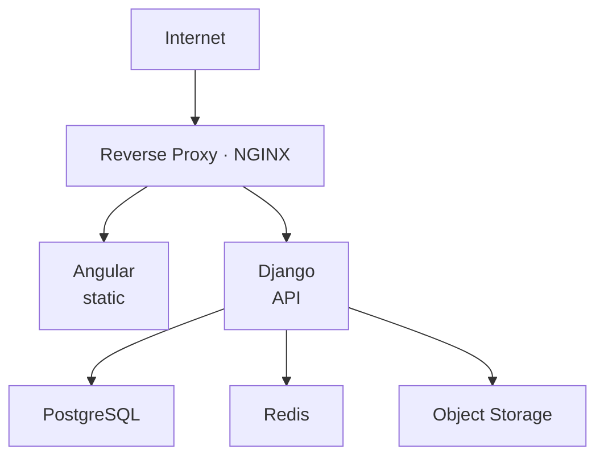
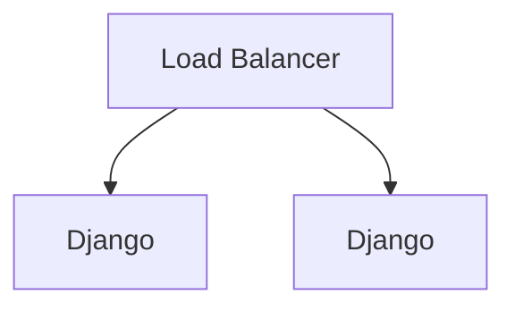
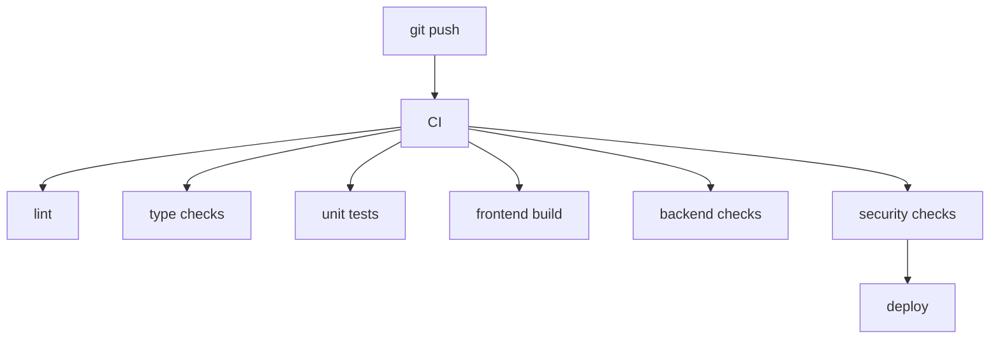
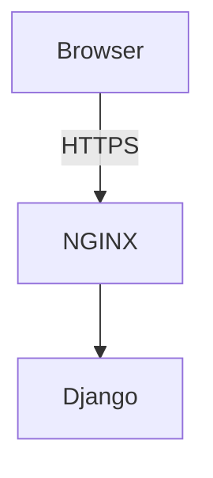

# ۰۷ — استقرار و عملیات

## ۱. Deployment Architecture



در production می‌توان Load Balancer و چند instance از Django اضافه کرد:



## ۲. Docker

پروژه حتماً containerize می‌شود. `docker-compose.yml` برای development شامل:

```
frontend · backend · postgres · redis · nginx
```

Object storage در production بهتر است **external** باشد.

## ۳. تفکیک محیط‌ها

```
development · staging · production
```

پیکربندی از طریق environment variables:

```
DATABASE_URL      REDIS_URL
SECRET_KEY        JWT_SECRET
STORAGE_ENDPOINT  STORAGE_BUCKET
EMAIL_HOST        ...
```

**Secrets داخل repository نباشند.**

تنظیمات Django نیز به همین صورت تفکیک می‌شود: `config/settings/{base,development,production}.py`.

## ۴. CI/CD



## ۵. Security Architecture



لایه‌های امنیتی: Authentication · Authorization · Object-level permissions · Rate limiting · CSRF · CORS · Input validation · Audit logging.

به‌خصوص object-level authorization برای assessment: پرسش `Can user X read assessment Y?` باید همیشه بررسی شود، نه صرفاً `is_authenticated == True`.

انتقال توکن‌ها: HTTPS only، با کوکی‌های `Secure` / `HttpOnly` / `SameSite` و استراتژی CSRF مناسب؛ access token کوتاه‌عمر همراه با refresh mechanism امن، و بدون قرار دادن بی‌دلیل در localStorage.

## ۶. Logging و Audit

سه لایه که با هم یکی نمی‌شوند:

| لایه | نمونه |
|---|---|
| Application Logs | 500 error، database timeout |
| Audit Logs | doctor viewed patient assessment |
| Security Logs | multiple failed login |

`AuditLog` شامل `actor_id`، `action`، `target_type`، `target_id`، `ip_address`، `user_agent`، `metadata` (JSONB)، `created_at` است. نمونه actionها: `PATIENT_STARTED_ASSESSMENT`، `PATIENT_COMPLETED_ASSESSMENT`، `PSYCHOLOGIST_VIEWED_ASSESSMENT`، `RELATIONSHIP_CREATED`، `RELATIONSHIP_APPROVED`، `PSYCHOLOGIST_PROFILE_APPROVED`.

## ۷. Redis در عملیات

Redis برای Cache، Rate Limiting، Temporary state، Background jobs و پشتیبانی WebSocket استفاده می‌شود — اما **دیتابیس اصلی پروژه نیست**.

## ۸. Background Processing

Celery برای send notification، generate report، process media و maintenance jobs. رویدادهای پس از تکمیل آزمون (notification، report generation، websocket update) به‌صورت async انجام می‌شوند تا تکمیل آزمون منتظر آن‌ها نماند.

## ۹. Object Storage

```
Object Storage
├── tests/rorschach/v1/{card-01.webp, card-02.webp, ...}
├── avatars/
└── attachments/
```

تصاویر رورشاخ در دیتابیس ذخیره نمی‌شوند؛ DB فقط metadata نگه می‌دارد (`MediaAsset`: `storage_key`، `mime_type`، `size`، `checksum`، `created_at`).

## ۱۰. Hardening (Sprint 9)

Security · Performance · Testing · Monitoring · Backup · Deployment

نکات عملکردی: index روی فیلدهای پرکاربرد (`users.email`، کلیدهای رابطه و session، `messages.conversation_id`، `notifications.user_id` و ...) و اجتناب از index زدن کورکورانه روی فیلدهای JSON پیش از مشخص شدن query pattern.
