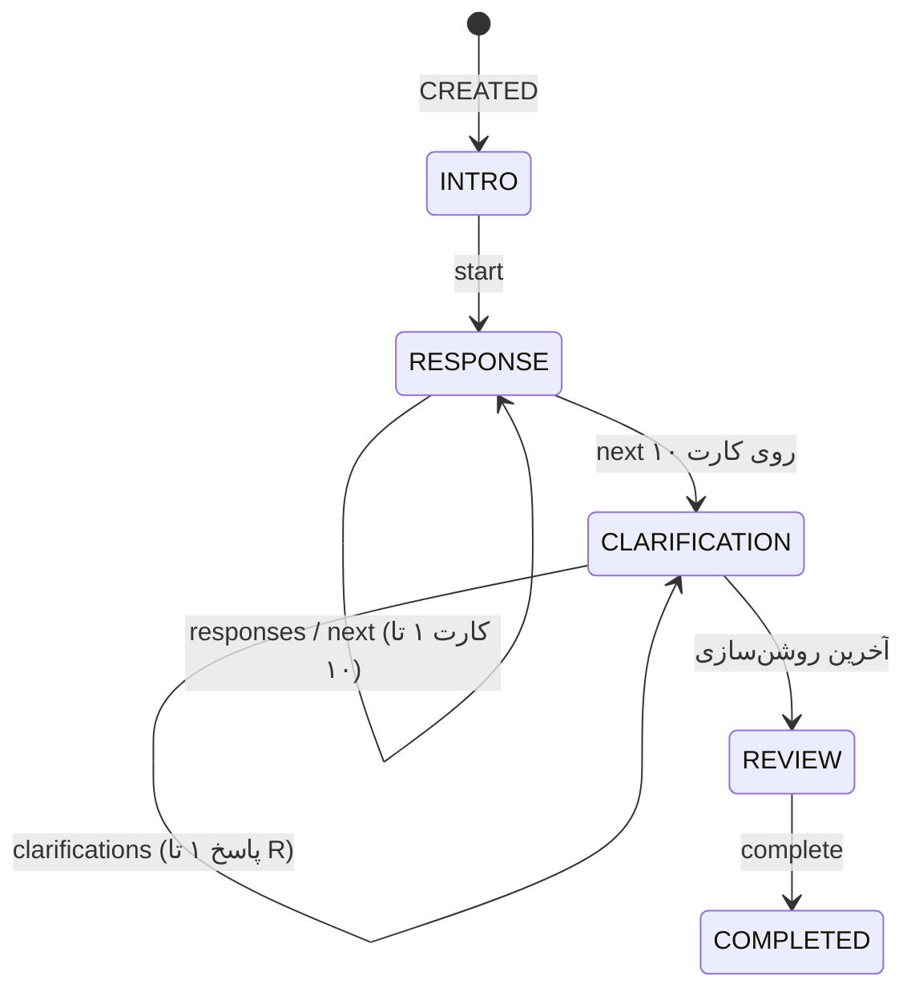

# ۱۰ — اجرای آزمون رورشاخ (R-PAS)

> جریان کامل در Frontend و Mock پیاده شده است. Mock (`src/app/core/mock`) **پیاده‌سازی مرجع** رفتار Backend است: همان endpointها، همان state machine و همان الگوریتم محاسبه (`rpas-scoring.ts`) باید در Django پیاده شود.

## ۱. قواعد اجرای استاندارد

| قاعده | پیاده‌سازی |
|---|---|
| ده کارت، یکی‌یکی | `current_card` را فقط سرور تعیین می‌کند (BR-05) |
| بدون راهنمایی در مرحله‌ی پاسخ | فقط پرسش استاندارد «این چه چیزی می‌تواند باشد؟»؛ بدون مثال یا بازخورد |
| «دو یا شاید سه پاسخ» | در دستورالعمل آغاز آزمون گفته می‌شود |
| Prompt (Pr) | اگر روی کارت فقط **یک** پاسخ باشد، اولین «کارت بعدی» پیشروی نمی‌کند و متن استاندارد یادآوری یک بار نمایش داده می‌شود |
| Pull (Pu) | **غیرفعال** (تصمیم کارفرما): تعداد پاسخ‌ها و طول متن سقف ندارد (`max_responses = null`). اگر روی کارت عددی تنظیم شود، رفتار استاندارد pull برمی‌گردد |
| کادر پاسخ | یک‌خطی؛ Enter پاسخ را ثبت و کادر پاسخ بعدی را باز می‌کند |
| چرخاندن کارت (CT) | دکمه‌ی «چرخاندن کارت»؛ تعداد چرخش و جهت نهایی برای هر پاسخ ثبت می‌شود |
| پاسخ‌ها overwrite نمی‌شوند | پاسخ ثبت‌شده فقط‌خواندنی است (BR-06)؛ روشن‌سازی و کدگذاری جدا ذخیره می‌شوند |
| مرحله‌ی روشن‌سازی (CP) | برای هر پاسخ: کارت + متن خود فرد، علامت‌گذاری محل روی تصویر (یا «کل تصویر») و پاسخ به «چه چیزی باعث شد این‌طور به نظر برسد؟» با **انتخاب از فهرست دلایل** (چندانتخابی) و توضیح اختیاری — جدول بخش ۵ |
| **بدون توقف** | دکمه‌ی توقف وجود ندارد؛ خروج از صفحه هشدار می‌دهد. اگر مرورگر بسته شود، آزمون از همان نقطه‌ای که سرور ثبت کرده ادامه پیدا می‌کند و **وقفه در پرونده ثبت می‌شود** |
| مشاهده‌های اجرایی | تعداد وقفه‌ها (`interruptions`) و خروج از صفحه (`tab_hidden`) در `administration` |
| زمان‌سنجی | زمان سرور مرجع است؛ زمان واکنش (نمایش کارت/پاسخ قبلی تا اولین تایپ) از کلاینت، به‌عنوان اندازه‌گیری کمکی |
| Idempotency | هر پاسخ `client_response_id` دارد؛ ارسال مجدد پس از قطعی شبکه رکورد تکراری نمی‌سازد |
| پیش‌نویس | متن تایپ‌شده‌ی ثبت‌نشده در `localStorage` نگه داشته می‌شود و پس از ثبت یا پایان آزمون پاک می‌شود |

## ۲. مراحل (state machine)

`stage` از روی `status`، `current_phase` (فاز RESPONSE یا CLARIFICATION نسخه) و `current_card` / `current_step` محاسبه می‌شود.

## ۳. API (افزوده به سند 04)

| Method | Endpoint | نقش | شرح |
|---|---|---|---|
| GET | `/assessments/sessions/{id}/state/` | مراجع مالک | `RunState` فعلی |
| POST | `/assessments/sessions/{id}/start/` | مراجع | CREATED → IN_PROGRESS |
| POST | `/assessments/sessions/{id}/responses/` | مراجع | ثبت پاسخ روی کارت جاری (idempotent) → `{response, state}` |
| POST | `/assessments/sessions/{id}/next/` | مراجع | کارت بعد؛ یا `{prompt: true}` اگر یادآوری لازم باشد |
| POST | `/assessments/sessions/{id}/clarifications/` | مراجع | `{response_id, whole, location_marks[], text}` |
| POST | `/assessments/sessions/{id}/complete/` | مراجع | فقط از REVIEW؛ ترمینال و idempotent؛ رویداد تحلیل |
| POST | `/assessments/sessions/{id}/events/` | مراجع | `INTERRUPTION` · `TAB_HIDDEN` |
| GET | `/assessments/sessions/{id}/detail/` | روان‌شناس مرتبط / ادمین | پروتکل کامل + کارت‌ها + تحلیل |
| PUT | `/assessments/sessions/{id}/responses/{rid}/coding/` | روان‌شناس مرتبط | کدگذاری R-PAS یک پاسخ |
| POST | `/assessments/sessions/{id}/analysis/` | روان‌شناس / ادمین | محاسبه‌ی مجدد متغیرها و تفسیر |

endpointهای `pause` / `resume` سند 04 در این آزمون استفاده نمی‌شوند.

## ۴. داده‌ها

- `AssessmentResponse`: `card_number`، `sequence` (شماره‌ی R)، `card_response_number`، `response_text`، زمان‌های سرور/کلاینت، `measurement_data = {reaction_time_ms, card_turns, final_rotation}`، `clarification = {whole, location_marks[{x,y}], reasons[], text}` (مختصات نسبی ۰ تا ۱ روی کارت چرخانده‌نشده)، `coding` (جدا از داده‌ی خام).
- `AssessmentSession.administration`: `prompts`، `pulls`، `card_turns`، `interruptions`، `tab_hidden`، کارت‌های prompt/pull‌شده، زمان شروع هر مرحله.
- `CardConfiguration`: `min_responses = 2`، `max_responses = null` (بدون سقف)، `allow_rotation`.
- تصاویر کارت‌ها: `public/images/test/1.jpg … 10.jpg` (در production: Object Storage و `image_url`).

## ۵. کدگذاری (روان‌شناس)

پارامترهای سند 09 را **روان‌شناس** پس از تکمیل آزمون وارد می‌کند، نه مراجع — این همان روال استاندارد است؛ مراجع فقط پاسخ خام و روشن‌سازی می‌دهد.

| گروه | کدها |
|---|---|
| Location | `W` `D` `Dd` |
| Space | `SR` `SI` |
| Content | `H` `(H)` `Hd` `(Hd)` `Hx` `A` `(A)` `Ad` `(Ad)` `An` `Art` `Ay` `Bl` `Cg` `Ex` `Fi` `Sx` `NC` |
| Object qualities | `Sy` `Vg` `2` |
| Form Quality | `o` `u` `-` `n` |
| Popular | `P` |
| Determinants | `M` `FM` `m` `FC` `CF` `C` `C'` `T` `V` `Y` `r` `FD` `F` |
| Cognitive | `DV1/2` `INC1/2` `DR1/2` `FAB1/2` `PEC` `CON` |
| Thematic | `ABS` `PER` `COP` `MAH` `MAP` `AGM` `AGC` `MOR` `ODL` |

### فهرست دلایل مرحله‌ی روشن‌سازی

مراجع یک یا چند دلیل را انتخاب می‌کند؛ کد پیشنهادی فقط **راهنمای کدگذار** است و خودکار اعمال نمی‌شود.

| کد | برچسب برای مراجع | Determinant پیشنهادی |
|---|---|---|
| `FORM` | شکلش | F |
| `MOVEMENT` | حرکت یا حالتی که دارد | M، FM، m |
| `COLOR` | رنگش | FC، CF، C |
| `ACHROMATIC` | سیاه، سفید یا خاکستری بودنش | C′ |
| `TEXTURE` | بافت یا زبری‌اش | T |
| `DEPTH` | عمق یا دوری و نزدیکی | V، FD |
| `SHADING` | سایه‌روشن و کم‌رنگ و پررنگی | Y |
| `REFLECTION` | قرینه یا انعکاس | r |
| `OTHER` | دلیل دیگر | — |

نکته: در R-PAS استاندارد، روشن‌سازی به‌صورت پرسش باز انجام می‌شود؛ ارائه‌ی فهرست دلایل یک انطباق برای اجرای آنلاین است و ممکن است پاسخ را جهت‌دهی کند — در تفسیر لحاظ شود.

جداول رسمی کیفیت فرم و پاسخ‌های رایج R-PAS در سامانه نیستند (دارای حق نشرند)؛ کدگذار آن‌ها را اعمال می‌کند.

## ۶. متغیرها (خام، `rpas-raw-0.1`)

| حوزه | متغیرها |
|---|---|
| اجرا | R، Pr، Pu، CT، وقفه، خروج از صفحه، میانگین زمان واکنش |
| درگیری و پردازش شناختی | F% (فرم خالص)، Blend، Sy، W%، Dd%، SI، MC = M + WSumC |
| ادراک و تفکر | FQo%، FQ-%، WD-%، P، WSumCog (وزن‌ها: DV1=1, DV2=2, INC1=2, INC2=4, DR1=3, DR2=6, FAB1=4, FAB2=7, PEC=4, CON=7)، SevCog |
| خود و دیگری | M، H، کل محتوای انسانی، COP، MAH، MAP، AGM، AGC، ODL، PER، Pair |
| استرس و پریشانی | m، Y، C′، T، V، MOR، WSumC = 0.5·FC + CF + 1.5·C، (CF+C)/SumC، PPD = FM+m+C′+T+V+Y، MC−PPD |

## ۷. تفسیر غیرقطعی

قواعد ساده و قابل‌ردیابی روی مقادیر خام (مثلاً R < 16، FQ-% ≥ 20٪، SevCog ≥ 1، MC−PPD ≤ −3، MOR ≥ 2). هر یافته حوزه، متغیرهای مبنا و سطح اطمینان (پایین/متوسط) دارد و همیشه با این هشدارها همراه است:

- مقادیر خام‌اند و با جداول هنجار R-PAS (نمره‌ی استاندارد) مقایسه نشده‌اند.
- آستانه‌ها تقریبی و اکتشافی‌اند.
- تفسیر ادعای تشخیص ندارد و جایگزین قضاوت بالینی نیست (BR-18).
- فقط روان‌شناس آن را می‌بیند؛ مراجع فقط «آزمون با موفقیت ثبت شد» را می‌بیند (BR-14).

## ۸. موارد باز

- وزن‌ها و آستانه‌ها باید با دستورالعمل رسمی R-PAS تطبیق و تأیید شوند.
- تبدیل به نمره‌ی استاندارد (SS) و Complexity نیازمند جداول هنجار R-PAS است.
- امکان «رد کارت» (پاسخ ندادن) فعلاً مجاز نیست؛ حداقل یک پاسخ برای هر کارت لازم است.
