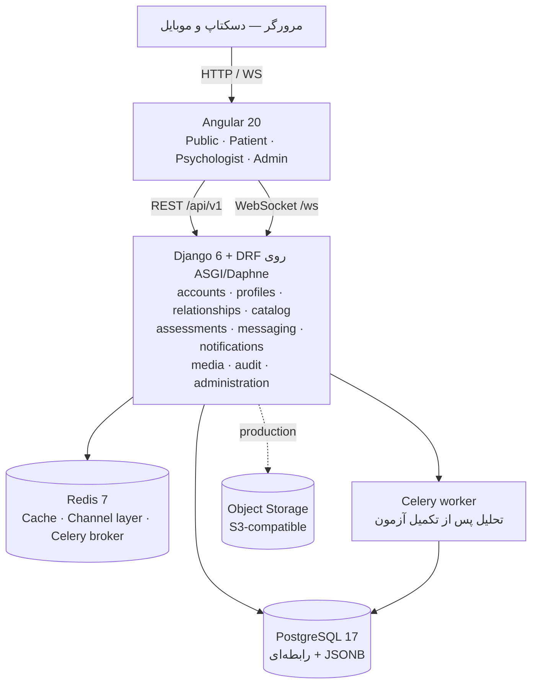
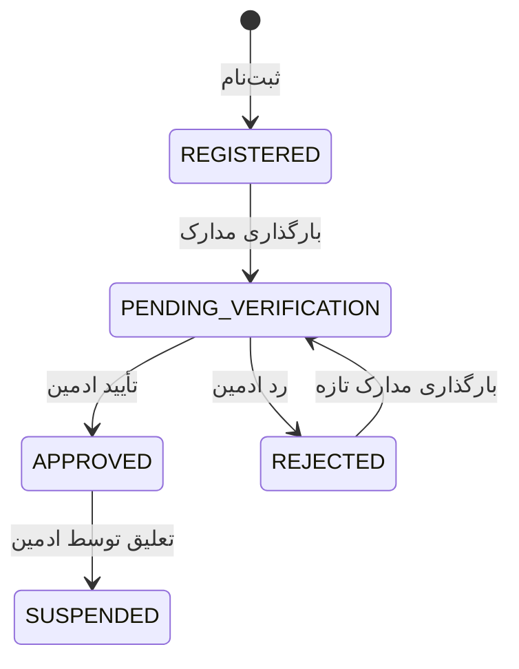
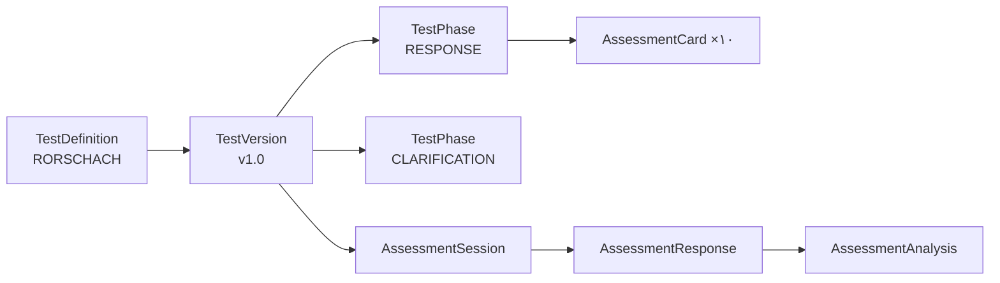
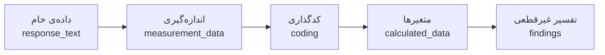
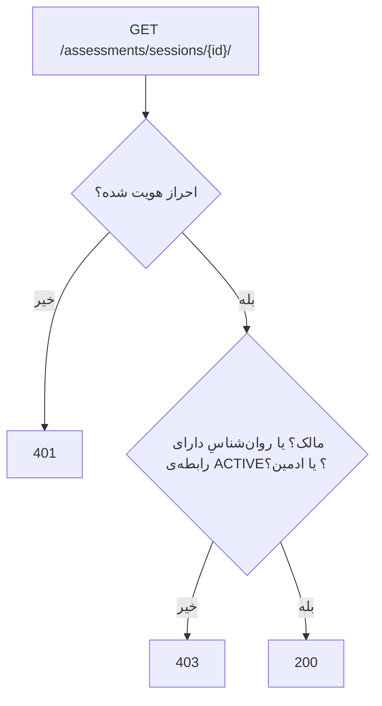

# ۰۰ — نمای کلی پروژه

## ۱. صورت مسئله

آزمون رورشاخ یکی از شناخته‌شده‌ترین آزمون‌های **فرافکن** روان‌شناسی است: به فرد ده کارت
لکه‌ی جوهر نشان می‌دهند و از او می‌پرسند «این چه چیزی می‌تواند باشد؟». اجرای سنتی آن
کاغذی است و سه مشکل دارد:

1. **ثبت داده‌ی اجرایی دقیق نیست** — زمان واکنش، تعداد چرخاندن کارت، تعداد یادآوری‌ها،
   همگی به حافظه و دست‌نویس آزمونگر وابسته‌اند.
2. **کدگذاری و محاسبه‌ی متغیرها دستی است** — ده‌ها متغیر باید از روی کدهای هر پاسخ
   جمع، وزن‌دهی و نسبت‌گیری شوند؛ کاری وقت‌گیر و مستعد خطای حسابی.
3. **پرونده‌ها پراکنده‌اند** — پاسخ خام، کدگذاری، محاسبات و یادداشت بالینی در جاهای
   مختلف می‌مانند و ردیابی تاریخچه‌ی یک مراجع دشوار است.

**سامانه‌ی رورشاخ** یک پلتفرم وب است که اجرای آزمون را برای مراجع آنلاین می‌کند،
داده‌ی خام و اندازه‌گیری‌های اجرایی را با زمان سرور ثبت می‌کند، ابزار کدگذاری استاندارد
را در اختیار روان‌شناس می‌گذارد و متغیرهای سطح پروتکل را خودکار محاسبه می‌کند.

> **سیستم ادعای تشخیص روان‌شناختی ندارد** . خروجی تحلیل، مجموعه‌ای از متغیرهای
> خام و یافته‌های «غیرقطعی» با ذکر مبنا و سطح اطمینان است؛ قضاوت بالینی بر عهده‌ی
> روان‌شناس است. جزئیات در [[10-assessment-rpas]] §۷.

## ۲. وضعیت پروژه در یک نگاه

| شاخص        | مقدار                                                                         |
| ----------- | ----------------------------------------------------------------------------- |
| ‏Backend    | **‏**Django 6.0 + DRF 3.18 — ۱۰ اپ دامنه‌ای، ۲۱ جدول، ۵۱ مسیر API             |
| ‏Frontend   | **‏**Angular 20 — Standalone + Signals، ۹ feature، ۳۰ صفحه                    |
| قرارداد API | **‏**`/api/v1/` — فرانت‌اند و بک‌اند روی یک قرارداد یکسان، بدون آداپتور میانی |
| بلادرنگ     | **‏**Django Channels روی ASGI — یک اندپوینت `/ws/` برای چت و حضور             |
| تست         | ۱۵۷ تست pytest (سبز)، شامل تست end-to-end مسیر بحرانی                         |
| کیفیت کد    | **‏**ruff بدون خطا (۸ گروه قاعده‌ی فعال، سطر ۱۱۰ کاراکتر)                     |
| اجرا        | **‏**`docker compose up -d --build` → PostgreSQL + Redis + Django + Celery    |

سیر تحول پروژه در سه مرحله بوده است: 
**(۱)** نوشتن اسناد طراحی پیش از کد ←
**(۲)** پیاده‌سازی کامل Frontend روی یک **Mock Backend** که مرجع رفتاری شد ←
**(۳)** پیاده‌سازی Backend واقعی روی همان قرارداد و تأیید اتصال در مرورگر.
دلیل این ترتیب این بود که فرانت‌اند اول و روی قرارداد mock ساخته شد، و Backend باید
خودش را با همان قرارداد جا می‌انداخت.

## ۳. معماری در یک نگاه

سبک معماری: **Modular Monolith** — یک اپلیکیشن Django با domainهای کاملاً جدا.
‏Microservice در این مقیاس فقط networking و consistency را سخت‌تر می‌کرد؛ مرزها آن‌قدر
تمیز کشیده شده‌اند که اگر روزی Chat یا Assessment بار متفاوتی پیدا کند، همان domain
قابل جدا شدن باشد.
## ‏ ۴. Bounded Contextها و نگاشت آن‌ها به کد

| ‏Context                | اپ Django              | مسئولیت                                                  |
| ----------------------- | ---------------------- | -------------------------------------------------------- |
| ‏Identity & Access      | ‏`apps/accounts`       | مدل `User`، ورود/ثبت‌نام/تمدید نشست، نقش                 |
| ‏Patient / Psychologist | ‏`apps/profiles`       | پروفایل دو نقش، مدارک تأیید، افتخارات، فهرست روان‌شناسان |
| ‏Relationship           | ‏`apps/relationships`  | ارتباط مراجع ↔ روان‌شناس، مبنای مجوز دسترسی              |
| ‏Test Catalog           | ‏`apps/catalog`        | تعریف آزمون ← نسخه ← مرحله ← کارت                        |
| ‏Assessment             | ‏`apps/assessments`    | ماشین حالت اجرا، پاسخ‌ها، کدگذاری، تحلیل (`rpas/`)       |
| ‏Communication          | ‏`apps/messaging`      | گفت‌وگو، پیام، WebSocket، حضور                           |
| ‏Notification           | ‏`apps/notifications`  | اطلاعیه‌ی عمومی سایت                                     |
| ‏Media                  | ‏`apps/media`          | متادیتای فایل‌ها (`MediaAsset`)                          |
| ‏Audit                  | ‏`apps/audit`          | جدول ممیزی و میان‌افزار حمل IP و User-Agent              |
| ‏Administration         | ‏`apps/administration` | پنل ادمین: کاربران، تأیید، نسخه‌ی آزمون، اطلاعیه، ممیزی  |

مدل `User` عمداً کوچک نگه داشته شده تا احراز هویت با پروفایل دامنه تداخلی ایجاد نشود.
هویت در `users` و اطلاعات نقش در `patient_profiles` / `psychologist_profiles`.

## ۵. نقش‌ها

| نقش             | توضیح                                                                            |
| --------------- | -------------------------------------------------------------------------------- |
| ‏`PATIENT`      | مراجع؛ آزمون را اجرا می‌کند و فقط پاسخ‌های خودش را می‌بیند                       |
| ‏`PSYCHOLOGIST` | پس از تأیید ادمین، مراجعان مرتبط و پروتکل کامل آن‌ها را می‌بیند و کدگذاری می‌کند |
| ‏`ADMIN`        | تأیید روان‌شناس، مدیریت کاربران و آزمون، اطلاعیه، ممیزی — کاربر عادی سایت نیست   |

تأیید روان‌شناس **اجباری** است (BR-01)؛ کسی نمی‌تواند خودش را روان‌شناس اعلام کند:

> حالت `SUSPENDED` در سند طراحی اولیه نبود، اما پنل ادمین سه تصمیم دارد
> ‏(`APPROVE` / `REJECT` / `SUSPEND`)، پس یک حالت واقعی است و در مدل وجود دارد.

## ۶. هسته‌ی آزمون

هر جلسه علاوه بر شناسه‌ی تعریف آزمون، حتماً شناسه‌ی **نسخه** را هم ثبت می‌کند و
نسخه‌ی منتشرشده **تغییرناپذیر** است (BR-04). ویرایش یک نسخه‌ی منتشرشده ممکن نیست؛
ادمین آن را clone می‌کند، نسخه‌ی پیش‌نویس را ویرایش و سپس منتشر می‌کند.

### تفکیک لایه‌های داده

سه دسته داده وجود دارد و در یکدیگر ادغام نمی‌شوند:
- **تولیدشده توسط کاربر** — متن پاسخ و متن روشن‌سازی
- **اندازه‌گیری‌شده توسط سیستم** — زمان واکنش، مدت پاسخ، تعداد چرخش کارت، وقفه‌ها
- **کدگذاری‌شده توسط روان‌شناس** — محل، عوامل تعیین‌کننده، کیفیت فرم، محتوا و…

پاسخ پس از ثبت **بازنویسی نمی‌شود** (BR-06)؛ روشن‌سازی و کدگذاری در ستون‌های جداگانه
کنار همان ردیف می‌نشینند.

## ۷. رابطه و مجوز دسترسی

مجوز دسترسی بر پایه‌ی رابطه‌ی مراجع ↔ روان‌شناس است، نه صرفاً نقش:

مهم‌ترین قاعده‌ی امنیتی سیستم این است که چنین اندپوینتی هرگز نباید صرفاً
«یافتن رکورد با شناسه» باشد. پیاده‌سازی در
‏`backend/apps/assessments/permissions.py` تابع `readable_session()` است و هیچ مسیری
دورش نمی‌زند.

هنگام ساخت جلسه آزمون، سه‌گانه‌ی *مراجع / روان‌شناس / رابطه* روی خود جلسه ثبت می‌شود.
اگر رابطه بعداً لغو شود، دسترسی جاری روان‌شناس بسته می‌شود اما **جلسه‌ی تاریخی
بی‌صاحب نمی‌شود** و خود را حفظ می‌کند (BR-12 و BR-13).

## ۸. جریان‌های اصلی

**مراجع:**
ورود ← داشبورد ← انتخاب روان‌شناس ← درخواست ارتباط ← (تأیید روان‌شناس) ← شروع آزمون ←
مرحله‌ی پاسخ (۱۰ کارت) ← مرحله‌ی روشن‌سازی (هر پاسخ) ← مرور ← ثبت نهایی

**روان‌شناس:**
ورود ← داشبورد ← درخواست‌ها ← مراجعان ← پرونده‌ی مراجع ← جزئیات آزمون ←
کدگذاری هر پاسخ ← محاسبه‌ی متغیرها ← مطالعه‌ی یافته‌های غیرقطعی

**ادمین:**
کاربران · تأیید روان‌شناسان · روابط · جلسات آزمون · نسخه‌های آزمون · اطلاعیه · رسانه · ممیزی

> پس از تکمیل آزمون، مراجع فقط پیام «آزمون با موفقیت ثبت شد» را می‌بیند؛ داده‌ی خام و
> کدگذاری‌شده و تحلیل فقط به روان‌شناس نشان داده می‌شود (BR-14).

دیاگرام‌های توالی کامل در [[05-sequence-diagrams]].

## ۹. تصمیمات فناوری

| لایه                  | انتخاب                                                                          | نسخه‌ی واقعی      |
| --------------------- | ------------------------------------------------------------------------------- | ----------------- |
| ‏Frontend             | ‏Angular (Standalone، Signals) + Tailwind CSS + daisyUI                         | ‏20.1 · 4.3 · 5.7 |
| ‏Backend              | ‏Django + Django REST Framework                                                 | ‏6.0 · 3.18       |
| احراز هویت            | ‏SimpleJWT — توکن دسترسی در بدنه، توکن تمدید در کوکی `HttpOnly` با چرخش و ابطال | ‏5.5              |
| دیتابیس               | ‏PostgreSQL + `JSONField` برای داده‌ی پویا                                      | ‏17               |
| ‏Cache / صف / بلادرنگ | ‏Redis · Celery · Django Channels روی ASGI/Daphne                               | ‏7 · 5.5 · 4.3    |
| ذخیره‌ی فایل          | سیستم‌فایل در توسعه · S3-compatible در production (`django-storages`)           | ‏1.14             |
| مستندسازی API         | ‏drf-spectacular (OpenAPI 3 + Swagger UI)                                       | ‏0.28             |
| تست و لینت            | ‏pytest + pytest-django · ruff                                                  | ‏8.4 · 0.14       |
| بسته‌بندی             | ‏Docker و docker compose                                                        | ‏—                |

### دلیل انتخاب MongoDB 
ساختار «مرحله ← کارت ← پاسخ‌ها» در MongoDB طبیعی است، اما در
کنار کاربران ، روابط، مجوزها، چت و ممیزی — که همگی رابطه‌ای و تراکنشی‌اند —
یک PostgreSQL واحد با JSONB انتخاب مناسب تری است.
## 10. مرزهای پروژه

| مورد                                       | تصمیم                                                                                                                      |
| ------------------------------------------ | -------------------------------------------------------------------------------------------------------------------------- |
| جداول رسمی کیفیت فرم و پاسخ‌های رایج R-PAS | در سامانه **جاسازی نشده‌اند** (دارای حق نشر)؛ کدگذار آن‌ها را اعمال می‌کند                                                 |
| تبدیل به نمره‌ی استاندارد                  | انجام نمی‌شود؛ خروجی **خام** است، چون جداول هنجار R-PAS در دسترس نیست                                                      |
| وزن‌ها و آستانه‌های تفسیر                  | اکتشافی‌اند و باید با دستورالعمل رسمی R-PAS تطبیق داده شوند ([[10-assessment-rpas]] §۸)                                    |
| تشخیص روان‌شناختی                          | سیستم چنین ادعایی ندارد (BR-18)                                                                                            |
| توقف آزمون                                 | در R-PAS اجرا پیوسته است؛ دکمه‌ی توقف وجود ندارد                                               |
| کدگذاری خودکار با هوش مصنوعی               | انجام نمی‌شود؛ هوش مصنوعی فقط **واژه‌های محتوا را پیشنهاد** می‌دهد و هرگز روی `coding` نمی‌نویسد ([[11-ai-content-words]]) |

مرز میان **مهندسی نرم‌افزار** و **روش‌شناسی روان‌شناسی** عمداً حفظ شده است: نرم‌افزار
ساختار، ثبت، محاسبه و ردیابی را تضمین می‌کند؛ اعتبار بالینی کدها و آستانه‌ها بر عهده‌ی
منابع رسمی و روان‌شناس است.
