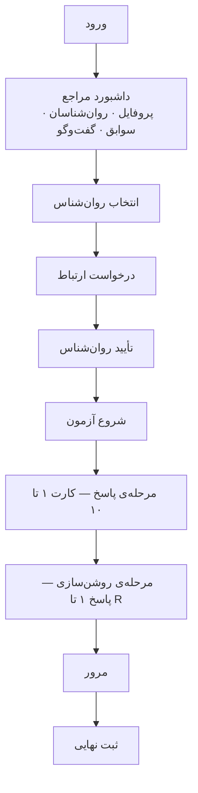
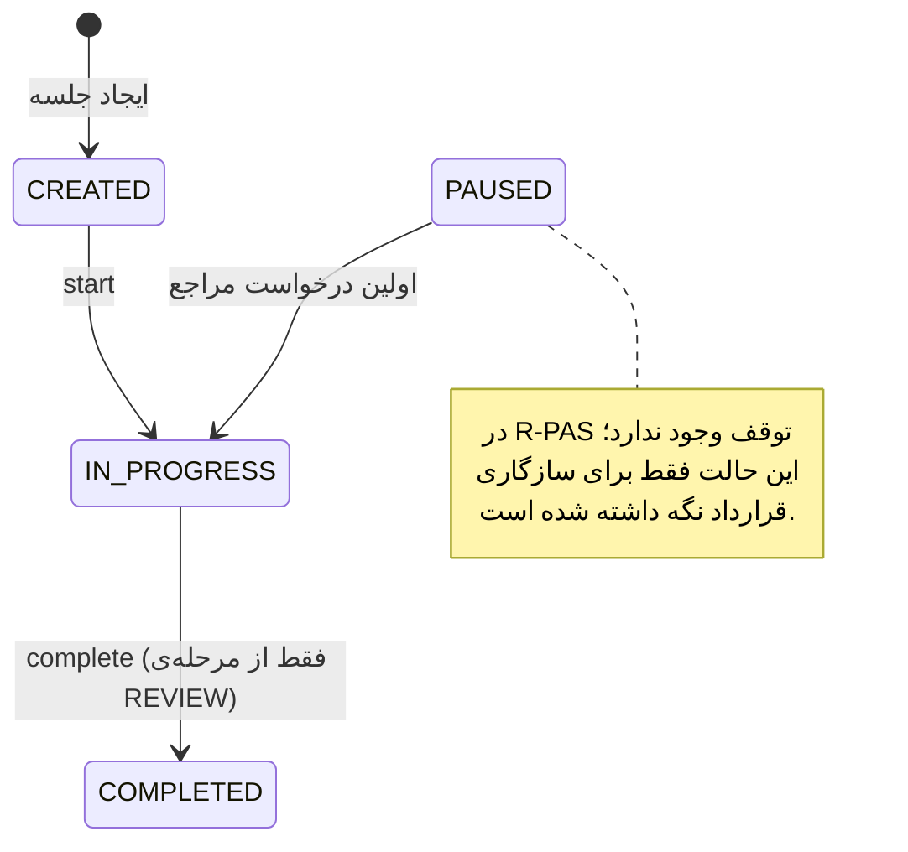

# ۰۱ — نیازمندی‌ها

> این سند نسخه‌ی **تطبیق‌داده‌شده با کد** است: هر قاعده و نیازمندی، ستون «کجا اعمال
> می‌شود» دارد. ماتریس کامل نیازمندی ← کد ← تست در [[13-traceability]].

## ۱. Actorها

| Actor | شرح | کد نقش |
|---|---|---|
| مراجع | آزمون را اجرا می‌کند | `PATIENT` |
| روان‌شناس | پس از تأیید ادمین، مراجعان مرتبط و پروتکل آن‌ها را می‌بیند و کدگذاری می‌کند | `PSYCHOLOGIST` |
| مدیر | تأیید روان‌شناس، پیکربندی آزمون، مدیریت کاربران، اطلاعیه، ممیزی | `ADMIN` |
| بازدیدکننده | صفحه‌ی نخست و اطلاعیه‌های عمومی را می‌بیند | — (بدون احراز هویت) |

هویت (`User`) کوچک نگه داشته می‌شود و اطلاعات هر نقش در پروفایل جداگانه است تا
احراز هویت با پروفایل دامنه قاطی نشود.

## ۲. Use Caseها

| گروه | موارد | وضعیت |
|---|---|---|
| هویت | ثبت‌نام مراجع/روان‌شناس، ورود، خروج، تمدید نشست، ویرایش پروفایل | ✅ |
| تأیید | بارگذاری مدارک روان‌شناس، تصمیم ادمین (تأیید/رد/تعلیق) | ✅ |
| رابطه | جست‌وجوی روان‌شناس، ارسال درخواست، تأیید، رد، لغو، فهرست مراجعان | ✅ |
| آزمون — مراجع | ایجاد جلسه، شروع، ثبت پاسخ، کارت بعد، روشن‌سازی، تکمیل، ثبت رویداد اجرا | ✅ |
| آزمون — روان‌شناس | مشاهده‌ی پروتکل کامل، کدگذاری هر پاسخ، محاسبه‌ی مجدد تحلیل | ✅ |
| ارتباط | فهرست گفت‌وگوها، پیام‌ها، ارسال پیام، رویدادهای بلادرنگ، خوانده‌شدن، حضور | ✅ |
| اطلاعیه | مشاهده‌ی اطلاعیه‌ی عمومی سایت | ✅ |
| مدیریت | کاربران، فعال/غیرفعال، تأیید روان‌شناس، روابط، جلسات، نسخه‌ی آزمون (clone/انتشار/ویرایش کارت)، اطلاعیه، رسانه، ممیزی | ✅ |
| اعلان شخصی | — | ⛔ حذف‌شده از محصول (D-04) |
| گزارش نهایی آزمون | — | ◐ مدل هست، تولیدکننده ندارد |

## ۳. قواعد کسب‌وکار

| کد | قاعده | کجا اعمال می‌شود |
|---|---|---|
| BR-01 | تأیید روان‌شناس **اجباری** و در اختیار ادمین است | `administration/views.py::VerifyView` · `common/permissions.py::IsApprovedPsychologist` |
| BR-02 | مجوز بر پایه‌ی رابطه است؛ دسترسی فقط در حالت `ACTIVE` | `assessments/permissions.py::readable_session` · `assessments/selectors.py::sessions_for` |
| BR-03 | یکتایی `email` و زوج `(patient, psychologist)` در سطح دیتابیس | `users_email_ci_unique` · `unique_patient_psychologist` |
| BR-04 | هر جلسه `test_version_id` دارد؛ نسخه‌ی منتشرشده تغییرناپذیر است | `assessments/models.py` · `administration/views.py::CardUpdateView` |
| BR-05 | Backend مرجع تعیین گام جاری است | `assessments/state.py::build_state` |
| BR-06 | پاسخ پس از ثبت بازنویسی نمی‌شود | `services.py::clarify` · `save_coding` (ستون‌های جدا) |
| BR-07 | ثبت پاسخ idempotent است | `unique_assessment_client_response` + بررسی پیش از درج |
| BR-08 | `COMPLETED` ترمینال است؛ تکرار، دو تحلیل نمی‌سازد | `services.py::complete` با `select_for_update` و `get_or_create` |
| BR-09 | تکمیل اتمیک است و کارهای بعدی پس از commit اجرا می‌شوند | `transaction.atomic` + `transaction.on_commit` در `tasks.py` |
| BR-10 | آزمون و چت/اطلاع‌رسانی در یک تراکنش نیستند | `enqueue_analysis` بیرون از بلاک تراکنش |
| BR-11 | سرور مرجع نهایی زمان است؛ زمان کلاینت فقط اندازه‌گیری کمکی | `server_started_at` / `server_submitted_at` در `submit_response` |
| BR-12 | جلسه‌ی تاریخی با لغو رابطه بی‌صاحب نمی‌شود | `on_delete=PROTECT` روی سه کلید خارجی جلسه |
| BR-13 | پیش‌فرض: رابطه‌ی فعال ← دسترسی جاری | `has_active_link()` در بررسی دسترسی روان‌شناس |
| BR-14 | داده‌ی خام/کدگذاری‌شده فقط برای روان‌شناس | `SessionDetailFullView` با `IsPsychologistOrAdmin` |
| BR-15 | تصویر در دیتابیس ذخیره نمی‌شود؛ فقط متادیتا | `media/models.py::MediaAsset` · `catalog.AssessmentCard.image_asset` |
| BR-16 | پیام‌ها به‌صورت آرایه داخل گفت‌وگو ذخیره نمی‌شوند | جدول `messages` با کلید خارجی |
| BR-17 | پارامترهای رورشاخ بدون منبع hard-code نمی‌شوند | `assessments/rpas/codes.py` — جداول دارای حق نشر جاسازی نشده‌اند |
| BR-18 | سیستم ادعای تشخیص ندارد | دو هشدار اجباری در خروجی `compute_rpas` |

## ۴. جریان‌های کاربری

**ثبت‌نام:** صفحه‌ی نخست ← ثبت‌نام ← انتخاب نقش ← (روان‌شناس: بارگذاری مدارک ← انتظار تأیید)

**مراجع:**

**روان‌شناس:** داشبورد ← درخواست‌های ارتباط ← مراجعان ← پرونده‌ی مراجع ←
جزئیات آزمون (پاسخ‌های خام، اندازه‌گیری‌ها، کدگذاری، متغیرها، تفسیر غیرقطعی)

**مدیر:** کاربران · روان‌شناسان · روابط · جلسات آزمون · نسخه‌های آزمون · اطلاعیه ·
رسانه · رویدادهای ممیزی

## ۵. جریان آزمون

ساختار منطقی: تعریف آزمون ← نسخه ← مرحله ← کارت.

جریان اجرا: ایجاد جلسه ← `start` ← برای هر کارت، ثبت یک یا چند پاسخ و سپس `next` ←
پس از کارت دهم، مرحله‌ی روشن‌سازی روی **پاسخ‌ها** ← مرور ← `complete`.

نکات اجرایی که نیازمندی محسوب می‌شوند:

- **حداقل دو پاسخ** — اگر روی کارتی فقط یک پاسخ ثبت شده باشد، اولین «کارت بعدی»
  پیشروی نمی‌کند و یک بار متن یادآوری استاندارد نمایش داده می‌شود (Pr).
- **بدون سقف پاسخ** — قاعده‌ی «برداشتن کارت» (Pu) غیرفعال است؛ `max_responses = null`.
- **پیش‌نویس** — متن تایپ‌شده‌ی ثبت‌نشده در `localStorage` نگه داشته می‌شود؛ ذخیره‌ی
  میانی روی سرور انجام نمی‌شود، چون ثبت پاسخ خودش یک رویداد گسسته است.
- **زمان‌سنجی** — `server_started_at`، `server_submitted_at`، `duration_ms` از سرور؛
  `client_started_at`، `client_submitted_at` و `reaction_time_ms` از کلاینت به‌عنوان
  اندازه‌گیری کمکی.
- **قطع شدن** — کاربر روی کارت ۴ مرورگر را می‌بندد؛ پس از ورود مجدد، `GET .../state/`
  دقیقاً همان مرحله/کارت را برمی‌گرداند و شمارنده‌ی وقفه در پرونده ثبت می‌شود.
- **پس از تکمیل** — ساخت تحلیل به‌صورت غیرهمزمان و پس از commit.

جزئیات کامل قواعد R-PAS در [[10-assessment-rpas]].

## ۶. مجوزها

احراز هویت فقط هویت را تعیین می‌کند؛ مجوز جداگانه و **پیش از اجرای منطق view** بررسی
می‌شود، و برای منابع حساس، بررسی در سطح شیء انجام می‌گیرد — نه صرفاً
«کاربر وارد شده است».

| منبع | مراجع | روان‌شناس | مدیر |
|---|---|---|---|
| پروفایل خود | خواندن / نوشتن | خواندن / نوشتن | خواندن / نوشتن |
| فهرست روان‌شناسان تأییدشده | خواندن (+ وضعیت رابطه‌ی خودش) | خواندن | خواندن |
| رابطه | ایجاد، لغو | تأیید، رد، لغو | خواندن همه |
| پرونده‌ی مراجع (`/patients/{id}/`) | — | فقط با رابطه‌ی `ACTIVE` | — |
| جلسه‌ی آزمون (فهرست) | جلسات خودش | جلسات مراجعانِ **فعلاً مرتبط** | همه |
| اجرای جلسه (`start` … `complete`) | فقط مالک | — | — |
| پروتکل کامل (`/detail/`) | ⛔ | با رابطه‌ی `ACTIVE` | خواندن |
| کدگذاری پاسخ | ⛔ | فقط روان‌شناسِ همان جلسه | ⛔ |
| محاسبه‌ی تحلیل | ⛔ | با رابطه‌ی `ACTIVE` | بله |
| گفت‌وگو و پیام | فقط گفت‌وگوهای خودش | فقط گفت‌وگوهای خودش | مثل بقیه |
| اطلاعیه‌ی عمومی | خواندن (بدون نیاز به ورود) | خواندن | مدیریت کامل |
| تعریف/نسخه‌ی آزمون | ⛔ | ⛔ | مدیریت کامل |
| رویدادهای ممیزی | ⛔ | ⛔ | خواندن |

نکته‌ی مهم درباره‌ی سطر «جلسات مراجعانِ فعلاً مرتبط»: پس از `REVOKED` شدن رابطه،
جلسه‌های قدیمی از فهرست روان‌شناس **حذف می‌شوند** ولی در دیتابیس باقی می‌مانند
(BR-12 در برابر BR-13).

## ۷. حالت‌ها

| موضوع | حالت‌ها |
|---|---|
| تأیید روان‌شناس | `REGISTERED` · `PENDING_VERIFICATION` · `APPROVED` · `REJECTED` · `SUSPENDED` |
| رابطه | `PENDING` · `ACTIVE` · `REJECTED` · `REVOKED` |
| جلسه (`status`) | `CREATED` · `IN_PROGRESS` · `PAUSED` · `COMPLETED` · `ABANDONED` · `CANCELLED` |
| مرحله‌ی اجرا (`stage`، محاسبه‌شده) | `INTRO` · `RESPONSE` · `CLARIFICATION` · `REVIEW` · `COMPLETED` |
| تحلیل | `PENDING` · `PROCESSING` · `DONE` · `FAILED` |

حالت‌های `ABANDONED` و `CANCELLED` در مدل تعریف شده‌اند ولی هیچ مسیری در API آن‌ها را
تولید نمی‌کند؛ برای سیاست آینده‌ی «رها کردن جلسه» رزرو شده‌اند.

## ۸. موارد خطا و رفتار مورد انتظار

این‌ها هم نیازمندی‌اند و هم مورد تست ([[12-testing-and-quality]]):

| مورد | رفتار پیاده‌شده |
|---|---|
| تازه‌سازی یا بستن مرورگر | بازگشت به همان مرحله/کارت/گام از `GET .../state/` |
| ارسال تکراری پاسخ | همان پاسخ قبلی برمی‌گردد؛ رکورد دوم ساخته نمی‌شود |
| دو ارسال هم‌زمان با یک کلید | قید یکتایی دیتابیس، بازنده رکورد برنده را می‌خواند |
| پاسخ خالی | `400` با پیام «متن پاسخ خالی است.» |
| چند پاسخ روی یک کارت | مجاز و بدون سقف |
| رد شدن از کارت بدون پاسخ | `400` — حداقل یک پاسخ لازم است |
| کارت عوض‌شده در درخواست | `409` — «کارت فعلی تغییر کرده است» |
| روشن‌سازی بدون محل | `400` — یا «کل تصویر» یا حداقل یک نشانه |
| روشن‌سازی بدون دلیل و بدون توضیح | `400` |
| روشن‌سازی تکراری | بی‌اثر و idempotent |
| تکمیل پیش از مرحله‌ی مرور | `409` |
| تکمیل دوباره | بی‌اثر؛ همان وضعیت برمی‌گردد |
| دسترسی روان‌شناس نامرتبط | `403` |
| دسترسی با رابطه‌ی لغوشده | `403` |
| کدگذاری پیش از تکمیل آزمون | `409` |
| کدگذاری توسط روان‌شناس دیگر | `403` |
| نشست منقضی | `401` با پیام عمومی؛ کلاینت یک بار تمدید می‌کند و بعد خارج می‌شود |
| قطعی شبکه | سه تلاش مجدد با فاصله‌ی پلکانی در کلاینت؛ کلید idempotency ایمن نگه‌شان می‌دارد |
| در دسترس نبودن Redis | محدودکننده‌ی نرخ **باز** می‌شود و رویداد در لاگ امنیتی ثبت می‌گردد |
| خاموش بودن Celery | تحلیل در همان درخواستِ خواندن محاسبه می‌شود تا در `PENDING` گیر نکند |

## ۹. نیازمندی‌های کارکردی

| کد | نیازمندی | وضعیت |
|---|---|---|
| FR-01 | ثبت‌نام و ورود با نقش؛ هویت در `User` و اطلاعات نقش در پروفایل | ✅ |
| FR-02 | فرایند تأیید روان‌شناس با بارگذاری مدارک و تصمیم ادمین | ✅ |
| FR-03 | جست‌وجو، درخواست، تأیید، رد و لغو رابطه | ✅ |
| FR-04 | تعریف آزمون به‌صورت تعریف ← نسخه ← مرحله ← کارت با `configuration` JSON | ✅ |
| FR-05 | اجرای باحالت آزمون؛ تعیین وضعیت از سمت Backend | ✅ |
| FR-06 | ثبت پاسخ با ترتیب، متن، زمان‌ها و اندازه‌گیری‌ها | ✅ |
| FR-07 | ثبت idempotent پاسخ‌ها | ✅ — پیش‌نویس فقط سمت کلاینت |
| FR-08 | ادامه‌ی آزمون پس از بستن مرورگر یا قطعی | ✅ |
| FR-09 | تکمیل اتمیک و انتشار رویدادها پس از commit | ✅ |
| FR-10 | تفکیک داده‌ی خام، اندازه‌گیری، کدگذاری و تفسیر | ✅ |
| FR-11 | تولید تحلیل نسخه‌دار (`algorithm_version`) | ✅ — ◐ گزارش نهایی: فقط مدل |
| FR-12 | نمایش پاسخ‌های خام، اندازه‌گیری‌ها، متغیرها و تفسیر به روان‌شناس | ✅ |
| FR-13 | چت با REST + WebSocket (پیام تازه، در حال تایپ، خوانده‌شدن، حضور) | ✅ |
| FR-14 | تفکیک اعلان شخصی از اطلاعیه‌ی عمومی | ◐ — فقط اطلاعیه‌ی عمومی پیاده شد (D-04) |
| FR-15 | نگهداری فایل در Object Storage و متادیتا در `MediaAsset` | ◐ — مدل و تنظیمات هست؛ بارگذاری آواتار اندپوینت ندارد |
| FR-16 | پنل ادمین برای کاربران، روان‌شناسان، روابط، آزمون‌ها، اطلاعیه، رسانه و ممیزی | ✅ |
| FR-17 | ثبت رویدادهای حساس در جدول ممیزی | ✅ — ۱۸ نوع رویداد |
| FR-18 | نسخه‌بندی API زیر `/api/v1/` | ✅ |
| FR-19 | پیشنهاد واژه‌های محتوا در پاسخ‌های دور اول به کمک هوش مصنوعی | ✅ — API و خط فرمان؛ ⛔ رابط کاربری ([[14-ai-content-words]]) |

## ۱۰. نیازمندی‌های غیرکارکردی

| دسته | نیازمندی | وضعیت |
|---|---|---|
| امنیت | مجوز در سطح شیء، اعتبارسنجی ورودی، CORS، محدودسازی نرخ، ممیزی | ✅ |
| امنیت | HTTPS، HSTS، کوکی `Secure` | ◐ — تنظیمات production آماده، ⛔ استقرار TLS انجام نشده |
| احراز هویت | توکن دسترسی کوتاه‌عمر (۱۵ دقیقه) + تمدید امن (۱۴ روز) با چرخش و ابطال | ✅ |
| احراز هویت | توکن دسترسی فقط در حافظه؛ توکن تمدید در کوکی `HttpOnly` | ✅ |
| یکپارچگی داده | قیدهای یکتایی و کلید خارجی در سطح دیتابیس | ✅ — ۷ قید یکتایی |
| کارایی | ایندکس روی فیلدهای پرکاربرد؛ حذف کوئری N+1 با `select_related` و annotate | ✅ |
| کارایی | ایندکس روی JSONB | ⛔ — تا مشخص شدن الگوی کوئری زده نشده |
| قابلیت اطمینان | اتمیک بودن تکمیل، idempotency، مقاومت در برابر قطعی شبکه | ✅ |
| مشاهده‌پذیری | تفکیک لاگ برنامه / ممیزی / امنیت | ✅ — سه logger مجزا |
| مشاهده‌پذیری | مانیتورینگ و هشدار | ⛔ |
| مقیاس‌پذیری | مونولیت ماژولار با امکان جداسازی دامنه؛ چند worker در production | ◐ |
| قابلیت حمل | Docker و تفکیک محیط توسعه/تست/production؛ اسرار بیرون از مخزن | ✅ |
| نگهداشت‌پذیری | لایه‌بندی `View → Serializer → Service → Model` و selector برای خواندن | ✅ |
| آزمون‌پذیری | تست واحد، سرویس، API، مجوز، ماشین حالت و مسیر بحرانی end-to-end | ✅ — ۱۴۷ تست |
| تجربه‌ی کاربری | آزمون در حالت تمرکز؛ داشبورد با ناوبری معمولی و Dock در موبایل | ✅ |
| بومی‌سازی | فارسی، RTL، تاریخ شمسی، ارقام فارسی، منطقه‌ی زمانی تهران | ✅ |
| دسترس‌پذیری | برچسب‌گذاری فرم‌ها و ناوبری با صفحه‌کلید | ◐ — بازبینی کامل انجام نشده |

## ۱۱. موارد باز

| مورد | وضعیت فعلی |
|---|---|
| سیاست دسترسی تاریخی پس از لغو رابطه (BR-13) | **حل شد** — دسترسی جاری قطع می‌شود، داده حذف نمی‌شود |
| ساختار پارامترهای رورشاخ (BR-17) | **حل شد** — R-PAS انتخاب شد؛ کدها در `rpas/codes.py` و کدگذاری در JSON روی پاسخ |
| نمایش تفسیر به مراجع | **حل شد** — نمایش داده نمی‌شود (BR-14) |
| تطبیق وزن‌ها و آستانه‌های R-PAS با منبع رسمی | باز — [[10-assessment-rpas]] §۸ |
| قالب گزارش نهایی آزمون | باز — تا تعیین قالب، خروجی `report` همیشه `null` است |
| امکان «رد کردن کارت» بدون پاسخ | باز — فعلاً مجاز نیست |
