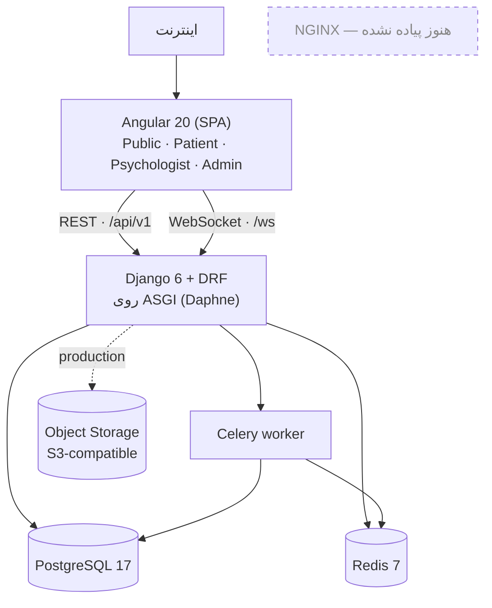
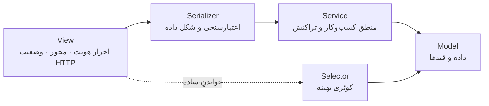
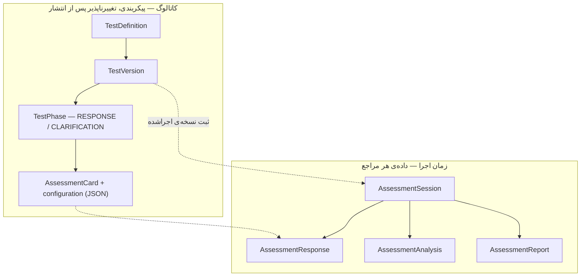
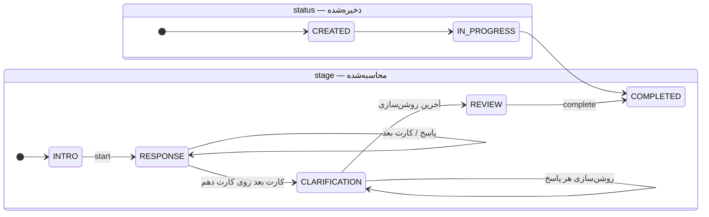
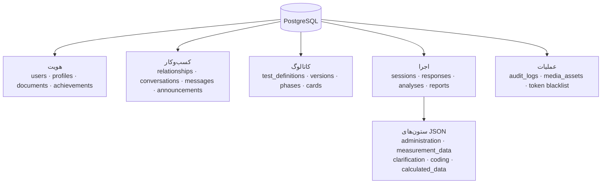
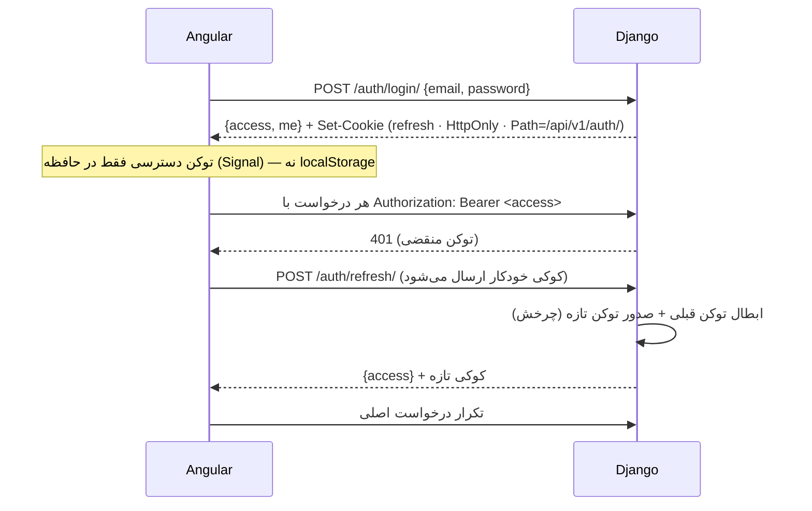
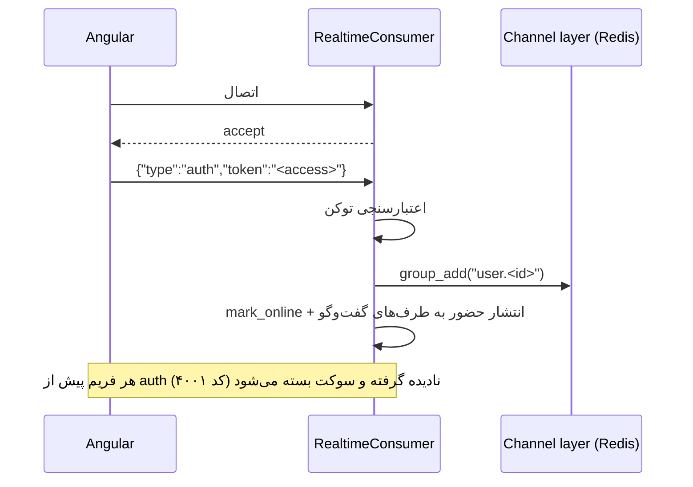
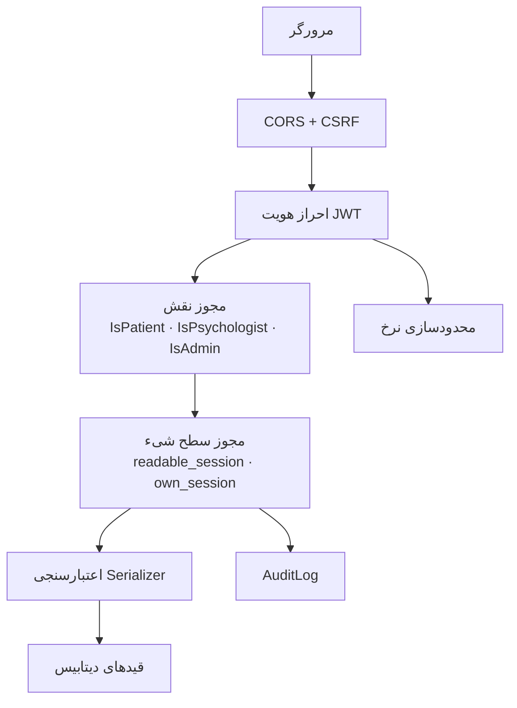

# ۰۲ — معماری سیستم

> جزئیات مدل داده در [[03-data-model-er]]، قرارداد اندپوینت‌ها در [[04-api-design]]،
> ساختار کد در [[06-development-guide]] و استقرار در [[07-deployment-operations]].

## ۱. معماری سیستم



در توسعه، سرور توسعه‌ی Angular روی `:4200` اجرا می‌شود و `/api` و `/ws` را با
`proxy.conf.json` به `127.0.0.1:8000` پروکسی می‌کند؛ بنابراین از دید مرورگر همه‌چیز
هم‌ریشه است و کوکی `HttpOnly` بدون دردسر cross-site کار می‌کند.

سبک معماری **Modular Monolith** است. در مقیاس این پروژه، microservice فقط هزینه‌ی
شبکه و سازگاری داده را اضافه می‌کرد بی‌آنکه منفعتی بدهد؛ در عوض مرزهای دامنه چنان تیز
کشیده شده‌اند که جدا کردن بعدی یک دامنه، جابه‌جایی یک پوشه باشد نه بازنویسی.

## ۲. مدل دامنه

| Bounded Context | اپ | محتوا |
|---|---|---|
| Identity & Access | `accounts` | `User`، توکن، نقش |
| Patient / Psychologist | `profiles` | دو پروفایل، مدارک تأیید، افتخارات |
| Relationship | `relationships` | `Relationship` — مبنای مجوز دسترسی |
| Test Catalog | `catalog` | تعریف، نسخه، مرحله، کارت |
| Assessment | `assessments` | جلسه، پاسخ، تحلیل، گزارش، موتور R-PAS |
| Communication | `messaging` | گفت‌وگو، شرکت‌کننده، پیام، مصرف‌کننده‌ی WebSocket |
| Notification | `notifications` | اطلاعیه‌ی عمومی |
| Media | `media` | `MediaAsset` |
| Audit | `audit` | `AuditLog` و میان‌افزار زمینه‌ی درخواست |
| Administration | `administration` | پنل ادمین (بدون مدل اختصاصی) |

قاعده‌ی وابستگی: هر اپ می‌تواند به اپ‌های «پایین‌تر» وابسته باشد
(`assessments` ← `catalog`, `relationships`, `profiles`, `accounts`)، اما اپ پایین‌تر
هرگز اپ بالاتر را `import` نمی‌کند. دو استثنا با `import` تأخیری داخل تابع حل شده‌اند
تا حلقه‌ی وابستگی ایجاد نشود (`services.py` ← `tasks.py` و `consumers.py` ← `selectors`).

## ۳. لایه‌بندی Backend



قواعدی که در سراسر کد رعایت شده‌اند:

- منطق کسب‌وکار در view نوشته نمی‌شود. کل ماشین حالت آزمون در
  `apps/assessments/services.py` است و viewها فقط اعتبارسنجی و واگذاری می‌کنند.
- کوئری‌های خواندنی پیچیده در `selectors.py` هر اپ‌اند، نه داخل serializer.
- اجرای آزمون عمداً `ModelViewSet` **نیست**: یک ماشین حالت است که به‌صورت
  actionهای صریح بیرون داده می‌شود (`start`، `responses`، `next`، `clarifications`،
  `complete`، `events`).
- سرویس‌ها آرگومان `request` نمی‌گیرند. زمینه‌ی HTTP (IP و User-Agent) که برای ممیزی
  لازم است، از طریق یک `ContextVar` در میان‌افزار `apps/audit/middleware.py` منتقل
  می‌شود تا نگرانی HTTP به لایه‌ی دامنه نشت نکند.

## ۴. معماری آزمون

### کاتالوگ در برابر زمان اجرا



پیکربندی هر کارت به‌جای ده‌ها ستون nullable در یک `configuration` از نوع JSON نشسته
است، چون ممکن است کارت ۱ پارامتری داشته باشد که کارت ۷ ندارد:

```json
{
  "required": true,
  "min_responses": 2,
  "max_responses": null,
  "allow_rotation": true,
  "allowed_responses": [],
  "metadata": { "roman": "I" }
}
```

### ماشین حالت

دو سطح، که نباید با هم اشتباه شوند:



تابع `build_state()` در `apps/assessments/state.py` در هر درخواست یک شیء `RunState`
می‌سازد:

| فیلد | معنی |
|---|---|
| `stage` | مرحله‌ی محاسبه‌شده |
| `card` · `card_index` · `total_cards` | کارت جاری و جایگاهش |
| `card_responses` | پاسخ‌های ثبت‌شده روی همین کارت |
| `prompted` · `pulled` | آیا یادآوری داده شده / سقف پاسخ پر شده |
| `target` · `clarification_index` · `clarification_total` | پاسخِ در حال روشن‌سازی |
| `min_responses` · `max_responses` | از `configuration` کارت |

چون `stage` مشتق است و ذخیره نمی‌شود، هیچ‌گاه «حالت ذخیره‌شده‌ی خراب» پدید نمی‌آید:
تنها منبع حقیقت، چند ستون ساده و شمارش پاسخ‌هاست.

### تراکنش و idempotency

ثبت پاسخ:

```
if existing(client_response_id): return existing          ← مسیر سریع
try: INSERT
except IntegrityError: return existing                    ← مسابقه‌ی دو تلاش هم‌زمان
```

تکمیل آزمون:

```
BEGIN
    SELECT ... FOR UPDATE                 ← قفل جلسه
    if status == COMPLETED: return        ← ترمینال بودن (BR-08)
    require stage == REVIEW
    status ← COMPLETED
    AssessmentAnalysis(status=PENDING)    ← get_or_create
    AuditLog(PATIENT_COMPLETED_ASSESSMENT)
COMMIT
→ transaction.on_commit → صف Celery       ← بیرون از تراکنش (BR-09، BR-10)
```

اگر کارگزار صف در دسترس نباشد، تابع `enqueue_analysis` همان‌جا و درجا محاسبه می‌کند و
هشدار می‌دهد؛ این مسیر برای ماشین توسعه‌دهنده است، نه production. علاوه بر آن،
`ensure_analysis()` هنگام خواندن پروتکل، تحلیلِ در `PENDING` مانده را محاسبه می‌کند تا
روان‌شناس هرگز به صفحه‌ی خالی نرسد.

## ۵. معماری داده



قاعده: موجودیت پایدار ← جدول رابطه‌ای؛ داده‌ی پویا/نسخه‌دار ← JSON.
در عمل شش ستون JSON داریم و هر شش‌تا دلیل روشن دارند:

| ستون | چرا JSON |
|---|---|
| `test_cards.configuration` | پارامترهای هر کارت متفاوت و نسخه‌پذیرند |
| `assessment_sessions.administration` | شمارنده‌های اجرایی R-PAS که ممکن است رشد کنند |
| `assessment_responses.measurement_data` | اندازه‌گیری‌ها ممکن است با نسخه‌ی آزمون عوض شوند |
| `assessment_responses.clarification` | ساختار تودرتو با آرایه‌ی مختصات |
| `assessment_responses.coding` | مجموعه‌ی کدها سیستم‌وابسته است (R-PAS در برابر Exner) |
| `assessment_analyses.calculated_data` | خروجی الگوریتم نسخه‌دار؛ شکلش با `algorithm_version` عوض می‌شود |

Redis **دیتابیس اصلی نیست**. سه کار می‌کند: cache و شمارنده‌ی محدودسازی نرخ،
لایه‌ی کانال برای WebSocket، و کارگزار صف Celery. فایل‌ها هم در دیتابیس ذخیره
نمی‌شوند: فقط متادیتا در `media_assets` و خود فایل روی سیستم‌فایل (توسعه) یا
Object Storage (production).

## ۶. معماری API

- **نسخه‌بندی:** همه‌چیز زیر `/api/v1/`؛ تنها استثنا `/health/` است که زیرساخت است
  نه بخشی از قرارداد.
- **قالب یکسان خطا:** هر شکست با همین شکل برمی‌گردد و کلاینت هم دقیقاً همین را
  انتظار دارد:

  ```json
  { "detail": "پیام برای کاربر", "code": "invalid", "errors": { "email": ["..."] } }
  ```

  این کار در `common/exceptions.py::api_exception_handler` انجام می‌شود. بدنه‌ی
  پیش‌فرض DRF برای خطای اعتبارسنجی یک دیکشنری لخت `{field: [...]}` است که کلاینت
  نمی‌تواند پیام بنر از آن بسازد؛ پس بسته‌بندی می‌شود. پیام‌های انگلیسی کتابخانه‌ها
  نیز با معادل فارسی جایگزین می‌شوند.
- **صفحه‌بندی موضعی، نه سراسری:** بیشتر فهرست‌ها آرایه‌ی ساده برمی‌گردانند و فقط سه
  اندپوینت صفحه‌بندی دارند (`/psychologists/` با ۱۲، `/admin/users/` با ۲۰،
  `/admin/audit-logs/` با ۲۵). دلیلش این است که کامپوننت صفحه‌بندی فرانت‌اند شمارش
  صفحه را از `count / pageSize` می‌سازد و تغییر این اعداد بی‌صدا خرابش می‌کند.
- **محدودسازی نرخ:** دو دامنه — `auth` با ۲۰ درخواست در دقیقه و `write` با ۱۲۰.
  محدودکننده **fail-open** است: اگر Redis نباشد، درخواست رد نمی‌شود بلکه در لاگ
  امنیتی ثبت می‌گردد. در دسترس نبودن cache یک مسئله‌ی دسترس‌پذیری است، نه مجوز.
- **مستندسازی:** `drf-spectacular` شمای OpenAPI 3 را از خود کد می‌سازد
  (`/api/schema/`) و Swagger UI را روی `/api/docs/` سرو می‌کند.

## ۷. معماری احراز هویت



| تصمیم | دلیل |
|---|---|
| توکن دسترسی در بدنه و فقط در حافظه | در دسترس XSS از طریق `localStorage` قرار نمی‌گیرد |
| توکن تمدید در کوکی `HttpOnly` | جاوااسکریپت هرگز آن را نمی‌بیند |
| `Path=/api/v1/auth/` | کوکی فقط به اندپوینت‌های احراز هویت فرستاده می‌شود |
| چرخش + لیست سیاه | یک توکن تمدید فقط یک بار مصرف می‌شود؛ سرقتِ بازپخش‌شده بی‌اثر است |
| عمر ۱۵ دقیقه / ۱۴ روز | تعادل میان امنیت و تعداد دفعات تمدید |
| `SameSite=Lax` و `Secure` | در production؛ در توسعه `Secure=False` چون HTTP ساده است |
| ۴۰۱ همیشه با پیام عمومی | پیام داخلی کتابخانه برای کاربر بی‌معنی است و کلاینت ۴۰۱ را ساختاری مدیریت می‌کند |

مدیریت نشست به `token_blacklist` خود SimpleJWT سپرده شده است؛ جدول `user_sessions`
سند طراحی ساخته نشد (D-03).

## ۸. معماری بلادرنگ

یک اندپوینت: `/ws/`.



**چرا توکن در اولین فریم و نه در URL؟** چون آدرس URL در لاگ پروکسی و سرور می‌نشیند؛
توکن دسترسی نباید آن‌جا بماند.

هر کاربر یک گروه کانال دارد (`user.<id>`). نوشتن از راه REST انجام می‌شود و سوکت فقط
خبر می‌دهد — این تفکیک باعث می‌شود قواعد مجوز فقط یک بار (در REST) نوشته شوند:

| رویداد | جهت |
|---|---|
| `message.new` | سرور ← گیرنده، پس از `POST /conversations/{id}/messages/` |
| `message.read` | سرور ← فرستنده، پس از `POST /conversations/{id}/read/` |
| `typing` | کلاینت ← سرور ← طرف مقابل |
| `presence` | سرور ← همه‌ی طرف‌های گفت‌وگو، هنگام اتصال/قطع |

حضور با کلید `presence:<user_id>` در Redis و TTL شصت ثانیه نگه داشته می‌شود؛ ارسال
رویداد «بهترین تلاش» است و هرگز باعث شکست درخواست REST نمی‌شود.

## ۹. معماری Frontend

Angular 20 با **Standalone Components**، **Signals** و `ChangeDetectionStrategy.OnPush`.

```
core/      auth · guards · interceptors · api · models · mock · rpas · services
shared/    ui · components · pipes · pages · utils
layouts/   public · dashboard · focus
features/  landing · auth · patient · psychologist · assessment · chat · profile · admin
```

قاعده‌ی سخت: **هیچ کامپوننتی مستقیماً `HttpClient` صدا نمی‌زند**؛ همه‌چیز از
`core/api/*` عبور می‌کند. این همان چیزی است که باعث شد جایگزینی Mock با Backend واقعی
به تغییر در کامپوننت‌ها نیاز نداشته باشد.

وضعیت اجرای آزمون در `AssessmentRunStore` نگهداری می‌شود، اما **آینه‌ی سرور است نه
منبع حقیقت**: هر عمل یک درخواست است و پاسخ سرور وضعیت محلی را جایگزین می‌کند.

رابط کاربری دو حالت دارد: داشبورد (هدر + سایدبار شیشه‌ای در دسکتاپ، Dock پایین در
موبایل) و **حالت تمرکز** برای اجرای آزمون — بدون سایدبار، بدون اعلان، بدون ناوبری
نامرتبط. جزئیات در [[08-frontend]].

## ۱۰. معماری امنیت



**مهم‌ترین قاعده:** هیچ اندپوینتی صرفاً با «کاربر وارد شده است» پاسخ نمی‌دهد. برای
هر جلسه‌ی آزمون، پرسش این است:

```
آیا این کاربر مالک جلسه است؟
یا روان‌شناسی است که رابطه‌ی ACTIVE دارد؟
یا ادمین است؟
```

تصمیم‌های امنیتی دیگر:

- **قیدهای سطح دیتابیس**، نه فقط بررسی در پایتون: یکتایی ایمیل به‌صورت
  حساس‌نبودن به بزرگی/کوچکی حروف، یکتایی زوج رابطه، و دو قید یکتایی روی پاسخ‌ها
  (idempotency و ترتیب پروتکل).
- **`PROTECT` روی کلیدهای خارجی جلسه** تا حذف یک پروفایل یا رابطه، پرونده‌ی آزمون را
  از بین نبرد (BR-12).
- **محدودیت بارگذاری مدارک**: حداکثر ۱۰ فایل، هر کدام ۱۰ مگابایت، فقط PDF/JPEG/PNG/WebP.
- **اعتبارسنجی رمز عبور**: حداقل ۸ کاراکتر به‌علاوه‌ی اعتبارسنج‌های Django
  (رمز پرتکرار، کاملاً عددی، شبیه به ایمیل).
- **UUID به‌عنوان کلید اصلی** در همه‌ی جدول‌های دامنه، تا شناسه‌های قابل‌حدس در URL
  نباشند.
- **کدگذاری نامعتبر رد نمی‌شود بلکه پاک‌سازی می‌شود**: `normalize_coding` کدهای ناشناخته
  را دور می‌ریزد، پس نسخه‌ی جلوتر فرانت‌اند هرگز ۴۰۰ نمی‌گیرد.

## ۱۱. مشاهده‌پذیری

سه لایه‌ی لاگ که هرگز با هم یکی نمی‌شوند:

| Logger | چه چیزی |
|---|---|
| `rorschach.app` | خطاهای برنامه، استثنای مدیریت‌نشده، در دسترس نبودن کارگزار صف |
| `rorschach.audit` | رویدادهای دامنه‌ای که در `audit_logs` هم ثبت می‌شوند |
| `rorschach.security` | ورود ناموفق، پاسخ ۴۰۱/۴۰۳، از کار افتادن محدودکننده‌ی نرخ |

جدول `audit_logs` علاوه بر actor و action، ایمیل actor را هم **غیرنرمال** نگه می‌دارد
تا پس از حذف حساب، ردیف ممیزی خوانا بماند.

## ۱۲. خلاصه‌ی تصمیمات معماری

| # | تصمیم | جایگزین رد شده | دلیل |
|---|---|---|---|
| ۱ | مونولیت ماژولار | میکروسرویس | مقیاس پروژه؛ پیچیدگی شبکه و سازگاری بی‌دلیل |
| ۲ | PostgreSQL + JSONB | MongoDB | نیاز هم‌زمان به تراکنش، قید یکتایی و انعطاف JSON |
| ۳ | موتور آزمون داده‌محور و نسخه‌پذیر | صفحات ثابت Angular | تغییر روش‌شناسی نباید هسته را بازنویسی کند |
| ۴ | مرحله‌ی اجرا محاسبه‌شده، نه ذخیره‌شده | ستون `stage` | حالت ذخیره‌شده‌ی ناسازگار ممکن نمی‌شود |
| ۵ | توکن تمدید در کوکی `HttpOnly` | ذخیره در `localStorage` | کاهش سطح حمله‌ی XSS |
| ۶ | احراز هویت WebSocket در اولین فریم | توکن در query string | توکن در لاگ پروکسی نمی‌نشیند |
| ۷ | تحلیل غیرهمزمان + محاسبه هنگام خواندن | فقط همزمان یا فقط صف | تکمیل آزمون منتظر نمی‌ماند و تحلیل هم گیر نمی‌کند |
| ۸ | محدودکننده‌ی نرخ fail-open | fail-closed | قطعی cache نباید ورود را غیرممکن کند |
| ۹ | صفحه‌بندی موضعی | صفحه‌بندی سراسری DRF | قرارداد موجود فرانت‌اند آرایه‌ی ساده انتظار دارد |
| ۱۰ | نام اپ `catalog` به‌جای `tests` | `apps/tests` | تداخل با کشف خودکار تست‌ها (D-01) |

## ۱۳. آنچه هنوز در معماری نیست

| مورد | وضعیت |
|---|---|
| NGINX به‌عنوان reverse proxy و سروکننده‌ی استاتیک | ⛔ |
| TLS و انتشار روی دامنه | ⛔ |
| توزیع بار و چند نمونه‌ی Django | ⛔ — تنظیمات آماده است (`SECURE_PROXY_SSL_HEADER`، Redis به‌عنوان channel layer) |
| مانیتورینگ و هشدار | ⛔ — `sentry-sdk` در وابستگی‌های production هست ولی راه‌اندازی نشده |
| پشتیبان‌گیری و بازیابی | ⛔ |
| ایندکس روی ستون‌های JSON | ⛔ — عمداً تا مشخص شدن الگوی کوئری |
