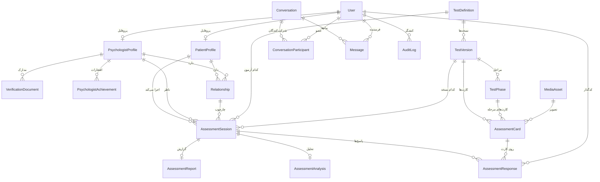
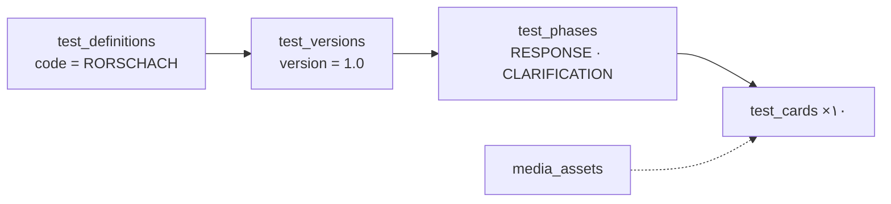

# ۰۳ — مدل داده و ERD

> این سند از روی مدل‌های واقعی Django تولید و بازبینی شده است. نام هر جدول همان
> `db_table` تعریف‌شده در کد است و هر ستون، نوع و قید دقیقاً مطابق مهاجرت‌هاست.

## ۱. ERD



نکته‌ی ظریف: کلید اصلی هر دو پروفایل، **همان شناسه‌ی کاربر** است
(`OneToOneField(primary_key=True)`). پس `relationship.patient_id` دقیقاً همان
`user_id` مراجع است و قرارداد API نیازی به دو شناسه‌ی جداگانه ندارد.

## ۲. فهرست جدول‌ها

| دامنه | جدول‌ها |
|---|---|
| هویت | `users` |
| پروفایل | `patient_profiles` · `psychologist_profiles` · `psychologist_verification_documents` · `psychologist_achievements` |
| رابطه | `patient_psychologist_relationships` |
| کاتالوگ | `test_definitions` · `test_versions` · `test_phases` · `test_cards` |
| رسانه | `media_assets` |
| اجرا | `assessment_sessions` · `assessment_responses` · `assessment_analyses` · `assessment_reports` |
| ارتباط | `conversations` · `conversation_participants` · `messages` |
| اطلاعیه | `site_announcements` |
| ممیزی | `audit_logs` |

جمعاً **۲۰ جدول دامنه‌ای**. علاوه بر این‌ها، جدول‌های خود Django
(`django_migrations`, `django_content_type`, `auth_permission`, `django_session`) و
دو جدول SimpleJWT (`token_blacklist_outstandingtoken`, `token_blacklist_blacklistedtoken`)
هم وجود دارند که ما تعریفشان نکرده‌ایم.

قرارداد مشترک همه‌ی جدول‌های دامنه: کلید اصلی از نوع **UUID** با مقدار پیش‌فرض
`uuid4` — تا شناسه‌ای که در URL جلوی چشم مراجع است قابل حدس زدن نباشد. تنها استثنا
`conversation_participants` است که جدول واسط ساده‌ای با `BigAutoField` است.

## ۳. هویت

### `users`

| ستون | نوع | قید و توضیح |
|---|---|---|
| `id` | UUID | کلید اصلی |
| `email` | varchar(254) | یکتا، ایندکس، **یکتای حساس‌نبودن به حروف** |
| `password` | varchar(128) | هش Django (PBKDF2) |
| `phone` | varchar(32) | nullable |
| `role` | varchar(20) | ایندکس · `PATIENT` \| `PSYCHOLOGIST` \| `ADMIN` |
| `is_active` | bool | پیش‌فرض `true` — ادمین می‌تواند حساب را ببندد |
| `is_verified` | bool | پیش‌فرض `false` — تأیید مالکیت ایمیل/تلفن؛ فعلاً جریان تأییدی ندارد |
| `is_staff` · `is_superuser` | bool | برای پنل داخلی Django |
| `last_login` | timestamptz | در API با نام قراردادی `last_login_at` سریالایز می‌شود |
| `created_at` | timestamptz | ایندکس |
| `updated_at` | timestamptz | — |

> چرا `Lower(email)` یکتا شده و نه فقط `unique=True`؟ چون `User@x.com` و `user@x.com`
> از دید کاربر یکی‌اند و یکتایی باید در سطح دیتابیس تضمین شود، نه در پایتون (BR-03).

### `patient_profiles`

| ستون | نوع | قید |
|---|---|---|
| `user_id` | UUID | **کلید اصلی** و کلید خارجی به `users` · `CASCADE` |
| `first_name` · `last_name` | varchar(80) | الزامی |
| `birth_date` | date | nullable |
| `gender` | varchar(10) | nullable · `MALE` \| `FEMALE` \| `OTHER` |
| `avatar` | varchar(100) | مسیر فایل، nullable |
| `bio` | text | پیش‌فرض `''` |
| `created_at` · `updated_at` | timestamptz | — |

### `psychologist_profiles`

| ستون | نوع | قید |
|---|---|---|
| `user_id` | UUID | **کلید اصلی** و کلید خارجی به `users` · `CASCADE` |
| `first_name` · `last_name` | varchar(80) | الزامی |
| `avatar` | varchar(100) | nullable |
| `bio` | text | پیش‌فرض `''` |
| `specialty` | varchar(160) | پیش‌فرض `''` |
| `professional_code` | varchar(64) | شماره‌ی نظام؛ پیش‌فرض `''` |
| `verification_status` | varchar(32) | ایندکس · پنج حالت · پیش‌فرض `REGISTERED` |
| `city` | varchar(80) | پیش‌فرض `''` |
| `years_of_experience` | smallint ≥ ۰ | پیش‌فرض ۰ |
| `verification_note` | text | یادداشت تصمیم ادمین |
| `verified_at` | timestamptz | nullable |
| `created_at` · `updated_at` | timestamptz | — |

### `psychologist_verification_documents`

| ستون | نوع | قید |
|---|---|---|
| `id` | UUID | کلید اصلی |
| `profile_id` | UUID | کلید خارجی به `psychologist_profiles` · `CASCADE` · ایندکس |
| `name` | varchar(255) | نام اصلی فایل |
| `file` | varchar(100) | مسیر فایل در فضای ذخیره‌سازی |
| `uploaded_at` | timestamptz | ترتیب پیش‌فرض |

### `psychologist_achievements`

| ستون | نوع | قید |
|---|---|---|
| `id` | UUID | کلید اصلی |
| `psychologist_id` | UUID | کلید خارجی به `psychologist_profiles` · `CASCADE` · ایندکس |
| `title` | varchar(200) | الزامی |
| `issuer` | varchar(200) | پیش‌فرض `''` |
| `year` | smallint ≥ ۰ | در نبود مقدار، سال جاری |
| `description` | text | پیش‌فرض `''` |
| `created_at` | timestamptz | ترتیب: `-year, title` |

## ۴. رابطه

### `patient_psychologist_relationships`

| ستون | نوع | قید |
|---|---|---|
| `id` | UUID | کلید اصلی |
| `patient_id` | UUID | کلید خارجی به `patient_profiles` · `CASCADE` · ایندکس |
| `psychologist_id` | UUID | کلید خارجی به `psychologist_profiles` · `CASCADE` · ایندکس |
| `status` | varchar(16) | ایندکس · `PENDING` \| `ACTIVE` \| `REJECTED` \| `REVOKED` · پیش‌فرض `PENDING` |
| `requested_at` | timestamptz | زمان آخرین درخواست |
| `approved_at` · `revoked_at` | timestamptz | nullable |
| `created_at` · `updated_at` | timestamptz | ترتیب: `-updated_at` |

**قید یکتایی `unique_patient_psychologist` روی `(patient_id, psychologist_id)`.**
نتیجه‌ی مهم این قید: درخواست دوباره پس از رد شدن، **همان ردیف** را دوباره به
`PENDING` برمی‌گرداند و ردیف دوم نمی‌سازد. این تصمیم تاریخچه‌ی رابطه را ساده نگه
می‌دارد به قیمت از دست رفتن سابقه‌ی رد قبلی — که در ممیزی ثبت شده است.

## ۵. کاتالوگ آزمون



### `test_definitions`

| ستون | نوع | قید |
|---|---|---|
| `id` | UUID | کلید اصلی |
| `code` | varchar(64) | **یکتا** — مثلاً `RORSCHACH` |
| `name` | varchar(200) | — |
| `description` | text | پیش‌فرض `''` |
| `status` | varchar(16) | `DRAFT` \| `ACTIVE` \| `ARCHIVED` · پیش‌فرض `DRAFT` |
| `coding_system` | varchar(32) | پیش‌فرض `R-PAS` — سیستم کدگذاری این آزمون |
| `methodology_reference` | varchar(255) | nullable — ارجاع روش‌شناسی |
| `source_document` | varchar(255) | nullable — سند مبنا |
| `created_at` | timestamptz | ترتیب: `code` |

ستون `coding_system` پاسخ صریح به این پرسش است که «این پروتکل با کدام سیستم کدگذاری
شده؟» — چون کدهای R-PAS و Exner قابل ترکیب نیستند ([[09-rorschach-analysis]] §۱۸).

### `test_versions`

| ستون | نوع | قید |
|---|---|---|
| `id` | UUID | کلید اصلی |
| `test_definition_id` | UUID | کلید خارجی · `CASCADE` · ایندکس |
| `version` | varchar(16) | مثل `1.0` و `1.1` |
| `is_published` | bool | پیش‌فرض `false` |
| `published_at` | timestamptz | nullable |
| `created_at` | timestamptz | ترتیب: `created_at` |

**قید یکتایی `unique_definition_version` روی `(test_definition_id, version)`.**
نسخه‌ی منتشرشده تغییرناپذیر است: ویرایش کارت‌های آن از سمت API رد می‌شود و راه
تغییر، `clone` کردن به یک پیش‌نویس تازه است.

### `test_phases`

| ستون | نوع | قید |
|---|---|---|
| `id` | UUID | کلید اصلی |
| `test_version_id` | UUID | کلید خارجی · `CASCADE` · ایندکس |
| `kind` | varchar(16) | `RESPONSE` \| `CLARIFICATION` |
| `name` · `description` | varchar(200) · text | متن نمایشی مرحله |
| `display_order` | smallint ≥ ۰ | پیش‌فرض ۱ · ترتیب پیش‌فرض |

**قید یکتایی `unique_version_phase_kind` روی `(test_version_id, kind)`** — هر نسخه
دقیقاً یک مرحله‌ی پاسخ و یک مرحله‌ی روشن‌سازی دارد.

> چرا مرحله «نوع» دارد و نه فقط «شماره»؟ چون مرحله‌ی روشن‌سازی در R-PAS روی
> **پاسخ‌ها** می‌چرخد، نه روی کارت‌ها؛ این تفاوت رفتاری است، نه ترتیبی.

### `test_cards`

| ستون | نوع | قید |
|---|---|---|
| `id` | UUID | کلید اصلی |
| `test_version_id` | UUID | کلید خارجی · `CASCADE` · ایندکس |
| `phase_id` | UUID | کلید خارجی به `test_phases` · `CASCADE` · ایندکس |
| `card_number` | smallint ≥ ۰ | ۱ تا ۱۰ |
| `title` | varchar(120) | مثل «کارت III» |
| `image_asset_id` | UUID | کلید خارجی به `media_assets` · `SET_NULL` · nullable |
| `image_path` | varchar(512) | مسیر نسبی جایگزین در توسعه |
| `display_order` | smallint ≥ ۰ | ترتیب نمایش |
| `configuration` | json | پیکربندی کارت (زیر) |

**قید یکتایی `unique_version_card_number` روی `(test_version_id, card_number)`.**

دو مسیر برای تصویر وجود دارد و هر کدام قاعده‌ی متفاوتی دارند: اگر `image_asset` پر
باشد، URL **مطلق** برگردانده می‌شود (فایل را Django یا Object Storage سرو می‌کند)؛ در
غیر این صورت `image_path` **نسبی** برمی‌گردد تا مرورگر آن را نسبت به دامنه‌ی
فرانت‌اند حل کند (D-10).

## ۶. رسانه

### `media_assets`

| ستون | نوع | قید |
|---|---|---|
| `id` | UUID | کلید اصلی |
| `storage_key` | varchar(512) | **یکتا** — مثل `tests/rorschach/v1/card-01.jpg` |
| `file` | varchar(100) | nullable — مسیر واقعی در فضای ذخیره‌سازی |
| `mime_type` | varchar(100) | — |
| `size` | bigint ≥ ۰ | پیش‌فرض ۰ |
| `checksum` | varchar(64) | SHA-256، پیش‌فرض `''` |
| `created_at` | timestamptz | ترتیب: `storage_key` |

تصویر رورشاخ در دیتابیس ذخیره نمی‌شود (BR-15)؛ فقط اشاره‌گر و checksum.

## ۷. اجرای آزمون

### `assessment_sessions`

| ستون | نوع | قید |
|---|---|---|
| `id` | UUID | کلید اصلی |
| `patient_id` | UUID | کلید خارجی به `patient_profiles` · **`PROTECT`** · ایندکس |
| `psychologist_id` | UUID | کلید خارجی به `psychologist_profiles` · **`PROTECT`** · ایندکس |
| `relationship_id` | UUID | کلید خارجی به رابطه · **`PROTECT`** |
| `test_definition_id` | UUID | کلید خارجی · **`PROTECT`** |
| `test_version_id` | UUID | کلید خارجی · **`PROTECT`** — نسخه‌ی اجراشده (BR-04) |
| `status` | varchar(16) | ایندکس · شش حالت · پیش‌فرض `CREATED` |
| `current_phase_id` | UUID | کلید خارجی به مرحله · `SET_NULL` · nullable |
| `current_card_id` | UUID | کلید خارجی به کارت · `SET_NULL` · nullable |
| `current_step` | int | nullable — در مرحله‌ی روشن‌سازی، اندیس پاسخِ در حال بررسی |
| `started_at` · `paused_at` · `completed_at` | timestamptz | nullable |
| `created_at` | timestamptz | ایندکس · ترتیب: `-created_at` |
| `updated_at` | timestamptz | — |
| `administration` | json | مشاهده‌های اجرایی (زیر) |

**ایندکس ترکیبی `(patient_id, status)`** — پرتکرارترین کوئری داشبورد مراجع
«آزمون بازِ من کدام است؟» دقیقاً همین است.

`PROTECT` روی پنج کلید خارجی، تضمین BR-12 است: حذف یک پروفایل یا رابطه در حالی که
پرونده‌ی آزمونی به آن وابسته است، در سطح دیتابیس شکست می‌خورد.

### `assessment_responses`

| ستون | نوع | قید |
|---|---|---|
| `id` | UUID | کلید اصلی |
| `assessment_id` | UUID | کلید خارجی به جلسه · `CASCADE` · ایندکس |
| `phase_id` | UUID | کلید خارجی به مرحله · `PROTECT` |
| `card_id` | UUID | کلید خارجی به کارت · `PROTECT` · ایندکس |
| `card_number` | smallint ≥ ۰ | غیرنرمال، برای خواندن سریع پروتکل |
| `client_response_id` | varchar(64) | کلید idempotency تولیدشده توسط کلاینت |
| `sequence` | int ≥ ۰ | شماره‌ی پاسخ در کل پروتکل (همان R) |
| `card_response_number` | smallint ≥ ۰ | چندمین پاسخ روی همین کارت |
| `response_text` | text | متن خام مراجع — **هرگز بازنویسی نمی‌شود** |
| `server_started_at` · `server_submitted_at` | timestamptz | مرجع زمانی (BR-11) |
| `client_started_at` · `client_submitted_at` | timestamptz | nullable — اندازه‌گیری کمکی |
| `duration_ms` | int ≥ ۰ | محاسبه‌شده از زمان سرور |
| `client_metadata` | json | پیش‌فرض `{}` — رزرو |
| `measurement_data` | json | اندازه‌گیری‌های اجرایی (زیر) |
| `clarification` | json | nullable — مرحله‌ی روشن‌سازی (زیر) |
| `coding` | json | nullable — کدگذاری R-PAS (زیر) |
| `coded_by_id` | UUID | کلید خارجی به `users` · `SET_NULL` · nullable |
| `coded_at` | timestamptz | nullable |
| `created_at` · `updated_at` | timestamptz | ترتیب: `sequence` |

دو قید یکتایی، هر دو در سطح دیتابیس:

| قید | روی | چرا |
|---|---|---|
| `unique_assessment_client_response` | `(assessment_id, client_response_id)` | idempotency ثبت پاسخ (BR-07) |
| `unique_assessment_sequence` | `(assessment_id, sequence)` | ترتیب پروتکل بدون سوراخ یا تکرار |

### `assessment_analyses`

| ستون | نوع | قید |
|---|---|---|
| `id` | UUID | کلید اصلی |
| `assessment_id` | UUID | **یک‌به‌یک** با جلسه · `CASCADE` |
| `algorithm_version` | varchar(32) | مثلاً `rpas-raw-0.1` |
| `status` | varchar(16) | `PENDING` \| `PROCESSING` \| `DONE` \| `FAILED` |
| `raw_analysis_data` | json | پیش‌فرض `{}` — رزرو برای ورودی خام الگوریتم |
| `calculated_data` | json | nullable — متغیرها، یافته‌ها و هشدارها |
| `generated_at` | timestamptz | nullable |
| `updated_at` | timestamptz | — |

نسخه‌دار بودن الگوریتم عمدی است: اگر وزنی یا آستانه‌ای عوض شود، تحلیل‌های قدیمی
همچنان قابل تفسیرند چون می‌دانیم با کدام نسخه محاسبه شده‌اند.

### `assessment_reports`

| ستون | نوع | قید |
|---|---|---|
| `id` | UUID | کلید اصلی |
| `assessment_id` | UUID | **یک‌به‌یک** با جلسه · `CASCADE` |
| `summary` | text | پیش‌فرض `''` |
| `structured_result` | json | پیش‌فرض `{}` |
| `generated_at` | timestamptz | — |
| `generated_by_id` | UUID | کلید خارجی به `users` · `SET_NULL` · nullable |
| `version` | smallint ≥ ۰ | پیش‌فرض ۱ |

> ◐ این جدول ساخته شده ولی **هیچ تولیدکننده‌ای ندارد**؛ تا تعیین قالب گزارش، مقدار
> `report` در API همیشه `null` است.

## ۸. ارتباط و اطلاعیه

### `conversations`

| ستون | نوع | قید |
|---|---|---|
| `id` | UUID | کلید اصلی |
| `created_at` | timestamptz | — |
| `updated_at` | timestamptz | ایندکس · با هر پیام به‌روز می‌شود · ترتیب: `-updated_at` |

### `conversation_participants`

| ستون | نوع | قید |
|---|---|---|
| `id` | bigint | کلید اصلی (جدول واسط) |
| `conversation_id` | UUID | کلید خارجی · `CASCADE` · ایندکس |
| `user_id` | UUID | کلید خارجی به `users` · `CASCADE` · ایندکس |
| `joined_at` | timestamptz | — |

**قید یکتایی `unique_conversation_participant`.** گفت‌وگو در این محصول همیشه
دونفره است و هنگام تأیید رابطه ساخته می‌شود.

### `messages`

| ستون | نوع | قید |
|---|---|---|
| `id` | UUID | کلید اصلی |
| `conversation_id` | UUID | کلید خارجی · `CASCADE` · ایندکس |
| `sender_id` | UUID | کلید خارجی به `users` · `CASCADE` · ایندکس |
| `message_type` | varchar(16) | `TEXT` \| `SYSTEM` · پیش‌فرض `TEXT` |
| `content` | text | حداکثر ۴۰۰۰ کاراکتر (اعتبارسنجی در serializer) |
| `created_at` | timestamptz | ایندکس · ترتیب: `created_at` |
| `read_at` | timestamptz | nullable |

**ایندکس ترکیبی `(conversation_id, created_at)`** برای بارگذاری تاریخچه‌ی گفت‌وگو.
پیام‌ها ردیف‌اند نه آرایه‌ای داخل گفت‌وگو (BR-16) — آرایه‌ی بی‌کران حتی در پایگاه‌داده‌ی
سندگرا هم توصیه نمی‌شود.

### `site_announcements`

| ستون | نوع | قید |
|---|---|---|
| `id` | UUID | کلید اصلی |
| `title` | varchar(200) | — |
| `body` | text | پیش‌فرض `''` |
| `published_at` · `expires_at` | timestamptz | nullable |
| `is_published` | bool | پیش‌فرض `false` |
| `created_at` · `updated_at` | timestamptz | ترتیب: `-created_at` |

## ۹. ممیزی

### `audit_logs`

| ستون | نوع | قید |
|---|---|---|
| `id` | UUID | کلید اصلی |
| `actor_id` | UUID | کلید خارجی به `users` · `SET_NULL` · nullable |
| `actor_email` | varchar(254) | nullable · **غیرنرمال** تا پس از حذف حساب هم خوانا بماند |
| `action` | varchar(64) | ایندکس |
| `target_type` · `target_id` | varchar(64) | ارجاع چندریختی به شیء هدف |
| `ip_address` | inet | nullable |
| `user_agent` | text | حداکثر ۵۱۲ کاراکتر ذخیره می‌شود |
| `metadata` | json | پیش‌فرض `{}` |
| `created_at` | timestamptz | ایندکس · ترتیب: `-created_at` |

**ایندکس ترکیبی `(target_type, target_id)`** برای پرسش «چه اتفاقاتی برای این جلسه افتاد؟».

رویدادهای ثبت‌شده (۱۶ نوع):

```
PSYCHOLOGIST_PROFILE_APPROVED · PSYCHOLOGIST_PROFILE_REJECTED · PSYCHOLOGIST_PROFILE_SUSPENDED
PSYCHOLOGIST_DOCUMENTS_UPLOADED · USER_ACTIVATED · USER_DEACTIVATED
RELATIONSHIP_CREATED · RELATIONSHIP_APPROVED · RELATIONSHIP_REJECTED · RELATIONSHIP_REVOKED
PATIENT_STARTED_ASSESSMENT · PATIENT_COMPLETED_ASSESSMENT · PSYCHOLOGIST_VIEWED_ASSESSMENT
RESPONSE_CODED · ANALYSIS_GENERATED
TEST_VERSION_CREATED · TEST_VERSION_PUBLISHED
```

## ۱۰. ساختار ستون‌های JSON

### `test_cards.configuration`

```json
{
  "required": true,
  "min_responses": 2,
  "max_responses": null,
  "allow_rotation": true,
  "allowed_responses": [],
  "metadata": { "roman": "I" }
}
```

### `assessment_sessions.administration`

```json
{
  "prompts": 0,
  "pulls": 0,
  "card_turns": 0,
  "interruptions": 0,
  "tab_hidden": 0,
  "prompted_cards": [],
  "pulled_cards": [],
  "response_phase_started_at": null,
  "clarification_phase_started_at": null,
  "card_started_at": null
}
```

`card_started_at` علاوه بر ثبت مشاهده، کاربرد محاسباتی هم دارد: مبدأ زمانی
نخستین پاسخ هر کارت از همین‌جا خوانده می‌شود.

### `assessment_responses.measurement_data`

```json
{ "reaction_time_ms": 4200, "card_turns": 1, "final_rotation": 90 }
```

`final_rotation` فقط یکی از مقادیر ۰، ۹۰، ۱۸۰ یا ۲۷۰ را می‌پذیرد.

### `assessment_responses.clarification`

```json
{
  "whole": false,
  "location_marks": [{ "x": 0.3, "y": 0.5 }, { "x": 0.7, "y": 0.5 }],
  "reasons": ["MOVEMENT", "FORM"],
  "text": "این دو قسمت سیاه، حالت دست زدن دارند.",
  "submitted_at": "2026-09-14T10:12:44+03:30"
}
```

مختصات **نسبی (۰ تا ۱)** روی تصویر چرخانده‌نشده‌اند تا مستقل از اندازه‌ی نمایشگر و
چرخش کارت بمانند. حداکثر ۱۲ نشانه برای هر پاسخ پذیرفته می‌شود.

### `assessment_responses.coding`

```json
{
  "location": "W",
  "space": [],
  "content": ["A"],
  "synthesis": false,
  "vague": false,
  "pair": false,
  "form_quality": "o",
  "popular": true,
  "determinants": ["F"],
  "cognitive_codes": [],
  "thematic_codes": [],
  "notes": ""
}
```

کدهای مجاز در `backend/apps/assessments/rpas/codes.py` فهرست شده‌اند و ورودی پیش از
ذخیره پاک‌سازی می‌شود: کدهای ناشناخته **دور ریخته می‌شوند** (نه اینکه درخواست رد شود).

### `assessment_analyses.calculated_data`

```json
{
  "coding_system": "R-PAS",
  "R": 18,
  "coded": 18,
  "variables": {
    "ADMINISTRATION": [{ "key": "R", "label": "…", "value": 18, "format": "count" }],
    "ENGAGEMENT": [], "PERCEPTION": [], "SELF_OTHER": [], "STRESS": []
  },
  "findings": [{ "domain": "STRESS", "text": "…", "basis": ["MC-PPD"], "confidence": "MODERATE" }],
  "caveats": ["…", "…"]
}
```

شرح کامل متغیرها و قواعد یافته‌ها در [[10-assessment-rpas]] §۶ و §۷.

## ۱۱. خلاصه‌ی قیدها

| قید | جدول | ستون‌ها |
|---|---|---|
| `users_email_ci_unique` | `users` | `Lower(email)` |
| `unique_patient_psychologist` | روابط | `(patient_id, psychologist_id)` |
| `unique_definition_version` | `test_versions` | `(test_definition_id, version)` |
| `unique_version_phase_kind` | `test_phases` | `(test_version_id, kind)` |
| `unique_version_card_number` | `test_cards` | `(test_version_id, card_number)` |
| `unique_assessment_client_response` | پاسخ‌ها | `(assessment_id, client_response_id)` |
| `unique_assessment_sequence` | پاسخ‌ها | `(assessment_id, sequence)` |
| `unique_conversation_participant` | شرکت‌کنندگان | `(conversation_id, user_id)` |
| یکتایی ستونی | `test_definitions.code` · `media_assets.storage_key` | — |

`CheckConstraint` روی ستون‌های وضعیت زده **نشده** است: `TextChoices` در Django
اعتبارسنجی را در لایه‌ی serializer و مدل انجام می‌دهد، و افزودن قید بررسی به هر
`status` باعث می‌شد هر بار افزودن یک حالت تازه به یک مهاجرت اجباری تبدیل شود. در عوض،
تمام گذارهای حالت از یک نقطه عبور می‌کنند (`services.py` هر اپ) و تست ماشین حالت
همان تضمین را می‌دهد.

## ۱۲. ایندکس‌ها

| نوع | مورد |
|---|---|
| تک‌ستونی | `users.email` · `users.role` · `users.created_at` |
| تک‌ستونی | `relationships.patient_id` · `.psychologist_id` · `.status` |
| تک‌ستونی | `sessions.patient_id` · `.psychologist_id` · `.status` · `.created_at` |
| تک‌ستونی | `responses.assessment_id` · `.card_id` |
| تک‌ستونی | `messages.conversation_id` · `.created_at` · `conversations.updated_at` |
| تک‌ستونی | `audit_logs.action` · `.created_at` · `psychologist_profiles.verification_status` |
| ترکیبی | `sessions(patient_id, status)` |
| ترکیبی | `messages(conversation_id, created_at)` |
| ترکیبی | `audit_logs(target_type, target_id)` |
| JSON | ⛔ هیچ ایندکسی روی ستون‌های JSON زده نشده |

ایندکس زدن کورکورانه روی JSON هزینه‌ی نوشتن را بالا می‌برد بی‌آنکه بدانیم کدام کلید
واقعاً کوئری می‌شود؛ این کار به زمانی موکول شده که الگوی کوئری واقعی دیده شود.

## ۱۳. موجودیت‌هایی که ساخته نشدند

| موجودیت در طراحی اولیه | چرا نیست |
|---|---|
| `assessment_measurements` | اندازه‌گیری‌های R-PAS سه فیلد ثابت‌اند و قرارداد فرانت‌اند هم آن‌ها را شیئی روی خود پاسخ مدل می‌کند؛ در `measurement_data` نشستند (D-02) |
| `user_sessions` | مدیریت نشست به `token_blacklist` خود SimpleJWT سپرده شد (D-03) |
| `notifications` | اعلان شخصی از محصول حذف شد؛ فقط `site_announcements` ماند (D-04) |
| `users.last_login_at` به‌عنوان ستون مستقل | همان `last_login` داخلی Django است که با نام قراردادی سریالایز می‌شود (D-05) |

شرح کامل هر انحراف در [[11-backend-notes]] §۴.

## ۱۴. سیاست حذف

| رابطه | رفتار | چرا |
|---|---|---|
| کاربر ← پروفایل، مدارک، افتخارات | `CASCADE` | داده‌ی شخصی با حساب می‌رود |
| کاربر ← گفت‌وگو و پیام | `CASCADE` | — |
| جلسه ← پاسخ، تحلیل، گزارش | `CASCADE` | پرونده یک واحد است |
| پروفایل/رابطه/نسخه ← جلسه | **`PROTECT`** | پرونده‌ی آزمون نباید به‌طور تصادفی نابود شود (BR-12) |
| کارت و مرحله ← پاسخ | **`PROTECT`** | پاسخ بدون کارتش بی‌معنی است |
| `media_assets` ← کارت | `SET_NULL` | حذف فایل، کارت را از بین نمی‌برد |
| کاربر ← `coded_by` و `audit_logs.actor` | `SET_NULL` | رکورد باقی می‌ماند، هویت کنشگر از ایمیل غیرنرمال خوانده می‌شود |
