# ۰۵ — دیاگرام‌های رفتاری

> همه‌ی دیاگرام‌های این سند با کد پیاده‌شده تطبیق داده شده‌اند: نام اندپوینت‌ها،
> ترتیب گام‌ها و مرز تراکنش‌ها همان چیزی است که در
> `backend/apps/*/services.py` اتفاق می‌افتد.

## ۱. ثبت‌نام و تأیید روان‌شناس

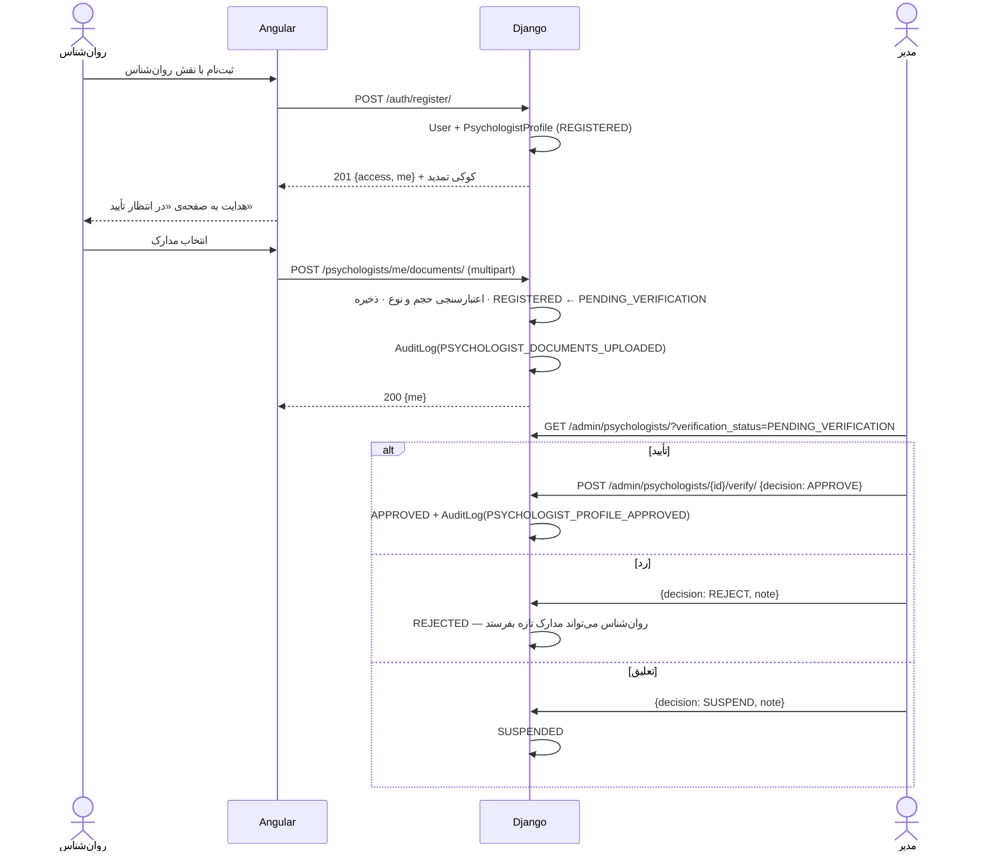

تا وقتی وضعیت `APPROVED` نشود، نگهبان `IsApprovedPsychologist` جلوی دسترسی به بخش
بالینی را می‌گیرد و فرانت‌اند هم کاربر را روی صفحه‌ی انتظار نگه می‌دارد (BR-01).

## ۲. برقراری رابطه

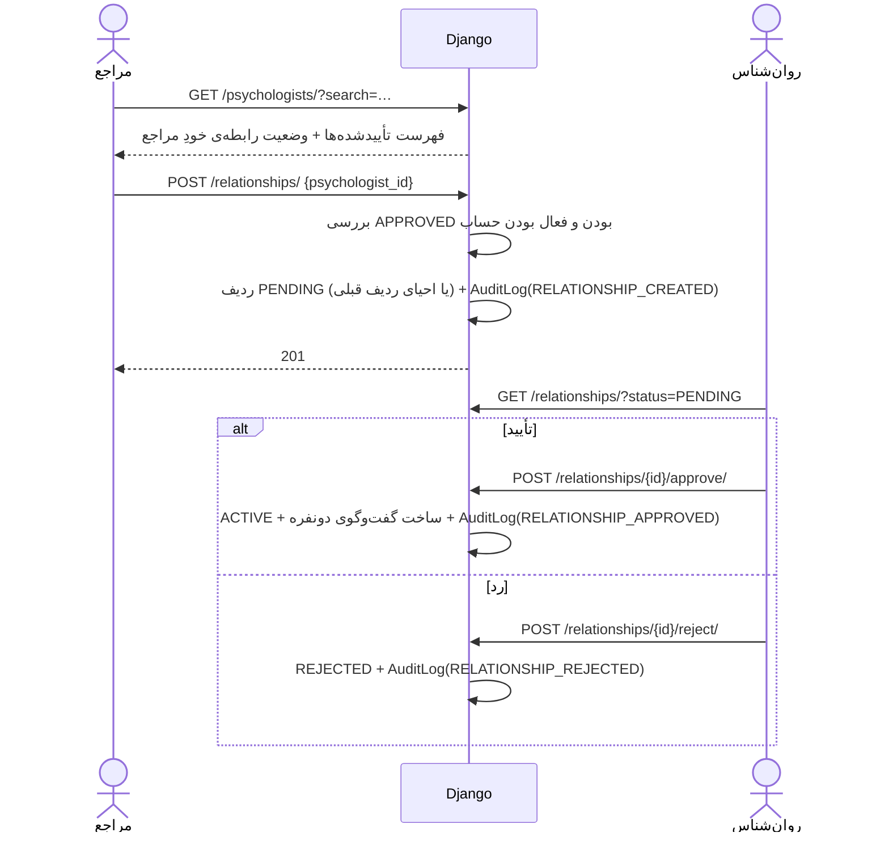

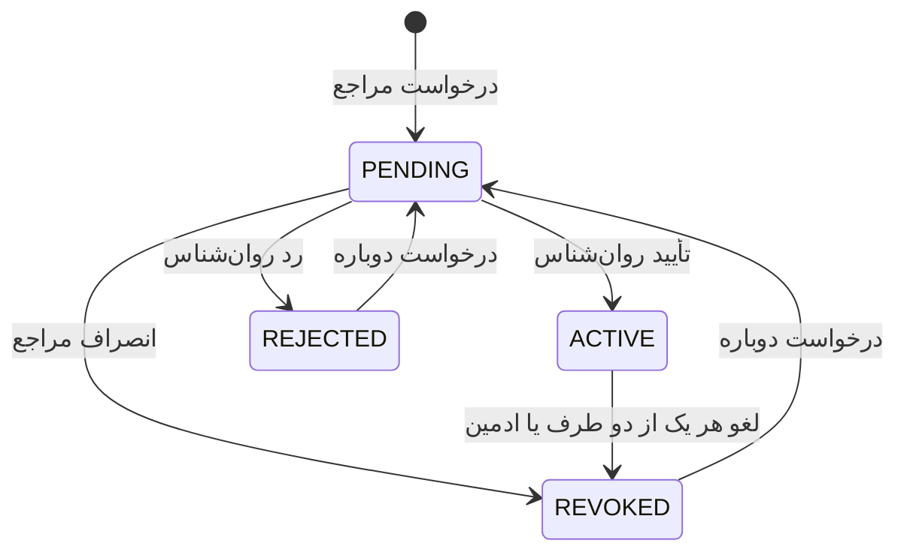

تصمیم درباره‌ی درخواست فقط کار روان‌شناس است؛ لغو را هر دو طرف یا ادمین می‌توانند
انجام دهند.

## ۳. اجرای کامل آزمون

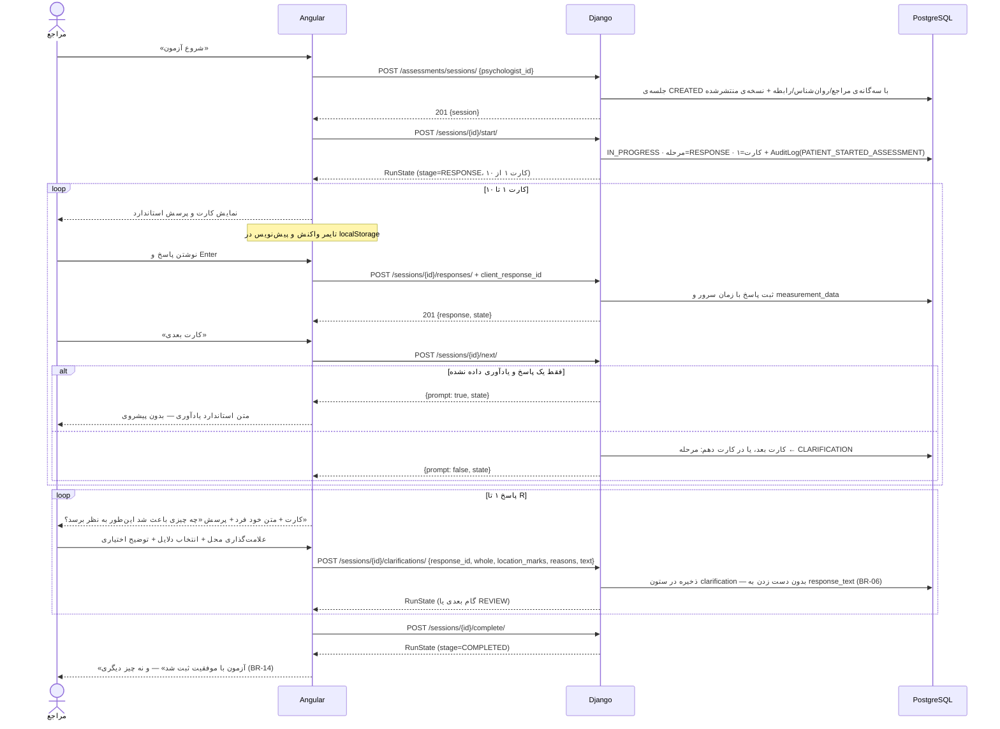

## ۴. ادامه پس از بستن مرورگر

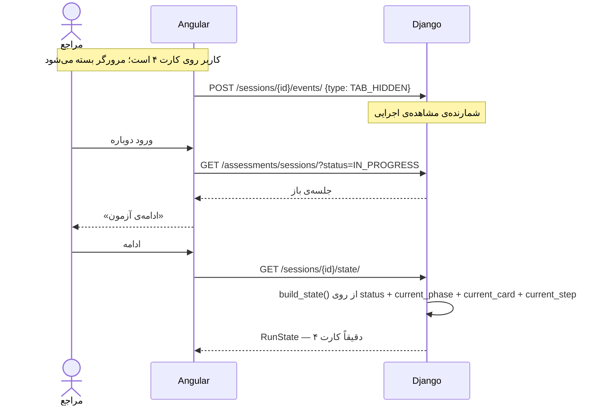

هیچ «حالت ذخیره‌شده‌ای» برای بازیابی وجود ندارد که بتواند خراب شود: مرحله در هر
درخواست از نو محاسبه می‌شود (BR-05). پیش‌نویس متن ثبت‌نشده در `localStorage` مرورگر
است و پس از ثبت یا پایان آزمون پاک می‌شود.

## ۵. ثبت تکراری پاسخ (idempotency)

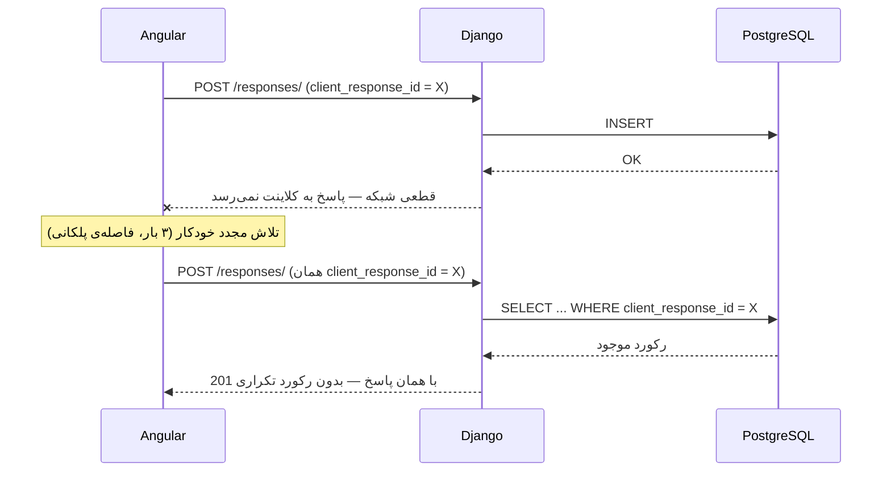

اگر دو تلاش **هم‌زمان** برسند، مسیر سریع هر دو خالی است و هر دو INSERT می‌زنند؛
آن‌گاه قید یکتایی `unique_assessment_client_response` یکی را رد می‌کند و کد،
`IntegrityError` را می‌گیرد و رکورد برنده را می‌خواند. یعنی تضمین در **دیتابیس**
است نه در منطق برنامه (BR-07).

## ۶. تکمیل آزمون: تراکنش و کار پس از commit

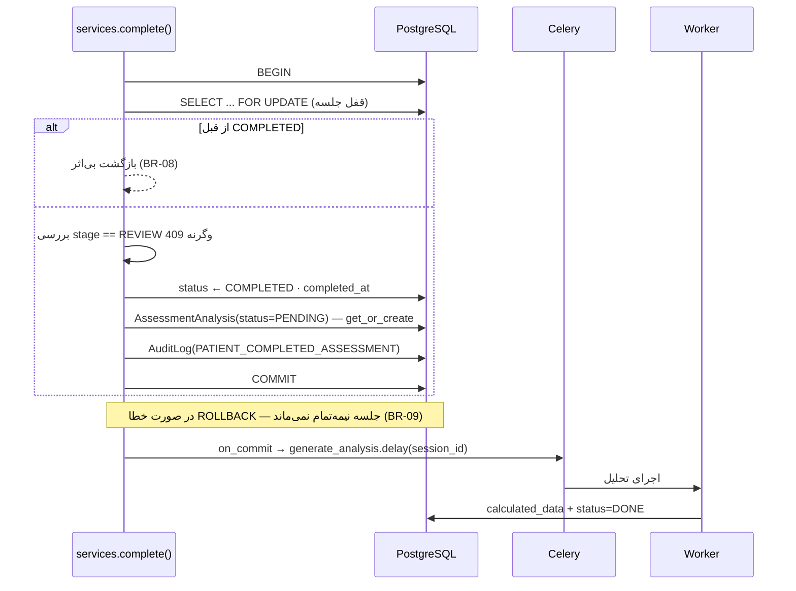

سه نکته‌ی طراحی در این دیاگرام:

1. **قفل صریح** (`SELECT ... FOR UPDATE`) تا دو کلیک هم‌زمان «ثبت نهایی» دو تحلیل
   نسازند.
2. **صف پس از commit** است، نه داخل تراکنش. اگر داخل تراکنش بود، worker می‌توانست
   پیش از commit اجرا شود و جلسه را پیدا نکند (BR-10).
3. **مسیر پشتیبان:** اگر worker خاموش باشد، `ensure_analysis()` هنگام نخستین خواندن
   پروتکل، تحلیل را همان‌جا محاسبه می‌کند. محاسبه‌ی متغیرهای خام چند ده سطر حساب روی
   حداکثر چند ده ردیف است و هزینه‌ای ندارد.

## ۷. کدگذاری و تحلیل توسط روان‌شناس

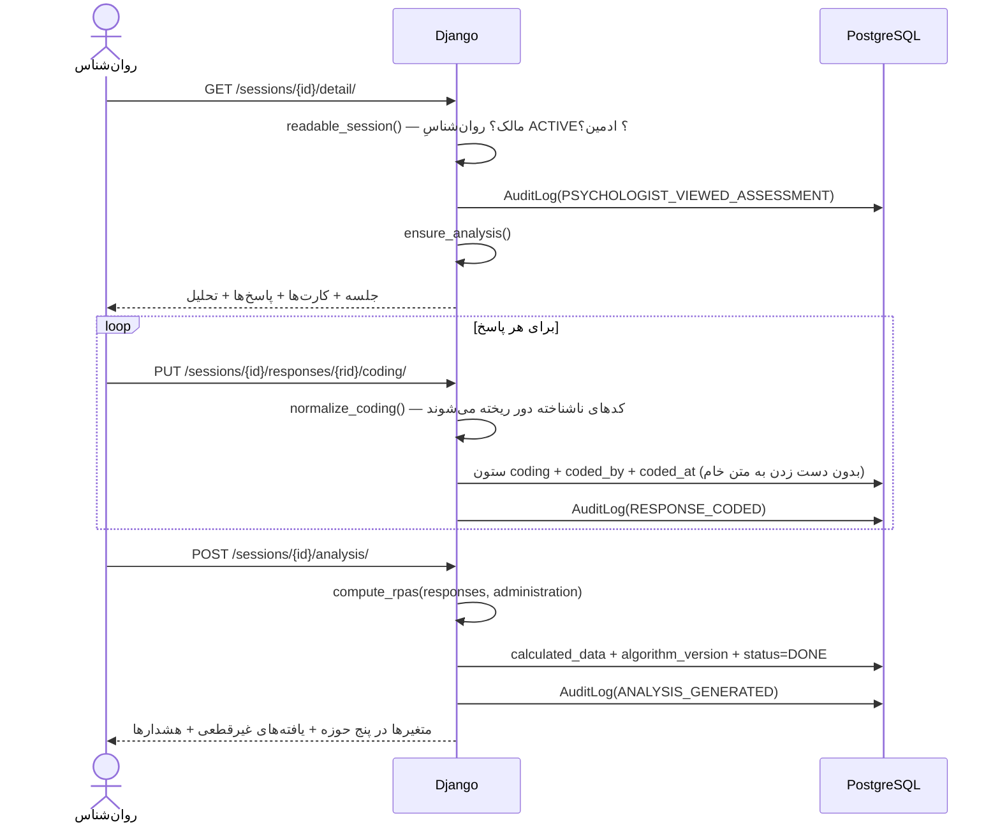

کدگذاری پیش از تکمیل آزمون `409` می‌گیرد، و روان‌شناسی که مالک جلسه نیست `403`.

## ۸. مجوز دسترسی در سطح شیء

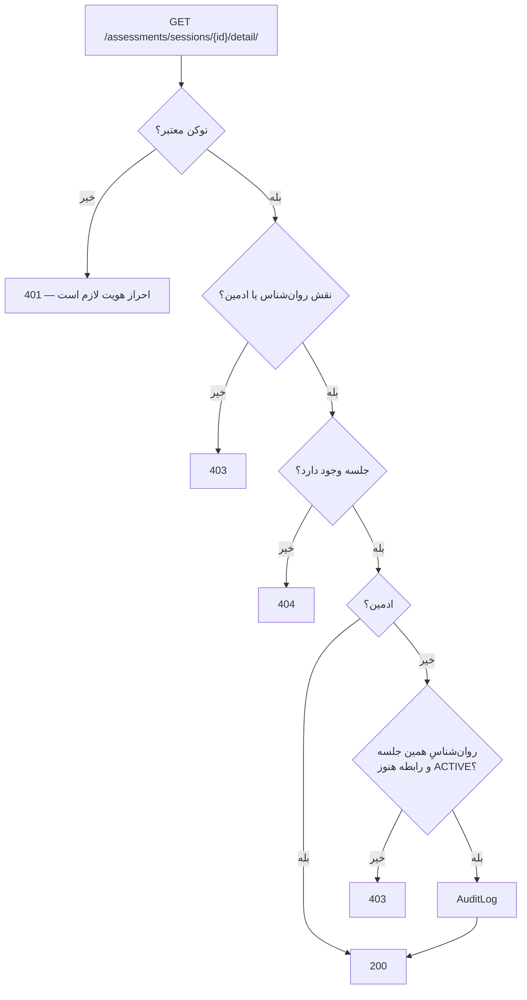

دو لایه پشت سر هم: کلاس مجوز نقش پیش از ورود به view، و بررسی سطح شیء داخل آن.
لغو رابطه بلافاصله دسترسی را می‌بندد ولی داده حذف نمی‌شود (BR-12 در برابر BR-13).

## ۹. چت و بلادرنگ

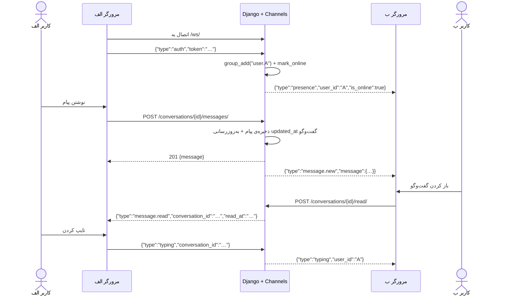

نوشتن همیشه REST است و سوکت فقط اطلاع می‌دهد؛ بنابراین قواعد مجوز فقط در یک جا
نوشته شده‌اند. اگر ارسال روی سوکت شکست بخورد، درخواست REST همچنان موفق است.

## ۱۰. تمدید خودکار نشست

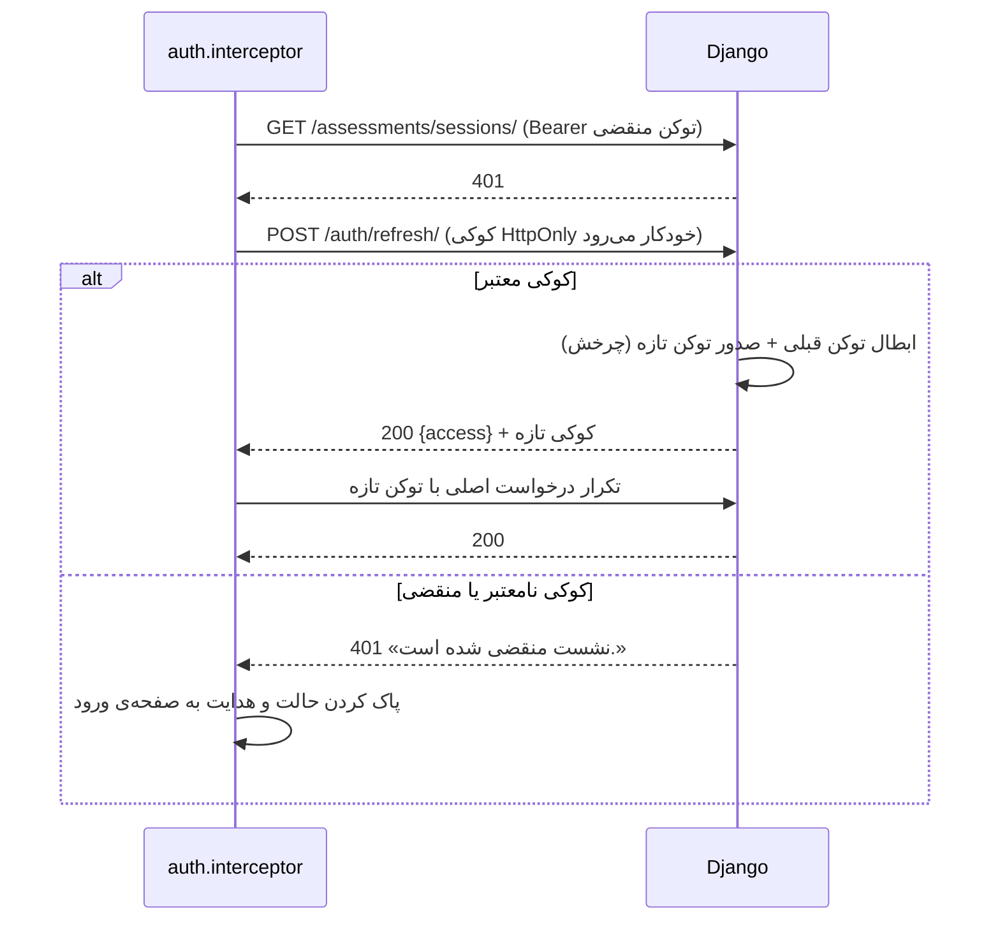

تمدید فقط **یک بار** برای هر درخواست تلاش می‌شود تا حلقه‌ی بی‌پایان شکل نگیرد.

## ۱۱. مسیر بحرانی end-to-end

```mermaid
flowchart LR
    R["ثبت‌نام مراجع و روان‌شناس"] --> V["تأیید روان‌شناس توسط ادمین"]
    V --> L["ورود"] --> S["درخواست و تأیید ارتباط"]
    S --> ST["شروع آزمون"] --> AC["پاسخ به ۱۰ کارت"]
    AC --> CP["روشن‌سازی هر پاسخ"] --> C["ثبت نهایی"]
    C --> PL["ورود روان‌شناس"] --> VW["مشاهده‌ی پروتکل"]
    VW --> CO["کدگذاری"] --> AN["تحلیل"]
```

این مسیر به‌صورت **یک تست خودکار و فقط از راه HTTP** پیاده شده است:
`backend/apps/assessments/tests/test_critical_path.py`. هیچ‌جای آن به لایه‌ی سرویس
مستقیم دست نمی‌زند، پس اگر قرارداد API بشکند، همین تست شکست می‌خورد.

## ۱۲. حالت‌ها در یک نگاه

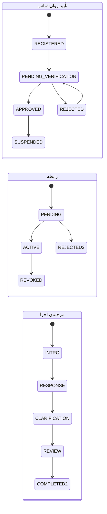
