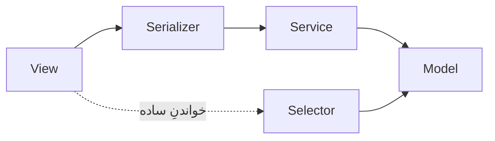

# ۰۶ — راهنمای توسعه

## ۱. پیش‌نیازها

| ابزار             | نسخه           | کاربرد                           |
| ----------------- | -------------- | -------------------------------- |
| ‏Python           | ۳٫۱۳ یا بالاتر | ‏Backend                         |
| ‏Node.js          | ۲۰ یا بالاتر   | ‏Frontend                        |
| ‏Docker + Compose | نسخه‌ی جدید    | راه‌اندازی کامل پشته             |
| ‏PostgreSQL       | ‏۱۷            | فقط اگر بدون Docker اجرا می‌کنید |
| ‏Redis            | ‏۷             | چت بلادرنگ و Celery              |

## ۲. راه‌اندازی سریع

### با Docker — روش پیشنهادی

```bash
docker compose up -d --build     # از ریشه‌ی مخزن
cd Rorschach && npm ci && npm start
```

- ‏Backend روی <http://localhost:8000> · سلامت: `/health/` · مستندات: `/api/docs/`
- ‏Frontend روی <http://localhost:4200> — `/api` و `/ws` را به `:8000` پروکسی می‌کند

کانتینر خودش منتظر دیتابیس می‌ماند، مهاجرت‌ها را اجرا می‌کند، ساختار آزمون رورشاخ
را می‌سازد و (با `SEED_DEMO=true` که پیش‌فرض است) حساب‌های آزمایشی را ایجاد می‌کند.
هر سه گام idempotent‌اند، پس restart بی‌خطر است.

### بدون Docker

```bash
cd backend
python -m venv .venv
.venv/Scripts/activate            # لینوکس و مک: source .venv/bin/activate
pip install -r requirements/development.txt
cp .env.example .env

python manage.py migrate
python manage.py seed_catalog     # ساختار آزمون — در هر محیطی لازم است
python manage.py seed_demo        # حساب‌های آزمایشی — فقط با DEBUG=True
python manage.py runserver 8000
```

برای چت بلادرنگ به Redis نیاز دارید؛ بدون آن، تنظیمات توسعه به‌طور خودکار روی cache و لایه‌ی کانال درون‌حافظه‌ای می‌افتد و بقیه‌ی سامانه کار می‌کند.

## ۳. ساختار Backend

```
backend/
├── config/
│   ├── settings/{base,development,production,testing}.py
│   ├── urls.py · asgi.py · wsgi.py · celery.py
├── apps/
│   ├── accounts/        models · serializers · services · views · urls · constants
│   ├── profiles/        models · serializers · selectors · views · urls
│   ├── relationships/   models · serializers · services · views · urls
│   ├── catalog/         models · selectors · urls · management/commands/seed_catalog
│   ├── assessments/     models · state · services · selectors · serializers
│   │                    permissions · views · urls · tasks · rpas/{codes,scoring}
│   ├── messaging/       models · selectors · serializers · views · urls
│   │                    consumers · routing · realtime
│   ├── notifications/   models · views · urls
│   ├── media/           models
│   ├── audit/           models · services · middleware
│   └── administration/  serializers · views · urls · management/commands/seed_demo
├── common/              exceptions · pagination · permissions · throttling · models · health
├── requirements/        base.txt · development.txt · production.txt
├── conftest.py · pyproject.toml · manage.py
└── Dockerfile · docker-entrypoint.sh · .env.example
```

هر اپ فقط فایل‌هایی را دارد که واقعاً لازم دارد؛ فایل خالی ساخته نشده است. مثلاً ‏`apps/media` فقط مدل دارد چون اندپوینت اختصاصی ندارد و `apps/administration` مدل
ندارد چون روی مدل‌های اپ‌های دیگر کار می‌کند.

### قاعده‌ی لایه‌بندی



| لایه        | مسئول                            | حق ندارد                       |
| ----------- | -------------------------------- | ------------------------------ |
| ‏View       | احراز هویت، مجوز، کد وضعیت HTTP  | منطق کسب‌وکار داشته باشد       |
| ‏Serializer | اعتبارسنجی و شکل داده            | تراکنش باز کند                 |
| ‏Service    | منطق کسب‌وکار، تراکنش، گذار حالت | به `request` دسترسی داشته باشد |
| ‏Selector   | کوئری خواندنی بهینه              | چیزی بنویسد                    |
| ‏Model      | داده و قیدها                     | منطق چندموجودیتی داشته باشد    |

## ۴. ساختار Frontend

```
Rorschach/src/app/
├── app.config.ts · app.routes.ts · app.ts
├── core/
│   ├── auth/            AuthService · TokenStore · مدل‌ها
│   ├── guards/          authGuard · guestGuard · roleGuard · approvedPsychologistGuard
│   ├── interceptors/    auth (توکن و تمدید) · error (پیام خطا)
│   ├── api/             Profile · Psychologists · Relationships · Assessments
│   │                    Communication · Admin
│   ├── models/          قراردادهای داده (snake_case، آینه‌ی serializerها)
│   ├── rpas/            فهرست کدهای R-PAS (دوقلوی TypeScript کد پایتون)
│   ├── mock/            mock-db · handlers/* · mock-backend.interceptor
│   └── services/        Toast · Realtime · TitleStrategy
├── shared/              ui/* · components/pagination · pipes/* · utils/* · pages/not-found
├── layouts/             public-layout · dashboard-layout · focus-layout
└── features/
    ├── landing/ auth/ profile/ chat/
    ├── patient/         dashboard · psychologists · psychologist-detail · assessments
    ├── psychologist/    dashboard · requests · patients · patient-detail · session-review
    ├── assessment/      assessment-runner + intro/response/clarification/finish
    └── admin/           dashboard · users · psychologist-verification · relationships
                         tests · test-version · assessments · audit-logs
```

## ۵. قواعد پیاده‌سازی

| ‏#  | قاعده                                                          | کجا رعایت شده                                    |
| --- | -------------------------------------------------------------- | ------------------------------------------------ |
| ۱‏  | گام جاری آزمون را سرور تعیین می‌کند، نه کلاینت                 | ‏`assessments/state.py`                          |
| ‏۲  | ثبت پاسخ idempotent باشد (کلید کلاینت + قید دیتابیس)           | ‏`services.submit_response`                      |
| ‏۳  | پاسخ ثبت‌شده بازنویسی نشود                                     | ستون‌های جدا برای روشن‌سازی و کدگذاری            |
| ‏۴  | تکمیل اتمیک، و رویدادها پس از commit                           | ‏`services.complete` + `tasks.enqueue_analysis`  |
| ‏۵  | آزمون و چت/اطلاع‌رسانی در یک تراکنش نباشند                     | صف بیرون از بلاک `atomic`                        |
| ‏۶  | مجوز سطح شیء همیشه بررسی شود                                   | ‏`assessments/permissions.py`                    |
| ‏۷  | یکپارچگی در سطح دیتابیس اعمال شود                              | ۷ قید یکتایی + `PROTECT`                         |
| ‏۸  | ‏JSON فقط برای داده‌ی پویا؛ ایندکس JSON پس از دیدن الگوی کوئری | ۶ ستون JSON، صفر ایندکس JSON                     |
| ‏۹  | تلاش مجدد شبکه با فاصله‌ی پلکانی، نه حلقه‌ی تنگ                | ‏`assessment-run.store.ts::netRetry`             |
| ‏۱۰ | سرور مرجع نهایی زمان است                                       | ‏`server_started_at` / `server_submitted_at`     |
| ‏۱۱ | اسرار داخل مخزن نباشند                                         | ‏`.env` در `.gitignore` · فقط `.env.example`     |
| ‏۱۲ | پارامترهای رورشاخ بدون منبع hard-code نشوند                    | جداول دارای حق نشر جاسازی نشده‌اند               |
| ‏۱۳ | منطق کسب‌وکار در view نباشد                                    | ‏viewها فقط اعتبارسنجی و واگذاری می‌کنند         |
| ‏۱۴ | سرویس‌ها `request` نگیرند                                      | زمینه‌ی HTTP با `ContextVar` در میان‌افزار ممیزی |

## ۶. قراردادهای کدنویسی

| موضوع                | قاعده                                                          |
| -------------------- | -------------------------------------------------------------- |
| زبان توضیحات کد      | **انگلیسی** — توضیح باید بگوید «چرا»، نه «چه»                  |
| زبان رشته‌های کاربری | ‏**فارسی** — هر پیام خطا مستقیماً قابل نمایش است               |
| نام فیلدهای API      | ‏`snake_case` در هر دو سمت؛ هیچ آداپتور تبدیل نامی وجود ندارد‏ |
| طول سطر              | ‏۱۱۰ کاراکتر (پیکربندی `ruff`)                                 |
| هدف پایتون           | ‏`py313` — از نحو مدرن مثل `X                                  |
| ترتیب import         | ‏`ruff` با `known-first-party = ["apps", "common", "config"]`‏ |
| مهاجرت‌ها            | ‏از لینت مستثنا؛ دست‌کاری دستی نمی‌شوند                        |
| کامپوننت Angular     | ‏Standalone + Signals + `OnPush`                               |

## ۷. دستورهای پرکاربرد

### ‏Backend

```bash
python -m pytest                      # ۱۴۷ تست
python -m pytest -k assessment        # فقط یک بخش
python -m pytest --cov                # با پوشش کد
python -m ruff check .                # لینت
python -m ruff check . --fix          # اصلاح خودکار

python manage.py makemigrations
python manage.py migrate
python manage.py seed_catalog
python manage.py seed_demo
python manage.py createsuperuser
python manage.py shell_plus           # از django-extensions
```

### ‏Frontend

```bash
npm start                             # سرور توسعه روی :4200
npm run build                         # ساخت production
npx ng test --watch=false --browsers=ChromeHeadless
```

### ‏Docker

```bash
docker compose up -d --build
docker compose logs -f backend
docker compose exec backend python manage.py <command>
docker compose exec backend python -m pytest
docker compose down                   # توقف
docker compose down -v                # توقف و پاک کردن کامل داده
PIP_INDEX_URL=<mirror> docker compose build   # وقتی pypi.org در دسترس نیست
```

## ۸. داده‌ی نمونه و حساب‌های آزمایشی

‏`seed_catalog` ساختار آزمون را می‌سازد (تعریف، نسخه‌ی ۱٫۰ منتشرشده، دو مرحله، ده کارت) و در هر محیطی لازم است.

‏`seed_demo` داده‌ی توسعه می‌سازد و **با `DEBUG=False` اجرا نمی‌شود** (مگر با `--force`)، چون حساب‌هایی با رمز عمومی می‌سازد. رمز همه: `Test1234`.

| ایمیل                                  | نقش                    | وضعیت                                                                         |
| -------------------------------------- | ---------------------- | ----------------------------------------------------------------------------- |
| ‏`patient@test.com`                    | مراجع — سارا محمدی     | ارتباط فعال؛ **یک آزمون کامل و کدگذاری‌شده** (۱۸ پاسخ) + یک درخواست در انتظار |
| ‏`patient2@test.com`                   | مراجع — علی رضایی      | فقط یک درخواست در انتظار — برای تست حالت انتظار                               |
| ‏`patient3@test.com`                   | مراجع — نرگس کاظمی     | **آزمون نیمه‌تمام روی کارت ۴** — برای تست ادامه‌ی آزمون                       |
| ‏`psych@test.com`                      | روان‌شناس — مریم احمدی | تأییدشده؛ دو مراجع فعال، یک درخواست، پروتکل کامل برای کدگذاری                 |
| ‏`psych2@test.com`                     | روان‌شناس — حسین کریمی | تأییدشده؛ یک درخواست در انتظار                                                |
| ‏`psych3@test.com` · `psych4@test.com` | روان‌شناس              | تأییدشده و بدون مراجع — برای تست جست‌وجو                                      |
| ‏`pending@test.com`                    | روان‌شناس — امید نوری  | **در انتظار تأیید** — برای تست صفحه‌ی انتظار و تأیید ادمین                    |
| ‏`admin@test.com`                      | مدیر                   | پنل ادمین                                                                     |
