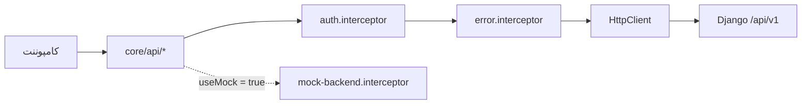

# ۰۸ — معماری Frontend

> فرانت‌اند ابتدا روی یک **Mock Backend** ساخته شد و همان Mock، مرجع رفتاری Backend
> واقعی شد. امروز اپلیکیشن به Django واقعی وصل است (`useMock: false`) و کد Mock
> به‌عنوان مرجع و بستر تست باقی مانده است.

## ۱. پشته و تصمیم‌ها

| موضوع | انتخاب |
|---|---|
| چارچوب | Angular 20 — Standalone Components، Signals، `rxResource`، `OnPush` |
| رابط کاربری | Tailwind CSS 4 + daisyUI 5 با تم سفارشی `rorschach` در `src/styles.css` |
| سبک بصری | خاکستری روشن + مشکی + بژ، گوشه‌های گرد بزرگ، دکمه‌های کپسولی، سطوح شیشه‌ای |
| زبان و فونت | فارسی، RTL، فونت **YekanBakh** (۸ وزن، از `public/fonts`)، تاریخ شمسی، ارقام فارسی |
| مسیریابی | مسیرهای تنبل (lazy) در هر feature؛ سه layout مجزا |
| داده | لایه‌ی API در `core/api/*` — هیچ کامپوننتی `HttpClient` را مستقیم صدا نمی‌زند |
| احراز هویت | توکن دسترسی فقط در حافظه (Signal) + توکن تمدید در کوکی `HttpOnly`؛ تمدید خودکار روی ۴۰۱ |
| بلادرنگ | `RealtimeService` روی WebSocket — فقط برای چت و حضور |
| تست | Karma + Jasmine — ۵ فایل spec |

## ۲. ساختار پوشه‌ها

```
Rorschach/
├── public/
│   ├── fonts/                    هشت وزن YekanBakh
│   └── images/{brand,landing,auth,dashboard,avatars,test}
├── proxy.conf.json               /api و /ws → 127.0.0.1:8000
├── src/
│   ├── styles.css                فونت + Tailwind + daisyUI + تم + ابزارهای شیشه‌ای
│   ├── environments/             apiBaseUrl · wsBaseUrl · useMock
│   └── app/
│       ├── app.config.ts · app.routes.ts · app.ts
│       ├── core/
│       │   ├── auth/             AuthService · TokenStore · مدل‌ها
│       │   ├── guards/           authGuard · guestGuard · roleGuard · approvedPsychologistGuard
│       │   ├── interceptors/     auth · error
│       │   ├── api/              profile · psychologists · relationships
│       │   │                     assessments · communication · admin · http-params
│       │   ├── models/           قراردادهای داده (snake_case)
│       │   ├── rpas/             rpas-codes.ts — دوقلوی TypeScript کاتالوگ کدها
│       │   ├── mock/             mock-db · mock-router · handlers/* · rpas-scoring
│       │   └── services/         Toast · Realtime · TitleStrategy
│       ├── shared/
│       │   ├── ui/               icon · avatar · logo · image-slot · status-badge
│       │   │                     stat-card · page-header · empty-state · loading
│       │   │                     form-field · toast-host · confirm-dialog · location-marker
│       │   ├── components/       pagination
│       │   ├── pipes/            jalaliDate · relativeTime · faNumber
│       │   ├── pages/            not-found
│       │   └── utils/            images · status · forms · names · uuid
│       ├── layouts/              public-layout · dashboard-layout · focus-layout
│       └── features/
│           ├── landing/          home
│           ├── auth/             login · register · register/:role · verification-pending
│           ├── profile/          profile + achievements-section
│           ├── patient/          dashboard · psychologists · psychologist-detail · assessments
│           ├── psychologist/     dashboard · requests · patients · patient-detail · session-review
│           ├── assessment/       assessment-runner + intro/response/clarification/finish + inkblot-card
│           ├── chat/             chat
│           └── admin/            dashboard · users · psychologist-verification · relationships
│                                 tests · test-version · assessments · audit-logs
```

## ۳. مسیرها

| مسیر | نگهبان | Layout |
|---|---|---|
| `/` | — | Public |
| `/login` · `/register` · `/register/:role` | `guestGuard` | Public |
| `/verification-pending` | `authGuard` + نقش روان‌شناس | Public |
| `/patient` · `/patient/psychologists` · `/patient/psychologists/:id` · `/patient/assessments` · `/patient/profile` · `/patient/chat[/:id]` | `authGuard` + نقش مراجع | Dashboard |
| `/psychologist` · `/requests` · `/patients` · `/patients/:id` · `/assessments/:id` · `/profile` · `/chat[/:id]` | `authGuard` + نقش روان‌شناس + `approvedPsychologistGuard` | Dashboard |
| `/admin` · `/users` · `/psychologists` · `/relationships` · `/tests` · `/tests/versions/:id` · `/assessments` · `/audit-logs` | `authGuard` + نقش ادمین | Dashboard |
| `/assessment/:sessionId` | `authGuard` + نقش مراجع | **Focus** |
| `**` | — | صفحه‌ی «یافت نشد» |

> نگهبان‌ها فقط تجربه‌ی کاربری‌اند؛ **مرجع واقعی دسترسی، مجوز سمت Backend است**
> (BR-02). هر صفحه‌ای که نگهبان دارد، اندپوینت متناظرش هم مجوز سطح شیء دارد.

## ۴. لایه‌ی داده



- **`auth.interceptor`** — توکن دسترسی را روی هر درخواست می‌گذارد و روی ۴۰۱، **یک بار**
  تمدید می‌کند و درخواست را دوباره می‌فرستد؛ اگر تمدید هم شکست خورد، خروج.
- **`error.interceptor`** — بدنه‌ی استاندارد خطا را می‌خواند و `detail` را به‌صورت
  toast نشان می‌دهد؛ خطاهای فیلدی را دست نمی‌زند تا فرم خودش آن‌ها را نمایش دهد.
- **مدل‌های `core/models/*`** دقیقاً آینه‌ی serializerهای Django‌اند؛ هیچ تبدیل نامی
  در میان نیست.

### وضعیت اجرای آزمون

`AssessmentRunStore` وضعیت اجرای آزمون را نگه می‌دارد اما **منبع حقیقت نیست**:

```
هر عمل  →  یک درخواست  →  RunState سرور جایگزین وضعیت محلی می‌شود
```

- تلاش مجدد شبکه: ۳ بار، فقط برای خطای شبکه یا ۵xx، با فاصله‌ی پلکانی
  (۸۰۰ میلی‌ثانیه × شماره‌ی تلاش). چون هر بدنه کلید idempotency دارد، تلاش مجدد ایمن است.
- پیش‌نویس متن ثبت‌نشده در `localStorage` (`ResponseDrafts`) و پس از ثبت یا پایان
  آزمون پاک می‌شود.
- خروج از صفحه با نگهبان `leave-assessment.guard.ts` هشدار می‌دهد؛ پنهان شدن تب و
  وقفه به `POST …/events/` گزارش می‌شود.

## ۵. طراحی رابط کاربری

دو الگوی متفاوت، عمداً:

| حالت | ساختار |
|---|---|
| **داشبورد** | هدر + سایدبار شیشه‌ای شناور (دسکتاپ) یا Dock پایین (موبایل) + محتوا |
| **تمرکز** | فقط کارت، پرسش و کادر پاسخ — بدون سایدبار، بدون اعلان، بدون ناوبری |

```
┌──────────────────────────────┐
│  کارت ۳ از ۱۰                │
│        [ تصویر لکه ]         │
│  این چه چیزی می‌تواند باشد؟  │
│  ┌────────────────────────┐  │
│  │  پاسخ …                │  │
│  └────────────────────────┘  │
│  ⟳ چرخاندن کارت   کارت بعدی │
└──────────────────────────────┘
```

تم `rorschach` در `styles.css` تعریف شده و تمام رنگ‌ها و شعاع‌ها از همان‌جا می‌آیند؛
کامپوننت‌ها از کلاس‌های معنایی daisyUI استفاده می‌کنند، پس تغییر تم نیازی به دست زدن
به کامپوننت‌ها ندارد.

## ۶. جای تصاویر

فایل را در مسیر گفته‌شده بگذارید؛ جای‌نگهدار (کادر خط‌چین «محل تصویر») خودکار با
تصویر جایگزین می‌شود. فهرست مرجع: `src/app/shared/utils/images.ts`.

| مسیر | محل استفاده | اندازه‌ی پیشنهادی | وضعیت |
|---|---|---|---|
| `public/images/brand/logo.svg` | هدر، سایدبار، فوتر | ارتفاع ~۴۰px، شفاف | ⛔ موجود نیست |
| `public/images/landing/hero.jpg` | تصویر اصلی صفحه‌ی نخست | عمودی ~۹۰۰×۱۱۰۰ | ✅ |
| `public/images/landing/psychologists.jpg` | بخش «روان‌شناس هستید؟» | ~۸۰۰×۹۰۰ | ✅ |
| `public/images/auth/login.webp` | کنار فرم ورود | عمودی ~۹۰۰×۱۱۰۰ | ✅ |
| `public/images/auth/register.jpg` | کنار فرم ثبت‌نام | عمودی ~۹۰۰×۱۱۰۰ | ✅ |
| `public/images/dashboard/patient.jpg` | بنر داشبورد مراجع | ~۶۰۰×۴۰۰ | ⛔ موجود نیست |
| `public/images/avatars/psychologist-{1..5}.webp` | عکس روان‌شناسان (داده‌ی نمونه) | مربع ۴۰۰×۴۰۰ | ⛔ موجود نیست |
| `public/images/test/1.jpg` … `10.jpg` | **کارت‌های آزمون** | — | ✅ هر ده تا |

در production، آواتار کاربران از API (`avatar`) و Object Storage می‌آید. تصاویر کارت
هم به Object Storage منتقل می‌شوند و `seed_catalog` با `image_asset` به آن‌ها وصل
می‌شود؛ تا آن زمان، `image_url` نسبی می‌ماند (D-10).

## ۷. Mock Backend — نقش امروز

Mock در `src/app/core/mock/` یک پیاده‌سازی کامل از همان قرارداد `/api/v1` است:
`mock-db.ts` (داده)، `mock-router.ts` (مسیریابی و قالب خطا)، `handlers/*` (auth،
relationships، assessments، communication، admin) و `rpas-scoring.ts` (همان الگوریتم
محاسبه‌ی متغیرها).

امروز نقشش سه چیز است:

1. **مرجع مکتوب رفتار Backend** — هنگام پیاده‌سازی Django، هر اندپوینت با
   هندلر متناظرش تطبیق داده شد.
2. **بستر تست فرانت‌اند** — سه فایل spec مستقیماً روی آن اجرا می‌شوند.
3. **نمایش بدون Backend** — با `useMock: true` اپ کاملاً مستقل اجرا می‌شود.

پیکربندی فعلی:

```ts
// src/environments/environment.ts و environment.development.ts
{ apiBaseUrl: '/api/v1', wsBaseUrl: '/ws', useMock: false }
```

دو نکته‌ی مهم:

- در ساخت production، فایل `mock.providers.ts` با `mock.providers.prod.ts` جایگزین
  می‌شود، پس **هیچ کد Mock در خروجی نهایی نیست**.
- پرچم `useMock` واقعاً پرچم است: نخستین سطر `mock-backend.interceptor.ts` آن را
  بررسی می‌کند. پیش از این، interceptor بی‌قیدوشرط پاسخ می‌داد و پرچم بی‌اثر بود — این
  یکی از سه تغییری بود که هنگام اتصال به Backend لازم شد ([[11-backend-notes]] §۵).

## ۸. وضعیت پیاده‌سازی

| مرحله | محتوا | وضعیت |
|---|---|---|
| F0 Setup | Tailwind/daisyUI، تم، RTL، فونت، محیط‌ها | ✅ |
| F1 Design System | layoutها، سبک شیشه‌ای، کامپوننت‌های مشترک، جای‌نگهدار تصویر | ✅ |
| F2 Core + Mock | مدل‌ها، سرویس‌های API، احراز هویت و نگهبان‌ها، Mock | ✅ |
| F3 Public/Auth | صفحه‌ی نخست، ورود، ثبت‌نام دو نقش، بارگذاری مدارک | ✅ |
| F4 Patient | داشبورد، فهرست روان‌شناسان، پروفایل، سوابق | ✅ |
| F5 Assessment | اجرای کامل R-PAS، کدگذاری روان‌شناس، متغیرها و تفسیر | ✅ |
| F6 Psychologist | داشبورد، درخواست‌ها، مراجعان، جزئیات آزمون، افتخارات | ✅ |
| F7 Chat | گفت‌وگوی بلادرنگ روی WebSocket واقعی | ✅ |
| F8 Admin | کاربران، تأیید، روابط، نسخه‌های آزمون، اطلاعیه، رسانه، ممیزی | ✅ |
| B1 اتصال به Backend | اجرا روی Django واقعی و تأیید در مرورگر | ✅ |
| F9 Polish | تصاویر باقی‌مانده، دسترس‌پذیری، تست بیشتر | ◐ |

### کارهای باقی‌مانده‌ی فرانت‌اند

| مورد | جزئیات |
|---|---|
| اعتبارسنجی سمت کلاینت برای مدارک | فیلتر `accept=".pdf,image/*"` هست، اما بررسی حجم (۱۰ مگابایت) و سقف تعداد (۱۰ فایل) و متن راهنما نیست — کاربر پس از بارگذاری خطا می‌گیرد (D-07) |
| متن راهنمای رمز عبور | فعلاً فقط «حداقل ۸ کاراکتر»؛ باید بگوید «نه کاملاً عددی و نه رمز پرتکرار» (D-09) |
| تصاویر لوگو، بنر داشبورد و آواتارها | جای‌نگهدار نمایش داده می‌شود |
| بازبینی دسترس‌پذیری | ناوبری با صفحه‌کلید و برچسب‌های ARIA بازبینی کامل نشده |
| نمایش حالت «در حال محاسبه» تحلیل | وقتی `analysis.status === 'PENDING'` است، صفحه خالی می‌ماند |

## ۹. اجرا

```bash
cd Rorschach
npm ci
npm start          # http://localhost:4200 — به Backend واقعی وصل می‌شود
npm run build      # ساخت production (بدون Mock)
npx ng test --watch=false --browsers=ChromeHeadless
```

برای اجرای مستقل بدون Backend، در `src/environments/environment.development.ts`
مقدار `useMock` را `true` کنید.

## ۱۰. نکته درباره‌ی پوشه‌ی `docs/`

پوشه‌ی `docs/` در ریشه‌ی مخزن، **خروجی ساخت** فرانت‌اند برای GitHub Pages است
(با `base href="/rorschach/"`) و کد منبع نیست. این خروجی مربوط به پیش از پیاده‌سازی
Backend است و چون ساخت production کد Mock را حذف می‌کند، در آن نسخه فقط صفحات عمومی
کار می‌کنند و ورود ممکن نیست. برای نمایش زنده، پشته‌ی Docker را بالا بیاورید.
