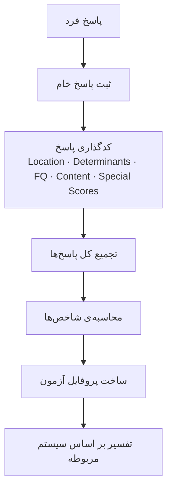

# ۰۹ — مبانی تحلیل آزمون رورشاخ

> این سند **دانش دامنه** است، نه مشخصات نرم‌افزار: توضیح می‌دهد کدگذاری رورشاخ چیست و
> چه متغیرهایی دارد. آنچه در این سامانه واقعاً پیاده شده، در [[10-assessment-rpas]]
> آمده و نگاشت میان این دو در §۱۹ همین سند.

## ۱. مقدمه

آزمون رورشاخ یک آزمون **فرافکن** است: فرد به مجموعه‌ای از لکه‌های جوهر پاسخ می‌دهد و
پاسخ‌های او بر اساس ویژگی‌های مشخصی **کدگذاری، طبقه‌بندی و تحلیل** می‌شوند.

در پیاده‌سازی نرم‌افزاری، باید بین سه مرحله تفاوت گذاشت:

1. **ثبت پاسخ خام فرد**
2. **کدگذاری پاسخ بر اساس سیستم امتیازدهی**
3. **محاسبه‌ی شاخص‌ها و متغیرهای ترکیبی**

دو سیستم مهم وجود دارد: **Exner Comprehensive System (CS)** و
**Rorschach Performance Assessment System (R-PAS)**. این دو مجموعه‌متغیرها و روش‌های
محاسبه‌ی متفاوتی دارند و **کدهایشان بدون تطبیق قابل ترکیب نیستند**. این سامانه از
**R-PAS** استفاده می‌کند و همین انتخاب در ستون `test_definitions.coding_system` ثبت
می‌شود.

## ۲. اطلاعات پایه‌ی هر پاسخ

| پارامتر | توضیح |
|---|---|
| `card` | شماره‌ی کارت رورشاخ |
| `response_text` | متن پاسخ فرد |
| `response_time` | مدت زمان پاسخ |
| `card_turn` | وضعیت چرخاندن کارت |
| `response_number` | شماره‌ی پاسخ |
| `inquiry_data` | اطلاعات مرحله‌ی پرسش و بررسی پاسخ |

این‌ها داده‌ی **خام**اند و هنوز به‌تنهایی امتیاز روان‌شناختی محسوب نمی‌شوند.

## ۳. Location — محل استفاده از لکه

مشخص می‌کند فرد از **کدام قسمت لکه** برای ارائه‌ی پاسخ استفاده کرده است.

| کد | نام | توضیح |
|---|---|---|
| `W` | Whole | استفاده از کل لکه |
| `D` | Common Detail | استفاده از یک جزئیات رایج |
| `Dd` | Unusual Detail | استفاده از جزئیات کوچک یا غیرمعمول |
| `S` | Space | استفاده از فضای سفید |

> در R-PAS، فضای سفید به‌جای یک کد محل مستقل، به‌صورت دو کد جداگانه ثبت می‌شود:
> `SR` (Space Reversal) و `SI` (Space Integration).

## ۴. Determinants — عوامل تعیین‌کننده

مشخص می‌کنند **چه ویژگی بصری لکه** باعث شده فرد آن پاسخ را بدهد.

| گروه | کد | توضیح |
|---|---|---|
| فرم | `F` | شکل یا فرم لکه |
| حرکت | `M` | حرکت انسانی |
| حرکت | `FM` | حرکت حیوانی |
| حرکت | `m` | حرکت غیرزنده یا مکانیکی |
| رنگ | `C` | رنگ خالص |
| رنگ | `CF` | رنگ غالب بر فرم |
| رنگ | `FC` | فرم غالب بر رنگ |
| رنگ آکروماتیک | `C'` | سیاه، خاکستری یا سفید |
| سایه | `T` | بافت (Texture) |
| سایه | `V` | سایه‌روشن با کیفیت عمق یا ارزش (Vista) |
| سایه | `Y` | سایه‌روشن منتشر |
| سایر | `r` | انعکاس (Reflection) |
| سایر | `FD` | بُعد مبتنی بر فرم (Form Dimension) |

## ۵. Form Quality — کیفیت فرم

مشخص می‌کند شکل واقعی پاسخ با شکل موجود در لکه **تناسب قابل‌قبول** دارد یا نه.

| کد | مفهوم کلی |
|---|---|
| `o` | کیفیت فرم معمول و مناسب |
| `u` | کیفیت فرم نامعمول یا کمتر متناسب |
| `-` | کیفیت فرم ضعیف |
| `n` | مواردی که کیفیت فرم قابل ارزیابی نیست |

این یکی از مهم‌ترین بخش‌های کدگذاری است و **باید بر اساس جدول‌های رسمی همان سیستم
امتیازدهی** انجام شود. (در سیستم Exner کد `+` هم وجود دارد.)

## ۶. Content — محتوای پاسخ

مشخص می‌کند فرد **چه چیزی** را در لکه دیده است.

| کد | محتوا |
|---|---|
| `H` · `(H)` | انسان کامل · انسان خیالی |
| `Hd` · `(Hd)` | بخشی از انسان · بخشی از انسان خیالی |
| `Hx` | تجربه‌ی انسانی |
| `A` · `(A)` | حیوان · حیوان خیالی |
| `Ad` · `(Ad)` | بخشی از حیوان · بخشی از حیوان خیالی |
| `An` | آناتومی |
| `Art` · `Ay` | هنر · انسان‌شناسی |
| `Bl` · `Cg` | خون · پوشاک |
| `Ex` · `Fi` | انفجار · آتش |
| `Sx` | محتوای جنسی |
| `NC` | سایر محتواها (Non-Content در R-PAS) |

## ۷. پاسخ‌های رایج (Popular)

بررسی می‌شود که آیا پاسخ با یکی از **پاسخ‌های رایج شناخته‌شده برای همان کارت یا ناحیه**
مطابقت دارد. مقدار منطقی است (`P` یا هیچ) و تشخیص آن باید بر اساس **جدول رسمی** سیستم
انجام شود.

## ۸. Special Scores — نمره‌های ویژه

برای شناسایی ویژگی‌های خاص در ساختار پاسخ. در R-PAS به دو خانواده تقسیم می‌شوند:

**کدهای شناختی (Cognitive):**

| کد | مفهوم |
|---|---|
| `DV1` · `DV2` | انحراف کلامی (Deviant Verbalization) |
| `DR1` · `DR2` | پاسخ انحرافی (Deviant Response) |
| `INC1` · `INC2` | ناسازگاری (Incongruous Combination) |
| `FAB1` · `FAB2` | ترکیب ساختگی (Fabulized Combination) |
| `PEC` | منطق نامعمول (Peculiar Logic) |
| `CON` | آلودگی (Contamination) |

**کدهای مضمونی (Thematic):**

| کد | مفهوم |
|---|---|
| `ABS` | انتزاع |
| `PER` | شخصی‌سازی |
| `COP` | حرکت همکارانه |
| `MAH` · `MAP` | بازنمایی سالم · بازنمایی مرضی از روابط |
| `AGM` · `AGC` | حرکت پرخاشگرانه · محتوای پرخاشگرانه |
| `MOR` | محتوای آسیب‌دیده، مرده یا آسیب‌زا |
| `ODL` | زبان وابستگی دهانی |

## ۹. فعالیت سازمان‌دهی

بررسی می‌کند فرد چگونه اجزای لکه را در یک ساختار کلی سازمان می‌دهد. در سیستم Exner
متغیرهایی مثل `Zf` (تعداد پاسخ‌های دارای سازمان‌دهی)، `ZSum` و `ZEst` وجود دارند و در
سطح **کل پروتکل** محاسبه می‌شوند، نه یک پاسخ منفرد.

در R-PAS معادل کارکردی این ایده، کد `Sy` (Synthesis) در سطح پاسخ و شمارش آن در سطح
پروتکل است.

## ۱۰. تعداد پاسخ‌ها

```
R = Total Number of Responses
```

تعداد پاسخ‌ها خودش یک متغیر مهم است و در محاسبه یا تفسیر بسیاری از شاخص‌ها نقش دارد.
R-PAS پروتکل ۱۶ تا ۲۷ پاسخی را توصیه می‌کند؛ پروتکل کوتاه‌تر ممکن است برای تفسیر
کافی نباشد.

## ۱۱. شاخص‌های مرتبط با فرم

- **`F%`** — درصد پاسخ‌هایی که عامل تعیین‌کننده‌ی اصلی‌شان فرم است.
- **`Pure F%`** — درصد پاسخ‌هایی که **صرفاً** بر اساس فرم‌اند و عامل دیگری (حرکت، رنگ،
  سایه) در آن‌ها نیست.

این شاخص‌ها نشان می‌دهند فرد چقدر به ویژگی‌های ساختاری محرک تکیه کرده است.

## ۱۲. شاخص‌های مرتبط با حرکت

`M` (انسانی)، `FM` (حیوانی) و `m` (غیرزنده) در سطح کل پروتکل جمع می‌شوند و در
شاخص‌های ترکیبی به کار می‌روند — مثلاً `M` در `MC` و `FM`+`m` در `PPD`.

## ۱۳. شاخص‌های مرتبط با رنگ

از `C`، `CF` و `FC` شاخص‌های ترکیبی ساخته می‌شوند. مهم‌ترین‌شان **`WSumC`** است که با
وزن‌دهی به پاسخ‌های رنگی محاسبه می‌شود:

```
WSumC = 0.5 × FC + 1.0 × CF + 1.5 × C
```

نسبت `(CF + C) / SumC` هم نشان می‌دهد چه سهمی از پاسخ‌های رنگی، کمتر مهارشده‌اند.

## ۱۴. شاخص‌های مرتبط با سایه

`T`، `V` و `Y` (و در کنارشان `C'`) در شاخص‌های ترکیبی مرتبط با تجربه‌ی فشار و
واکنش به محرک‌های پیچیده استفاده می‌شوند — مثلاً همگی در `PPD` جمع می‌شوند.

## ۱۵. شاخص‌های محاسباتی سطح پروتکل

برخی متغیرها از یک پاسخ منفرد استخراج نمی‌شوند و باید پس از کدگذاری **کل پروتکل**
محاسبه شوند:

| شاخص | توضیح کلی | سیستم |
|---|---|---|
| `Lambda` | نسبت پاسخ‌های فرم‌محور | Exner |
| `EA` · `es` | Experience Actual · Experience Stimulation | Exner |
| `Afr` | نسبت عاطفی | Exner |
| `Egocentricity Index` | شاخص خودمحوری | Exner |
| `PTI` · `HVI` · `Isolation Index` | شاخص‌های ترکیبی | Exner |
| `WSumC` | مجموع وزنی رنگ | هر دو |
| `XA%` · `WDA%` | کیفیت ادراکی فرم | Exner |
| `MC` · `PPD` · `MC−PPD` | منابع، فشارها و تفاضلشان | R-PAS |
| `FQo%` · `FQ−%` · `WD−%` | نسبت‌های کیفیت فرم | R-PAS |
| `WSumCog` · `SevCog` | بار کدهای شناختی | R-PAS |
| `Complexity` | پیچیدگی پاسخ‌ها | R-PAS |

**نکته‌ی کلیدی:** این مقادیر را **نباید از روی متن پاسخ حدس زد**. ابتدا پاسخ باید
به‌صورت استاندارد کدگذاری شود و سپس شاخص طبق فرمول همان سیستم محاسبه گردد.

## ۱۶. چهار حوزه‌ی R-PAS

سیستم R-PAS متغیرهایش را در چهار حوزه سازمان می‌دهد:

| حوزه | موضوع |
|---|---|
| Engagement and Cognitive Processing | نحوه‌ی درگیر شدن با محرک و پردازش اطلاعات |
| Perception and Thinking Problems | ادراک، سازمان‌دهی و ویژگی‌های غیرمعمول تفکر |
| Self and Other Representation | بازنمایی خود و دیگران در پاسخ‌ها |
| Stress and Distress | تجربه و مدیریت فشار و پریشانی |

علاوه بر این چهار حوزه، R-PAS دسته‌ای از متغیرهای **رفتار هنگام اجرا و مشاهده‌های
اجرایی** را هم در نظر می‌گیرد — مثل تعداد یادآوری‌ها و چرخاندن کارت.

## ۱۷. ساختار پیشنهادی برای نرم‌افزار

```text
Rorschach Test
├── Administration
│   ├── Total Time · Response Count · Card Turns · Observations
├── Responses
│   ├── Card · Response Text · Response Time · Inquiry Data
├── Coding
│   ├── Location · Determinants · Form Quality · Content
│   ├── Popular · Special Scores · Organizational Activity
├── Calculated Variables
│   ├── R · F% · PureF% · WSumC · MC · PPD · FQ ratios · …
└── Interpretation
    ├── Cognitive Processing · Perception · Self/Other · Stress/Distress
```

## ۱۸. جریان کلی تحلیل



به بیان ساده:

> **Raw Response → Coding → Variables → Calculated Scores → Profile → Interpretation**

نمونه‌ی یک پاسخ کدگذاری‌شده:

```json
{
  "card": 3,
  "response_text": "دو انسان که روبه‌روی هم ایستاده‌اند",
  "response_time": 18,
  "coding": {
    "location": "D",
    "determinants": ["M"],
    "form_quality": "o",
    "content": ["H"],
    "popular": true,
    "pair": true,
    "thematic_codes": ["COP", "MAH"]
  }
}
```

**اصل طراحی:** داده‌ی خام، کدگذاری و تفسیر باید از یکدیگر جدا بمانند. کدگذاری
رورشاخ **سیستم‌وابسته** است، بنابراین دیتابیس باید صریحاً بگوید پروتکل با کدام سیستم
کدگذاری شده است.

## ۱۹. نگاشت به پیاده‌سازی

| مفهوم این سند | کجای سامانه |
|---|---|
| داده‌ی پایه‌ی پاسخ | جدول `assessment_responses` — ستون‌های متن، زمان‌ها و `measurement_data` |
| `card_turn` و `response_time` | `measurement_data.card_turns` · `final_rotation` · `reaction_time_ms` |
| `inquiry_data` | ستون `clarification` — محل روی کارت، دلایل و توضیح |
| کدهای Location، Determinant، FQ، Content، Special Scores | ستون `coding` + کاتالوگ `backend/apps/assessments/rpas/codes.py` |
| انتخاب سیستم کدگذاری | ستون `test_definitions.coding_system` = `R-PAS` |
| متغیرهای سطح پروتکل | `backend/apps/assessments/rpas/scoring.py` — تابع `compute_rpas` |
| چهار حوزه‌ی R-PAS + حوزه‌ی اجرا | پنج کلید `variables` در `calculated_data` |
| تفسیر | `findings` با حوزه، متغیرهای مبنا و سطح اطمینان — **غیرقطعی** |

آنچه عمداً پیاده **نشده** است:

| مورد | دلیل |
|---|---|
| متغیرهای Exner (`Lambda`، `EA`، `es`، `Afr`، `PTI`، `HVI`، `XA%`، `WDA%`) | سامانه R-PAS است و ترکیب دو سیستم نادرست است |
| جدول رسمی کیفیت فرم | دارای حق نشر — کدگذار آن را اعمال می‌کند |
| جدول رسمی پاسخ‌های رایج | دارای حق نشر |
| تبدیل به نمره‌ی استاندارد | نیازمند جداول هنجار R-PAS |
| `Complexity` به‌صورت رسمی | نیازمند فرمول و جداول رسمی |

فهرست دقیق متغیرهای محاسبه‌شده و قواعد تفسیر در [[10-assessment-rpas]] §۶ و §۷.
