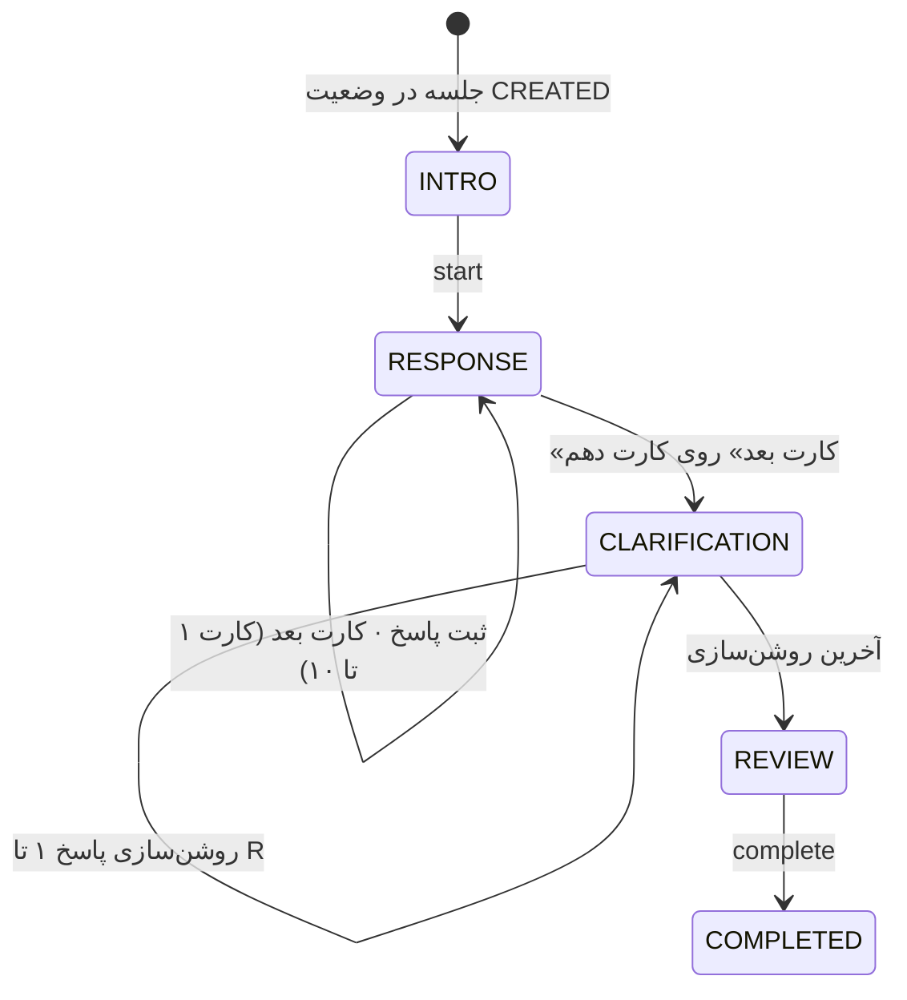

# ۱۰ — موتور اجرای آزمون (R-PAS)
این فایل، نحوه اجرای استاندارد آزمون رورشاخ با روش R-PAS را نمایش می دهد.
## ۱. قواعد اجرای استاندارد و پیاده‌سازی آن‌ها

| قاعده‌ی R-PAS                 | پیاده‌سازی در سامانه                                                                                                                                                  |
| ----------------------------- | --------------------------------------------------------------------------------------------------------------------------------------------------------------------- |
| ده کارت، یکی‌یکی              | کارت جاری را فقط سرور تعیین می‌کند (BR-05)                                                                                                                            |
| بدون راهنمایی در مرحله‌ی پاسخ | فقط پرسش استاندارد «این چه چیزی می‌تواند باشد؟»؛ بدون مثال و بدون بازخورد                                                                                             |
| «دو یا شاید سه پاسخ»          | در دستورالعمل آغاز آزمون گفته می‌شود و `min_responses = 2` است                                                                                                        |
| **یادآوری (Pr)**              | اگر روی کارت فقط **یک** پاسخ باشد، نخستین «کارت بعدی» پیشروی نمی‌کند و متن استاندارد یادآوری **یک بار** نمایش داده می‌شود                                             |
| **برداشتن کارت (Pu)**         | **غیرفعال** (تصمیم کارفرما): سقفی برای تعداد پاسخ نیست (`max_responses = null`). منطقش در کد هست — کافی است روی کارت عددی تنظیم شود                                   |
| کادر پاسخ                     | یک‌خطی؛ Enter پاسخ را ثبت و کادر بعدی را باز می‌کند                                                                                                                   |
| چرخاندن کارت (CT)             | دکمه‌ی «چرخاندن کارت»؛ تعداد چرخش و جهت نهایی برای هر پاسخ ثبت می‌شود                                                                                                 |
| پاسخ‌ها بازنویسی نمی‌شوند     | پاسخ ثبت‌شده فقط‌خواندنی است (BR-06)؛ روشن‌سازی و کدگذاری جدا ذخیره می‌شوند                                                                                           |
| **مرحله‌ی روشن‌سازی (CP)**    | برای هر پاسخ: کارت + متن خود فرد، علامت‌گذاری محل روی تصویر (یا «کل تصویر») و پاسخ به «چه چیزی باعث شد این‌طور به نظر برسد؟» با انتخاب از فهرست دلایل و توضیح اختیاری |
| **بدون توقف**                 | دکمه‌ی توقف وجود ندارد؛ خروج از صفحه هشدار می‌دهد. اگر مرورگر بسته شود، آزمون از همان نقطه‌ای که سرور ثبت کرده ادامه می‌یابد و **وقفه در پرونده ثبت می‌شود**          |
| مشاهده‌های اجرایی             | تعداد وقفه‌ها و خروج از صفحه در `administration`                                                                                                                      |
| زمان‌سنجی                     | زمان سرور مرجع است؛ زمان واکنش از کلاینت، به‌عنوان اندازه‌گیری کمکی                                                                                                   |
| ‏Idempotency                  | هر پاسخ `client_response_id` دارد؛ ارسال مجدد رکورد تکراری نمی‌سازد                                                                                                   |
| پیش‌نویس                      | متن تایپ‌شده‌ی ثبت‌نشده در `localStorage` می‌ماند و پس از ثبت یا پایان پاک می‌شود                                                                                     |

## ۲. ماشین حالت

مرحله (`stage`) **ذخیره نمی‌شود**؛ در هر درخواست از روی چهار چیز محاسبه می‌شود:

| ورودی                 | نقش در تصمیم                                                             |
| --------------------- | ------------------------------------------------------------------------ |
| ‏`status`             | ‏`CREATED` ← `INTRO` · `COMPLETED`/`ABANDONED`/`CANCELLED` ← `COMPLETED` |
| ‏`current_phase.kind` | ‏`RESPONSE` یا `CLARIFICATION`                                           |
| ‏`current_card`       | کدام کارت در مرحله‌ی پاسخ                                                |
| ‏`current_step`       | اندیس پاسخِ در حال روشن‌سازی؛ اگر از تعداد پاسخ‌ها بیشتر شد ← `REVIEW`   |

اگر اشاره‌گر کارت به هر دلیلی گم شود، تابع به کارت اول برمی‌گردد و هرگز `None` نمی‌دهد — یعنی خطای «صفحه‌ی سفید» در اجرا ممکن نیست.

## ۳. اندپوینت‌ها

| متد  | مسیر                                      | نقش                     | شرح                                                        |
| ---- | ----------------------------------------- | ----------------------- | ---------------------------------------------------------- |
| GET  | `…/sessions/{id}/state/`                  | مراجعِ مالک             | وضعیت جاری (`RunState`)                                    |
| POST | `…/sessions/{id}/start/`                  | مراجع                   | ‏`CREATED` ← `IN_PROGRESS`                                 |
| POST | `…/sessions/{id}/responses/`              | مراجع                   | ثبت پاسخ روی کارت جاری (idempotent) → `{response, state}`  |
| POST | `…/sessions/{id}/next/`                   | مراجع                   | کارت بعد، یا `{prompt: true}` اگر یادآوری لازم باشد        |
| POST | `…/sessions/{id}/clarifications/`         | مراجع                   | ‏`{response_id, whole, location_marks[], reasons[], text}` |
| POST | `…/sessions/{id}/complete/`               | مراجع                   | فقط از `REVIEW`؛ ترمینال و idempotent                      |
| POST | `…/sessions/{id}/events/`                 | مراجع                   | ‏`INTERRUPTION` · `TAB_HIDDEN`                             |
| GET  | `…/sessions/{id}/detail/`                 | روان‌شناس مرتبط / ادمین | پروتکل کامل + کارت‌ها + تحلیل                              |
| PUT  | `…/sessions/{id}/responses/{rid}/coding/` | روان‌شناسِ همان جلسه    | کدگذاری یک پاسخ                                            |
| POST | `…/sessions/{id}/analysis/`               | روان‌شناس / ادمین       | محاسبه‌ی مجدد متغیرها و یافته‌ها                           |

اندپوینت‌های `pause` و `resume` که در طراحی اولیه بودند، **پیاده نشده‌اند** — در R-PAS اجرا پیوسته است (D-12). اگر جلسه‌ای به هر دلیل در `PAUSED` باشد، نخستین درخواست مراجع آن را به `IN_PROGRESS` برمی‌گرداند.

## ۴. ساختار داده
در فایل مستندات پایگاه داده شرح داده شده است.

## ۵. کدگذاری (توسط روان‌شناس)
پارامترهای سند [[09-rorschach-analysis]] را **روان‌شناس پس از تکمیل آزمون** وارد
می‌کند، نه مراجع — این همان روال استاندارد است؛ مراجع فقط پاسخ خام و روشن‌سازی می‌دهد.

| گروه          | کدها                                                                                            |
| ------------- | ----------------------------------------------------------------------------------------------- |
| ‏Location     | ‏`W` `D` `Dd`                                                                                   |
| ‏Space        | ‏`SR` `SI`                                                                                      |
| ‏Content      | ‏`H` `(H)` `Hd` `(Hd)` `Hx` `A` `(A)` `Ad` `(Ad)` `An` `Art` `Ay` `Bl` `Cg` `Ex` `Fi` `Sx` `NC` |
| ویژگی شیء     | ‏`Sy` (synthesis) · `Vg` (vague) · `2` (pair)                                                   |
| ‏Form Quality | ‏`o` `u` `-` `n`                                                                                |
| ‏Popular      | ‏`P`                                                                                            |
| ‏Determinants | ‏`M` `FM` `m` `FC` `CF` `C` `C'` `T` `V` `Y` `r` `FD` `F`                                       |
| ‏Cognitive    | ‏`DV1` `DV2` `INC1` `INC2` `DR1` `DR2` `FAB1` `FAB2` `PEC` `CON`                                |
| ‏Thematic     | ‏`ABS` `PER` `COP` `MAH` `MAP` `AGM` `AGC` `MOR` `ODL`                                          |

### فهرست دلایل مرحله‌ی روشن‌سازی

مراجع یک یا چند دلیل انتخاب می‌کند. کد پیشنهادی فقط **راهنمای کدگذار** است و هرگز خودکار اعمال نمی‌شود.

| کد            | برچسب برای مراجع                          | ‏Determinant پیشنهادی |
| ------------- | ----------------------------------------- | --------------------- |
| ‏`FORM`       | شکلش                                      | ‏`F`                  |
| ‏`MOVEMENT`   | حرکت یا حالتی که دارد                     | ‏`M` `FM` `m`‏        |
| ‏`COLOR`      | رنگش                                      | ‏`FC` `CF` `C`        |
| ‏`ACHROMATIC` | سیاه، سفید یا خاکستری بودنش               | ‏`C'`                 |
| ‏`TEXTURE`    | بافت یا زبری‌اش (مثل خز یا پوست)          | ‏`T`                  |
| ‏`DEPTH`      | عمق یا دوری و نزدیکی                      | ‏`V` `FD`             |
| ‏`SHADING`    | سایه‌روشن و کم‌رنگ و پررنگی               | ‏`Y`                  |
| ‏`REFLECTION` | قرینه یا انعکاس (مثل تصویر در آب یا آینه) | ‏`r`                  |
| ‏`OTHER`      | دلیل دیگر                                 | ‏—                    |

## ۶. متغیرهای محاسبه‌شده

در جدول‌های زیر، `n` تعداد پاسخ‌های **کدگذاری‌شده** است. متغیرهای وابسته به کدگذاری تا
وقتی هیچ پاسخی کد نخورده باشد، `null` می‌مانند — نه صفر، چون «کد نخورده» با «صفر
است» یکی نیست.

### حوزه‌ی اجرا

| متغیر    | معنی               | محاسبه                                                |
| -------- | ------------------ | ----------------------------------------------------- |
| `R`      | تعداد پاسخ‌ها      | شمارش کل پاسخ‌ها                                      |
| `Pr`     | یادآوری            | ‏`administration.prompts`                             |
| `Pu`     | برداشتن کارت       | ‏`administration.pulls` (همیشه ۰، چون Pu غیرفعال است) |
| `CT`     | چرخاندن کارت       | ‏`administration.card_turns`                          |
| `Int`    | وقفه در اجرا       | ‏`administration.interruptions`                       |
| `Hidden` | خروج از صفحه       | ‏`administration.tab_hidden`                          |
| `RT`     | میانگین زمان واکنش | میانگین `reaction_time_ms` پاسخ‌هایی که مقدار دارند   |

### درگیری و پردازش شناختی

| متغیر   | معنی              | محاسبه                                                    |
| ------- | ----------------- | --------------------------------------------------------- |
| `F%`    | پاسخ‌های فرم خالص | شمار پاسخ‌هایی که `determinants` دقیقاً `["F"]` است ÷ `n` |
| `Blend` | پاسخ‌های ترکیبی   | شمار پاسخ‌هایی با **دو یا بیش‌تر** عامل غیر از `F`        |
| `Sy`    | ترکیب/سنتز        | شمار پاسخ‌های با `synthesis`                              |
| `W%`    | کل لکه            | شمار `location == W` ÷ `n`                                |
| `Dd%`   | جزئیات غیرمعمول   | شمار `location == Dd` ÷ `n`                               |
| `SI`    | ادغام فضا         | شمار پاسخ‌های دارای `SI`                                  |
| `MC`    | منابع             | ‏`M + WSumC`                                              |

### ادراک و تفکر

| متغیر      | معنی                    | محاسبه                                                                     |
| ---------- | ----------------------- | -------------------------------------------------------------------------- |
| ‏`FQo%`    | کیفیت فرم معمول         | شمار `FQ == o` ÷ شمار پاسخ‌های دارای کیفیت فرم قابل‌ارزیابی                |
| ‏`FQ-%`    | کیفیت فرم ضعیف          | شمار `FQ == -` ÷ همان مخرج                                                 |
| ‏`WD-%`    | فرم ضعیف در W و D       | شمار پاسخ‌های `W`/`D` با `FQ == -` ÷ شمار پاسخ‌های `W`/`D` دارای کیفیت فرم |
| ‏`P`       | پاسخ‌های رایج           | شمار پاسخ‌های `popular`                                                    |
| ‏`WSumCog` | مجموع وزنی کدهای شناختی | جمع وزن هر کد شناختی                                                       |
| ‏`SevCog`  | کدهای شناختی شدید       | شمار کدهای `DV2` `INC2` `DR2` `FAB2` `PEC` `CON`                           |

وزن‌های `WSumCog`:

| کد | `DV1` | `DV2` | `INC1` | `INC2` | `DR1` | `DR2` | `FAB1` | `FAB2` | `PEC` | `CON` |
|---|---|---|---|---|---|---|---|---|---|---|
| وزن | ۱ | ۲ | ۲ | ۴ | ۳ | ۶ | ۴ | ۷ | ۴ | ۷ |

### خود و دیگری

| متغیر | معنی |
|---|---|
| `M` | شمار پاسخ‌های دارای حرکت انسانی |
| `H` | شمار محتوای «انسان کامل» |
| `SumH` | جمع همه‌ی محتوای انسانی: `H` `(H)` `Hd` `(Hd)` `Hx` |
| `COP` · `MAH` · `MAP` | همکاری · بازنمایی سالم · بازنمایی مرضی |
| `AGM` · `AGC` | حرکت پرخاشگرانه · محتوای پرخاشگرانه |
| `ODL` · `PER` | وابستگی دهانی · شخصی‌سازی |
| `Pair` | شمار پاسخ‌های دارای جفت |

### استرس و پریشانی

| متغیر | معنی | محاسبه |
|---|---|---|
| `m` · `Y` · `C'` · `T` · `V` | شمار هر عامل | شمارش در `determinants` |
| `MOR` | آسیب یا مرگ | شمار کد مضمونی `MOR` |
| `WSumC` | مجموع وزنی رنگ | `0.5 × FC + 1.0 × CF + 1.5 × C` |
| `(CF+C)/SumC` | سهم رنگ کمتر مهارشده | `(CF + C) ÷ (FC + CF + C)` |
| `PPD` | فشارهای درونی | `FM + m + C' + T + V + Y` |
| `MC−PPD` | منابع منهای فشار | `MC − PPD` |

## ۷. تفسیر غیرقطعی

خروجی تحلیل، علاوه بر متغیرها، فهرستی از **یافته‌ها** است. هر یافته چهار جزء دارد: حوزه، متن، **متغیرهای مبنا** و **سطح اطمینان** (`LOW` یا `MODERATE`). هیچ یافته‌ای بدون ذکر مبنا تولید نمی‌شود، تا روان‌شناس بتواند آن را ردیابی و رد کند.

قواعد پیاده‌شده، دقیقاً:

| حوزه | شرط | اطمینان | مبنا |
|---|---|---|---|
| اجرا | `R < 16` | متوسط | `R` |
| اجرا | `R > 27` | متوسط | `R` |
| اجرا | `Pr ≥ 4` | پایین | `Pr` |
| اجرا | `Int > 0` یا `Hidden > 2` | متوسط | `Int` `Hidden` |
| درگیری | `F% ≥ 0.5` | پایین | `F%` |
| درگیری | `Blend/n ≥ 0.3` و `F% < 0.3` | پایین | `Blend` `F%` |
| ادراک | `FQ-% ≥ 0.2` | متوسط | `FQ-%` `WD-%` |
| ادراک | `SevCog ≥ 1` یا `WSumCog ≥ 12` | متوسط | `WSumCog` `SevCog` |
| ادراک | `R ≥ 14` و `P ≤ 2` | پایین | `P` |
| خود و دیگری | `M ≥ 3` و `COP > 0` | پایین | `M` `COP` |
| خود و دیگری | `MAP > MAH` | متوسط | `MAP` `MAH` |
| خود و دیگری | `AGM + AGC ≥ 3` | پایین | `AGM` `AGC` |
| خود و دیگری | `R ≥ 14` و `SumH == 0` | پایین | `SumH` |
| استرس | `MC − PPD ≤ −3` | متوسط | `MC-PPD` |
| استرس | `m + Y ≥ 3` | پایین | `m` `Y` |
| استرس | `MOR ≥ 2` | متوسط | `MOR` |
| استرس | `C' + V ≥ 3` | پایین | `C'` `V` |

هر خروجی تحلیل **همیشه** با این هشدارها همراه است:

- «مقادیر خام‌اند و با جداول هنجار R-PAS (نمره‌ی استاندارد) مقایسه نشده‌اند؛
  آستانه‌ها تقریبی و اکتشافی‌اند.»
- «این تفسیر خودکار و غیرقطعی است، ادعای تشخیص ندارد و جایگزین قضاوت بالینی
  روان‌شناس نیست.» (BR-18)

و در صورت لزوم، دو هشدار موقعیتی:

- اگر هیچ پاسخی کد نخورده باشد: «فقط متغیرهای اجرایی محاسبه شده‌اند.»
- اگر کدگذاری ناقص باشد: «کدگذاری کامل نیست (x از y پاسخ)؛ شاخص‌ها موقت‌اند.»

تحلیل فقط برای روان‌شناس و ادمین نمایش داده می‌شود؛ مراجع پس از تکمیل فقط
«آزمون با موفقیت ثبت شد» را می‌بیند (BR-14).

