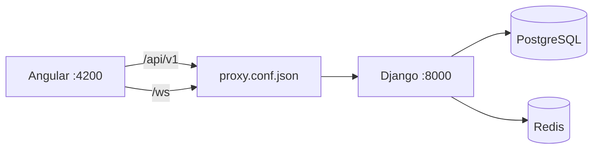

# ۱۱ — یادداشت‌های پیاده‌سازی Backend

> Backend روی همان قرارداد `/api/v1` سوار شد که فرانت‌اند از پیش داشت. مرجع رفتار،
> **Mock فرانت‌اند** بود: همان اندپوینت‌ها، همان ماشین حالت و همان الگوریتم محاسبه.
> این سند می‌گوید کجا و چرا از سند طراحی یا از Mock فاصله گرفتیم، و چه چیزی هنوز
> باقی مانده است.

## ۱. چرا Mock مرجع شد

فرانت‌اند زودتر از Backend ساخته شد و برای اینکه بتواند مستقل اجرا شود، یک
Mock کامل از API داشت: `mock-router.ts` قالب خطا را می‌ساخت، `handlers/*` رفتار هر
اندپوینت را و `rpas-scoring.ts` الگوریتم محاسبه را.

این وضعیت یک فرصت بود: به‌جای نوشتن Backend از روی سند و امید به تطابق، Mock به‌عنوان
**مشخصات اجرایی** خوانده شد. نتیجه این شد که هنگام اتصال، **هیچ تغییری در مدل‌ها،
سرویس‌های `core/api/*` یا کامپوننت‌ها لازم نبود**؛ نام و شکل تمام فیلدها یکی بود.

## ۲. پشته و ساختار

| موضوع | انتخاب |
|---|---|
| زمان اجرا | Python 3.13 · Django 6.0 · Django REST Framework 3.18 |
| احراز هویت | SimpleJWT — توکن دسترسی در بدنه، تمدید در کوکی `HttpOnly` با چرخش و ابطال |
| داده | PostgreSQL با ستون‌های JSON — تست‌ها روی SQLite هم اجرا می‌شوند |
| Cache / صف / بلادرنگ | Redis · Celery · Django Channels روی ASGI |
| ذخیره‌سازی | سیستم‌فایل در توسعه · S3-compatible در production |
| کیفیت | ۱۵۷ تست pytest · ruff بدون خطا |

ساختار کامل در [[06-development-guide]] §۳. لایه‌بندی `View → Serializer → Service →
Model` با selector برای خواندن؛ کل ماشین حالت آزمون در `apps/assessments/services.py`
است، نه در view.

## ۳. آنچه پیاده شده است

| Sprint | وضعیت |
|---|---|
| ۱ Foundation | ✅ Django · Docker · PostgreSQL · Redis · تنظیمات چهار‌محیطی — ⛔ NGINX و CI |
| ۲ Identity | ✅ ثبت‌نام، ورود، تمدید، خروج، پروفایل، مدارک تأیید |
| ۳ Relationships | ✅ جست‌وجو، درخواست، تأیید، رد، لغو، پرونده‌ی مراجع |
| ۴ Test Engine | ✅ تعریف/نسخه/مرحله/کارت، نسخه‌بندی، clone و انتشار |
| ۵ Rorschach Flow | ✅ کل جریان R-PAS: شروع، پاسخ، کارت بعد (+ یادآوری)، روشن‌سازی، تکمیل، رویدادها |
| ۶ Psychologist | ✅ پروتکل کامل، کدگذاری، تحلیل — ◐ گزارش نهایی فقط مدل است |
| ۷ Communication | ✅ REST گفت‌وگو/پیام + WebSocket برای پیام، تایپ، خوانده‌شدن، حضور |
| ۸ Admin | ✅ هر ۱۶ مسیر پنل ادمین |
| ۹ Hardening | ◐ محدودسازی نرخ، لاگ سه‌لایه، قیدهای دیتابیس، ۱۵۷ تست — ⛔ NGINX، مانیتورینگ، پشتیبان |

مسیر بحرانی به‌صورت end-to-end و فقط از راه HTTP تست می‌شود:
`apps/assessments/tests/test_critical_path.py`.

## ۴. انحراف‌ها از سند طراحی و از Mock

هر مورد: **چه تغییری**، **چرا**، **اثر روی فرانت‌اند**.

### D-01 — نام اپ از `tests` به `catalog`

سند طراحی اولیه این اپ را `tests` می‌نامید. یک پکیج پایتون به نام `tests` داخل
`apps/` با کشف خودکار تست‌ها تداخل می‌کند (هم `manage.py test` و هم pytest).

**فرانت‌اند:** بدون اثر — اندپوینت همچنان `/api/v1/tests/` است.

### D-02 — جدول `assessment_measurements` ساخته نشد

ERD طراحی اولیه یک موجودیت جدا برای اندازه‌گیری داشت. اندازه‌گیری‌های R-PAS
(`reaction_time_ms`، `card_turns`، `final_rotation`) سه فیلد ثابت‌اند و قرارداد
فرانت‌اند هم آن‌ها را به‌صورت یک شیء روی خود پاسخ مدل می‌کند. طبق قاعده‌ی
«داده‌ی پویا ← JSON»، در `assessment_responses.measurement_data` نشستند.

**فرانت‌اند:** بدون اثر.

### D-03 — جدول `user_sessions` ساخته نشد

مدیریت نشست به `rest_framework_simplejwt.token_blacklist` سپرده شد؛ توکن تمدید با هر
بار استفاده می‌چرخد و توکن قبلی در لیست سیاه می‌رود.

**فرانت‌اند:** بدون اثر.

### D-04 — `Notification` پیاده نشد

طراحی داده این موجودیت را داشت، اما محصول اعلان شخصی را حذف کرده است. فقط
`SiteAnnouncement` وجود دارد.

**فرانت‌اند:** بدون اثر (قبلاً حذف شده بود).

### D-05 — `last_login_at` ستون جدا ندارد

همان `last_login` داخلی Django است که با نام قراردادی سریالایز می‌شود.

**فرانت‌اند:** بدون اثر.

### D-06 — تحلیل به‌صورت غیرهمزمان ساخته می‌شود

Mock در لحظه‌ی `complete` تحلیل را همان‌جا محاسبه می‌کرد. طبق BR-09، تکمیل آزمون
نباید منتظر کار پس از commit بماند: حالا در همان تراکنش یک `AssessmentAnalysis` با
وضعیت `PENDING` ساخته می‌شود و محاسبه با Celery **پس از commit** انجام می‌گیرد.

برای اینکه هرگز تحلیلی در `PENDING` گیر نکند (مثلاً وقتی کارگر خاموش است)،
`GET …/detail/` اگر آزمون تکمیل‌شده باشد و تحلیل `DONE` نباشد، همان‌جا محاسبه می‌کند.

**فرانت‌اند:** عملاً بدون اثر، اما قرارداد را رعایت کنید — `analysis` ممکن است
`{status: 'PENDING', calculated_data: null}` باشد. صفحه‌ی مرور جلسه با
`@if (result(); as res)` محافظت شده؛ بهتر است در حالت `PENDING` پیام «در حال محاسبه»
نشان داده شود.

### D-07 — محدودیت بارگذاری مدارک

Mock هیچ محدودیتی نداشت. Backend: حداکثر **۱۰ فایل**، هر کدام حداکثر **۱۰ مگابایت**،
فقط `PDF` / `JPEG` / `PNG` / `WebP`. تخطی → `400` با پیام فارسی.

**وضعیت فرانت‌اند:** ◐ نیمه‌انجام — فیلتر `accept=".pdf,image/*"` روی ورودی فایل هست،
اما بررسی حجم پیش از ارسال و متن راهنما نیست. کاربر پس از بارگذاری یک فایل بزرگ
خطا می‌گیرد.

### D-08 — محدودسازی نرخ

در Mock نبود. Backend: گروه `auth` (ورود/ثبت‌نام/تمدید) **۲۰ درخواست در دقیقه** و گروه
`write` **۱۲۰ در دقیقه**. پاسخ `429` با بدنه‌ی استاندارد خطا. اگر Redis در دسترس
نباشد، محدودکننده **باز** می‌شود و رویداد در لاگ امنیتی ثبت می‌گردد.

**وضعیت فرانت‌اند:** ✅ انجام شد — `assessment-run.store.ts` تلاش مجدد را با فاصله‌ی
پلکانی (۸۰۰ میلی‌ثانیه × شماره‌ی تلاش، حداکثر ۳ بار) و فقط برای خطای شبکه یا ۵xx
انجام می‌دهد.

### D-09 — اعتبارسنجی سخت‌گیرانه‌تر رمز عبور

Mock فقط طول ≥ ۸ را بررسی می‌کرد. Backend علاوه بر آن اعتبارسنج‌های Django را اجرا
می‌کند: رمزهای پرتکرار، کاملاً عددی و شبیه به ایمیل رد می‌شوند.

**وضعیت فرانت‌اند:** ⛔ انجام نشده — متن راهنمای زیر فیلد رمز هنوز فقط
«حداقل ۸ کاراکتر» است. خطاها از قبل روی همان فیلد می‌نشینند، فقط متن راهنما ناقص است.

### D-10 — `image_url` کارت‌ها نسبی می‌ماند

اگر تصویر کارت از `MediaAsset` بیاید، آدرس **مطلق** برگردانده می‌شود. اما در توسعه
تصاویر را خود اپ Angular سرو می‌کند (`public/images/test/N.jpg`) و آدرس باید **نسبی**
بماند تا مرورگر آن را نسبت به دامنه‌ی فرانت‌اند حل کند؛ مطلق کردنش به دامنه‌ی Django
اشاره می‌کرد و ۴۰۴ می‌داد.

**فرانت‌اند:** بدون اثر — فقط فایل‌های `public/images/test/1..10.jpg` باید سر جایشان
بمانند.

### D-11 — پیام خطای ۴۰۱ همیشه عمومی است

پیام‌های داخلی SimpleJWT انگلیسی‌اند و برای کاربر معنایی ندارند؛ هر ۴۰۱ با
`detail: "احراز هویت لازم است."` برمی‌گردد. خطاهای صریح خودمان (مثل «ایمیل یا رمز
عبور اشتباه است.») دست‌نخورده می‌مانند.

**فرانت‌اند:** بدون اثر — interceptor روی ۴۰۱ ساختاری عمل می‌کند.

### D-12 — `pause` و `resume` پیاده نشدند

طبق [[10-assessment-rpas]] §۱ آزمون توقف ندارد. اگر جلسه‌ای به هر دلیل در `PAUSED`
باشد، نخستین درخواست مراجع آن را به `IN_PROGRESS` برمی‌گرداند. حالت `PAUSED` فقط
برای سازگاری قرارداد در مدل مانده است.

**فرانت‌اند:** بدون اثر — `AssessmentsApi` این دو را صدا نمی‌زند.

### D-13 — تأیید روان‌شناس در سطح اندپوینت اجباری نیست ⚠️

کلاس `IsApprovedPsychologist` در `common/permissions.py` تعریف شده اما **در هیچ
view‌ای استفاده نمی‌شود**. اجرای BR-01 در عمل از سه راه دیگر انجام می‌شود:

- روان‌شناس تأییدنشده در فهرست عمومی (`GET /psychologists/`) دیده نمی‌شود.
- درخواست ارتباط با روان‌شناس تأییدنشده `400` می‌گیرد.
- نگهبان `approvedPsychologistGuard` در فرانت‌اند مسیر `/psychologist/**` را می‌بندد.

**اثر باقی‌مانده:** اگر روان‌شناسی ابتدا `APPROVED` شود، رابطه‌ی فعال بگیرد و سپس
`SUSPENDED` شود، همچنان می‌تواند با یک کلاینت مستقیم (بدون عبور از نگهبان فرانت‌اند)
پرونده‌ی همان مراجعان و پروتکل آزمونشان را بخواند و درخواست‌های در انتظار را تأیید
کند. برای بستن کامل این مسیر باید `IsApprovedPsychologist` روی viewهای بالینی
(`PatientDetailView`، `SessionDetailFullView`، `CodingView`، `ApproveView` و
`RejectView`) اعمال شود.

**وضعیت:** شکاف شناخته‌شده، رفع نشده — نه یک تصمیم طراحی.

## ۵. اتصال فرانت‌اند — انجام شد

فرانت‌اند روی Backend واقعی اجرا و در مرورگر تأیید شد. فقط سه تغییر لازم بود:

1. **پروکسی** — افزودن `Rorschach/proxy.conf.json` و اتصالش به `angular.json`؛
   `/api` و `/ws` به `http://127.0.0.1:8000` می‌روند (با `ws: true`).
2. **`useMock: false`** در `src/environments/environment.development.ts` — همان فایلی
   که ساخت توسعه جایگزین می‌کند، نه `environment.ts`.
3. **`useMock` واقعاً پرچم mock نبود** — `mock-backend.interceptor.ts` هر درخواست
   منطبق با `apiBaseUrl` را بی‌قیدوشرط پاسخ می‌داد و فقط در ساخت production با
   `fileReplacements` حذف می‌شد؛ یعنی `false` کردن پرچم هیچ اثری نداشت. یک سطر به
   ابتدای interceptor اضافه شد:

   ```ts
   if (!environment.useMock) return next(req);
   ```

هیچ تغییر دیگری در مدل‌ها، سرویس‌های `core/api/*` یا کامپوننت‌ها لازم نبود.



### آنچه در مرورگر تأیید شد

| مسیر | نتیجه |
|---|---|
| ورود و بازیابی نشست | `login` → `{access, me}` + کوکی تمدید؛ در بوت‌استرپ بدون کوکی پاسخ `401` می‌گیرد (نه ۵۰۰) |
| داشبورد مراجع و روان‌شناس | شمارنده‌ها از داده‌ی واقعی: ۲ مراجع فعال، ۱ درخواست، ۱ آزمون تکمیل‌شده |
| فهرست روان‌شناسان | ۴ روان‌شناس تأییدشده با `relationship_status` درست |
| اجرای آزمون | تصویر کارت نمایش داده شد (تأیید D-10)؛ ثبت پاسخ؛ و **قاعده‌ی یادآوری**: با یک پاسخ پیش نرفت و متن یادآوری آمد — در دیتابیس هم `prompts=1` و `prompted_cards=[1]` ثبت شد |
| جزئیات آزمون | جدول کامل متغیرها در هر پنج حوزه با اعداد درست (`WSumC=۴٫۵`، `MC=۶٫۵`، `PPD=۶`، `MC−PPD=۰٫۵`) |
| تفسیر غیرقطعی | نسخه‌ی الگوریتم، دکمه‌ی محاسبه‌ی مجدد و هر دو هشدار اجباری BR-18 |
| چت و WebSocket | سوکت روی `/ws/` وصل و پایدار ماند؛ پیام REST مراجع بلادرنگ به‌صورت `message.new` به سوکت روان‌شناس رسید |

## ۶. تصمیم‌های امنیتی

- **مجوز سطح شیء** در `apps/assessments/permissions.py`: هیچ اندپوینتی با
  «کاربر وارد شده است» تنها پاسخ نمی‌دهد. تابع `readable_session` بررسی می‌کند کاربر
  مالک است، روان‌شناسِ دارای رابطه‌ی `ACTIVE` است، یا ادمین.
- **BR-12 در برابر BR-13**: با لغو رابطه، دسترسی جاری روان‌شناس بسته می‌شود ولی جلسه
  حذف یا بی‌صاحب نمی‌شود؛ سه‌گانه‌ی مراجع/روان‌شناس/رابطه روی جلسه ثابت مانده و
  کلیدهای خارجی `PROTECT` هستند.
- **ممیزی**: رویدادهای حساس با IP و User-Agent ثبت می‌شوند. سه logger جدا:
  `rorschach.app`، `rorschach.audit`، `rorschach.security`.
- **قیدهای دیتابیس**: یکتایی ایمیل (حساس‌نبودن به حروف)، یکتایی زوج رابطه، یکتایی
  `(assessment, client_response_id)` برای idempotency و `(assessment, sequence)` برای
  ترتیب پروتکل.
- **پاک‌سازی به‌جای رد کردن**: کدگذاری ناشناخته دور ریخته می‌شود تا نسخه‌ی جلوتر
  فرانت‌اند هرگز ۴۰۰ نگیرد.

## ۷. تصمیم‌های Docker

خلاصه (شرح کامل در [[07-deployment-operations]] §۲):

| تصمیم | چرا |
|---|---|
| بدون `apt-get` | همه‌ی وابستگی‌ها چرخ manylinux دارند؛ نصب gcc کندترین و شکننده‌ترین مرحله بود |
| healthcheck با `python -c urllib.request` | تا ایمیج به `curl` یا `wget` نیاز نداشته باشد |
| `PIP_INDEX_URL` به‌صورت build arg | برای میزبان‌هایی که pypi.org در دسترس نیست |
| اجرای غیر-root | در هر دو مرحله‌ی ساخت |
| `RUN_MIGRATIONS=false` روی کارگر | مسابقه‌ی دو کانتینر روی `migrate` راه واقعی قفل‌شدن است |
| `init: true` | تا سیگنال‌ها درست برسند و پروسه‌ی zombie نماند |
| Daphne به‌جای `runserver` | چت WebSocket به ASGI نیاز دارد |
| entrypoint در `/usr/local/bin` + نرمال‌سازی CRLF | bind mount مسیر `/app` را می‌پوشاند و چک‌اوت ویندوزی CRLF می‌دهد |
| فرانت‌اند بیرون از Docker | پایش فایل روی bind mount در ویندوز کند است |

مسیر `/health/` عمداً بیرون از `/api/v1/` است: زیرساخت است نه بخشی از قرارداد، و
چون پروسه‌ای که به PostgreSQL نمی‌رسد سالم نیست، دیتابیس را هم بررسی می‌کند.

## ۸. کارهای باقی‌مانده

| مورد | توضیح |
|---|---|
| **اعمال `IsApprovedPsychologist`** | D-13 — تنها شکاف امنیتی شناخته‌شده |
| NGINX و ترکیب production | پروکسی معکوس، سرو استاتیک Angular، TLS |
| CI | فعلاً لازم نبوده؛ `pytest` و `ruff` محلی سبزند |
| تست خودکار WebSocket | مصرف‌کننده پیاده و **دستی در مرورگر تأیید شده**، اما تست خودکار ندارد (نیازمند `pytest-asyncio` و `ChannelsLiveServer`) |
| تولیدکننده‌ی `AssessmentReport` | مدل هست، تولیدکننده ندارد — تا تعیین قالب گزارش، `report` همیشه `null` است |
| بارگذاری آواتار | در قرارداد اندپوینت ندارد؛ فقط مدارک تأیید بارگذاری می‌شوند |
| وزن‌ها و آستانه‌های R-PAS | [[10-assessment-rpas]] §۸ — باید با دستورالعمل رسمی تطبیق داده شود |
| ایندکس JSON | تا مشخص شدن الگوی کوئری زده نشده |
| مانیتورینگ و پشتیبان‌گیری | [[07-deployment-operations]] §۹ و §۱۰ |
| کارهای فرانت‌اند D-07 و D-09 | محدودیت بارگذاری و متن راهنمای رمز |
| رابط کاربری تشخیص واژه‌های محتوا | اندپوینت و خط فرمان آماده‌اند؛ پنل کدگذاری هنوز آن را مصرف نمی‌کند ([[14-ai-content-words]] §۱۱) |
