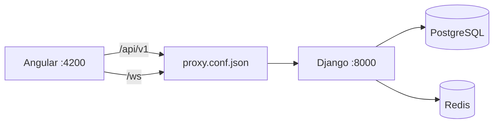

# ۱۱ — پیاده‌سازی Backend

> Backend روی همان قرارداد `/api/v1` فاز ۱ سوار شده است. مرجع رفتار، Mock فرانت‌اند بود ([[10-assessment-rpas]]): همان endpointها، همان state machine و همان الگوریتم محاسبه. هر جا از Mock فاصله گرفته‌ایم در بخش ۴ با دلیل آمده و کار لازم در فرانت‌اند مشخص شده است.

## ۱. پشته و ساختار

| موضوع | انتخاب |
|---|---|
| Runtime | Python 3.13+ · Django 6.0 · Django REST Framework 3.18 |
| Auth | SimpleJWT — access در بدنه، refresh در کوکی `HttpOnly` با چرخش و blacklist |
| داده | PostgreSQL (JSONB برای داده‌ی پویا) — تست‌ها روی SQLite هم اجرا می‌شوند |
| Cache / Queue / Realtime | Redis · Celery · Django Channels (ASGI) |
| Storage | FileSystem در توسعه · S3-compatible در production |
| کیفیت | pytest (۱۲۸ تست) · ruff |

```
backend/
├── config/settings/{base,development,production,testing}.py · urls · asgi · wsgi · celery
├── apps/
│   ├── accounts/        User، احراز هویت، /users/me/
│   ├── profiles/        پروفایل دو نقش، مدارک، افتخارات، فهرست روان‌شناسان
│   ├── relationships/   ارتباط بیمار ↔ روان‌شناس، /patients/:id/
│   ├── catalog/         TestDefinition → TestVersion → TestPhase → AssessmentCard
│   ├── assessments/     موتور آزمون + rpas/{codes,scoring}
│   ├── messaging/       گفت‌وگو، پیام، WebSocket
│   ├── notifications/   اطلاعیه‌ی سایت
│   ├── media/           MediaAsset
│   ├── audit/           AuditLog + middleware
│   └── administration/  پنل ادمین
└── common/              exceptions · pagination · permissions · throttling · models
```

لایه‌بندی طبق [[06-development-guide]]: `View → Serializer → Service → Model` و `Selector` برای queryهای خواندنی. منطق آزمون کامل در `apps/assessments/services.py` است، نه در view.

## ۲. اجرا

```bash
# ۱) وابستگی‌ها
cd backend
python -m venv .venv && .venv/Scripts/activate        # لینوکس: source .venv/bin/activate
pip install -r requirements/development.txt
cp .env.example .env

# ۲) دیتابیس و داده‌ی اولیه
python manage.py migrate
python manage.py seed_catalog      # ساختار آزمون رورشاخ (هر محیطی)
python manage.py seed_demo         # حساب‌های آزمایشی (فقط DEBUG)

# ۳) اجرا
python manage.py runserver 8000
```

یا با Docker (شامل PostgreSQL، Redis، Celery):

```bash
docker compose up -d
```

- مستندات تعاملی API: `http://localhost:8000/api/docs/`
- تست‌ها: `python -m pytest` — لینت: `python -m ruff check .`
- حساب‌های `seed_demo` دقیقاً همان‌هایی‌اند که [[08-frontend-phase1]] §۵ می‌گوید (رمز `Test1234`): `patient@test.com` · `psych@test.com` · `pending@test.com` · `admin@test.com`

> `seed_demo` علاوه بر حساب‌ها، یک پروتکل کامل و کدگذاری‌شده (۱۸ پاسخ) و یک آزمون نیمه‌تمام می‌سازد تا صفحات روان‌شناس از همان ابتدا داده داشته باشند.

## ۳. آنچه پیاده شده است

| Sprint ([[06-development-guide]] §۷) | وضعیت |
|---|---|
| 1 — Foundation | ✅ Django · Docker · PostgreSQL · Redis · settings سه‌محیطی — ❌ NGINX و CI |
| 2 — Identity | ✅ ثبت‌نام، ورود، refresh، خروج، پروفایل، مدارک تأیید |
| 3 — Relationships | ✅ جست‌وجو، درخواست، تأیید، رد، لغو، `/patients/:id/` |
| 4 — Test Engine | ✅ TestDefinition/Version/Phase/Card، نسخه‌بندی، clone و publish |
| 5 — Rorschach Flow | ✅ کل جریان R-PAS: start، responses، next (+Pr)، clarifications، complete، events |
| 6 — Psychologist | ✅ detail، کدگذاری، تحلیل — ⏳ `AssessmentReport` فقط مدل است (مثل Mock) |
| 7 — Communication | ✅ REST گفت‌وگو/پیام + WebSocket (`/ws/`) برای پیام، typing، read receipt، presence |
| 8 — Admin | ✅ هر ۱۶ endpoint پنل ادمین |
| 9 — Hardening | ◐ throttle، لاگ سه‌لایه، constraintهای DB، ۱۲۸ تست — ❌ NGINX، CI، monitoring، backup |

مسیر بحرانی [[05-sequence-diagrams]] §۹ به‌صورت end-to-end و فقط از راه HTTP تست می‌شود: `apps/assessments/tests/test_critical_path.py`.

## ۴. انحراف‌ها از سند و Mock

هر مورد: **چه تغییری**، **چرا**، **فرانت‌اند چه کند**.

### D-01 — نام app از `tests` به `catalog`

[[02-architecture]] §۵ و [[06-development-guide]] §۲ این app را `tests` می‌نامند. یک پکیج پایتون به نام `tests` داخل `apps/` با کشف خودکار تست‌ها تداخل می‌کند (هم `manage.py test` و هم pytest).

**فرانت‌اند:** بدون اثر. endpoint همان `/api/v1/tests/` است.

### D-02 — جدول `assessment_measurements` ساخته نشد

ERD سند [[03-data-model-er]] §۱ یک entity جدا برای اندازه‌گیری دارد. اندازه‌گیری‌های R-PAS (`reaction_time_ms`، `card_turns`، `final_rotation`) سه فیلد ثابت‌اند و قرارداد فرانت‌اند هم آن‌ها را به‌صورت یک شیء روی خود پاسخ مدل می‌کند (`ResponseMeasurements`). طبق قاعده‌ی §۱۰ همان سند (`داده‌ی پویا → JSONB`) در `assessment_responses.measurement_data` ذخیره می‌شوند.

**فرانت‌اند:** بدون اثر.

### D-03 — جدول `user_sessions` ساخته نشد

مدیریت نشست‌ها به `rest_framework_simplejwt.token_blacklist` سپرده شده (`OutstandingToken` / `BlacklistedToken`)؛ refresh با هر بار استفاده می‌چرخد و توکن قبلی blacklist می‌شود.

**فرانت‌اند:** بدون اثر.

### D-04 — `Notification` پیاده نشد

[[03-data-model-er]] §۸ این entity را دارد، اما [[08-frontend-phase1]] اعلان‌های شخصی را از محصول حذف کرده است. فقط `SiteAnnouncement` وجود دارد.

**فرانت‌اند:** بدون اثر (قبلاً حذف شده).

### D-05 — `last_login_at` ستون جدا ندارد

همان `last_login` داخلی Django است که با نام قراردادی serialize می‌شود.

**فرانت‌اند:** بدون اثر.

### D-06 — تحلیل به‌صورت async ساخته می‌شود

Mock در لحظه‌ی `complete` تحلیل را همان‌جا محاسبه می‌کرد. طبق BR-09 و [[04-api-design]] §۵، تکمیل آزمون نباید منتظر کار پس از commit بماند: اکنون در همان transaction یک `AssessmentAnalysis` با وضعیت `PENDING` ساخته می‌شود و محاسبه با Celery پس از commit انجام می‌گیرد.

برای اینکه هرگز تحلیلی در `PENDING` گیر نکند (ورکر خاموش باشد)، `GET /assessments/sessions/{id}/detail/` اگر آزمون `COMPLETED` است و تحلیل `DONE` نیست، همان‌جا محاسبه می‌کند. محاسبه‌ی متغیرهای خام صرفاً چند ده سطر حساب است و هزینه‌ای ندارد.

**فرانت‌اند:** عملاً بدون اثر، اما قرارداد را رعایت کنید — `analysis` ممکن است `{status: 'PENDING', calculated_data: null}` باشد. صفحه‌ی `session-review.page.ts` از قبل با `@if (result(); as res)` محافظت شده است؛ اگر خواستید، در حالت `PENDING` به‌جای خالی‌بودن یک پیام «در حال محاسبه…» نشان دهید.

### D-07 — محدودیت بارگذاری مدارک

Mock هیچ محدودیتی نداشت. Backend: حداکثر **۱۰ فایل**، هر کدام حداکثر **۱۰ مگابایت**، فقط `PDF` / `JPEG` / `PNG` / `WebP`. تخطی → `400` با پیام فارسی در `detail`.

**فرانت‌اند — کار لازم:** در فرم بارگذاری مدارک (`features/auth`) همین محدودیت‌ها را به‌صورت `accept=".pdf,image/*"` و بررسی `file.size` قبل از ارسال اعمال کنید و متن راهنما را اضافه کنید، وگرنه کاربر تازه بعد از آپلود ۵۰ مگابایت خطا می‌گیرد.

### D-08 — Rate limiting

در Mock نبود. Backend: گروه `auth` (ورود/ثبت‌نام/refresh) **۲۰ درخواست در دقیقه** و گروه `write` (ثبت پاسخ، پیام، کدگذاری و…) **۱۲۰ در دقیقه**. پاسخ `429` با بدنه‌ی استاندارد خطا. اگر Redis در دسترس نباشد، محدودکننده **باز** می‌شود (درخواست رد نمی‌شود) و رویداد در لاگ امنیتی ثبت می‌گردد.

**فرانت‌اند — کار لازم:** مطمئن شوید autosave و ثبت پاسخ همچنان debounced بماند ([[06-development-guide]] §۴ قاعده‌ی ۹). `error.interceptor` پیام `detail` را نمایش می‌دهد، پس نیازی به کد جدید نیست؛ فقط در حلقه‌ی retry فاصله‌ی زمانی بگذارید.

### D-09 — اعتبارسنجی سخت‌گیرانه‌تر رمز عبور

Mock فقط طول ≥ ۸ را بررسی می‌کرد. Backend علاوه بر آن validatorهای Django را اجرا می‌کند: رمزهای پرتکرار، رمزهای کاملاً عددی و رمز شبیه به ایمیل رد می‌شوند.

**فرانت‌اند — کار لازم:** متن راهنمای زیر فیلد رمز در فرم ثبت‌نام را کامل کنید («حداقل ۸ کاراکتر، نه کاملاً عددی و نه رمز پرتکرار»). خطاها از قبل روی همان فیلد می‌نشینند (`errors.password` در `shared/utils/forms.ts`).

### D-10 — `image_url` کارت‌ها نسبی می‌ماند

اگر تصویر کارت از `MediaAsset` (Object Storage) بیاید، آدرس **مطلق** برگردانده می‌شود. اما در توسعه تصاویر از خود اپ Angular سرو می‌شوند (`public/images/test/N.jpg`) و آدرس باید **نسبی** بماند تا مرورگر آن را نسبت به دامنه‌ی فرانت‌اند حل کند؛ مطلق‌کردن آن به دامنه‌ی Django اشاره می‌کرد و ۴۰۴ می‌داد.

**فرانت‌اند:** بدون اثر — فقط `public/images/test/1..10.jpg` باید سر جایش بماند. برای production، تصاویر به Object Storage می‌روند و `seed_catalog` با `image_asset` به آن‌ها وصل می‌شود.

### D-11 — پیام خطای ۴۰۱ همیشه عمومی است

پیام‌های داخلی SimpleJWT (مثلاً «Given token not valid for any token type») انگلیسی‌اند و برای کاربر معنایی ندارند؛ هر ۴۰۱ با `detail: "احراز هویت لازم است."` برمی‌گردد. خطاهای صریح خودمان (مثل «ایمیل یا رمز عبور اشتباه است.») دست‌نخورده می‌مانند.

**فرانت‌اند:** بدون اثر — interceptor روی ۴۰۱ ساختاری عمل می‌کند (refresh و سپس خروج).

### D-12 — `PAUSED` عملاً بی‌اثر است

طبق [[10-assessment-rpas]] §۱ آزمون توقف ندارد. اگر session به هر دلیل در `PAUSED` باشد، اولین درخواست مراجع آن را به `IN_PROGRESS` برمی‌گرداند. `pause` و `resume` سند [[04-api-design]] پیاده **نشده‌اند**.

**فرانت‌اند:** بدون اثر — `AssessmentsApi` این دو را صدا نمی‌زند.

## ۵. کار لازم در فرانت‌اند برای اتصال

۱. **proxy** — فایل `Rorschach/proxy.conf.json` اضافه شد و `angular.json` به آن وصل شد؛ `/api` و `/ws` به `http://127.0.0.1:8000` می‌روند. تا وقتی `useMock: true` است اثری ندارد.

۲. **سوئیچ به backend واقعی** — تنها تغییر باقی‌مانده:

```ts
// src/environments/environment.ts
export const environment = {
  production: false,
  apiBaseUrl: '/api/v1',
  wsBaseUrl: '/ws',
  useMock: false,   // ← از true به false
};
```

۳. سه مورد محتوایی که در بخش ۴ علامت **کار لازم** خورده‌اند: محدودیت‌های بارگذاری مدارک (D-07)، فاصله‌ی retry (D-08) و متن راهنمای رمز عبور (D-09).

هیچ تغییر دیگری در مدل‌ها، سرویس‌های `core/api/*` یا کامپوننت‌ها لازم نیست؛ نام و شکل تمام فیلدها با `core/models/*` یکی است.



## ۶. تصمیم‌های امنیتی

- **object-level permission** در `apps/assessments/permissions.py`: هیچ endpointای با `is_authenticated` تنها پاسخ نمی‌دهد. `readable_session` بررسی می‌کند کاربر مالک است، روان‌شناسِ دارای رابطه‌ی `ACTIVE` است، یا ادمین (BR-02، [[02-architecture]] §۸).
- **BR-12 در برابر BR-13**: با `REVOKED` شدن رابطه، دسترسی جاری روان‌شناس بسته می‌شود ولی session حذف یا بی‌صاحب نمی‌شود؛ سه‌گانه‌ی patient/psychologist/relationship روی session ثابت مانده است.
- **Audit**: رویدادهای حساس در `audit_logs` با IP و user-agent ثبت می‌شوند. سه لاگر جدا: `rorschach.app`، `rorschach.audit`، `rorschach.security`.
- **Constraintهای دیتابیس**: یکتایی ایمیل (case-insensitive)، یکتایی `(patient, psychologist)`، یکتایی `(assessment, client_response_id)` برای idempotency و `(assessment, sequence)` برای ترتیب پروتکل.

## ۷. کارهای باقی‌مانده

| مورد | توضیح |
|---|---|
| NGINX و compose تولیدی | reverse proxy، سرو استاتیک Angular، TLS |
| CI | lint + تست backend و frontend روی هر push ([[07-deployment-operations]] §۴) |
| تست WebSocket | consumer پیاده است اما تست خودکار ندارد (نیازمند `pytest-asyncio` و `ChannelsLiveServer`) |
| `AssessmentReport` | مدل هست، تولیدکننده ندارد — دقیقاً مثل Mock. تا وقتی قالب گزارش تعیین نشده، `report` همیشه `null` است |
| بارگذاری avatar | در قرارداد فاز ۱ endpoint ندارد |
| وزن‌ها و آستانه‌های R-PAS | همان مورد باز [[10-assessment-rpas]] §۸ — باید با دستورالعمل رسمی تطبیق داده شود |
| ایندکس JSONB | طبق [[03-data-model-er]] §۱۲ تا مشخص‌شدن query pattern زده نشده است |
