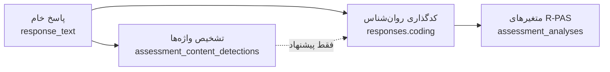
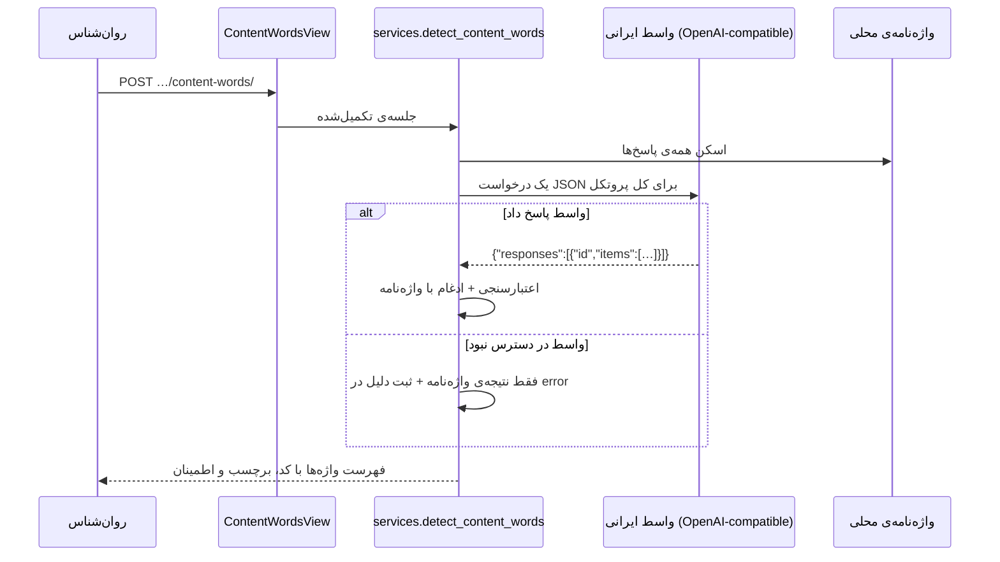

# ۱۴ — تشخیص واژه‌های محتوا با هوش مصنوعی

> این قابلیت **کدگذاری نمی‌کند**. فقط در متن پاسخ‌های دور اول، کلمه‌هایی را نشان می‌دهد
> که یک محتوای مستندشده‌ی R-PAS را می‌رسانند تا روان‌شناس سریع‌تر به آن‌ها برسد.
> تصمیم نهایی، مثل همیشه، با روان‌شناس است ([[10-assessment-rpas]] §۵).

## ۱. مسئله

در **دور اول** (مرحله‌ی پاسخ‌دهی) مراجع برای هر کارت می‌نویسد چه چیزی می‌بیند:
«یه خفاش سیاه با بال‌های باز». کدگذار بعداً باید از همین متن تشخیص دهد که چه
محتواهایی نام برده شده‌اند — `A` برای خفاش، `Ad` برای بال — و آن‌ها را در فیلد
`coding.content` بگذارد ([[09-rorschach-analysis]] §۶).

این کار برای یک پروتکل ۲۰ تا ۳۰ پاسخی، تکراری و خسته‌کننده است. آنچه اینجا پیاده
شده، همین قدم را خودکار می‌کند: خواندن متن خام و علامت‌گذاری واژه‌های محتوا،
همراه با کد پیشنهادی و میزان اطمینان.

## ۲. جایگاه در لایه‌بندی

سامانه سه لایه را عمداً از هم جدا نگه می‌دارد: **داده‌ی خام → اندازه‌گیری →
کدگذاری**. این قابلیت لایه‌ی چهارمی است که روی هیچ‌کدام نمی‌نویسد:



نتیجه در جدول خودش ذخیره می‌شود، دقیقاً به همان دلیلی که `clarification` کنار پاسخ
می‌نشیند و نه رویش (BR-06): چیزی که مشورتی است هرگز نباید با چیزی که بالینی است
اشتباه گرفته شود.

## ۳. جریان کار



**یک درخواست برای کل پروتکل**، نه یکی به‌ازای هر پاسخ: هزینه و تأخیر را به یک تماس
کاهش می‌دهد و مدل کل دور اول را یک‌جا می‌بیند.

## ۴. واسط ایرانی و پیکربندی

مدل از طریق یک **واسط ایرانی سازگار با OpenAI** فراخوانی می‌شود — پیش‌فرض
[AvalAI](https://api.avalai.ir) با همان الگویی که در پروژه‌ی MediCase استفاده شده
است. هر واسط دیگری که همین قرارداد (`POST /chat/completions`) را بدهد، فقط با
عوض‌کردن `AI_BASE_URL` کار می‌کند.

| متغیر محیطی | پیش‌فرض | توضیح |
|---|---|---|
| `AI_ENABLED` | `True` | کلید قطع سراسری |
| `AI_BASE_URL` | `https://api.avalai.ir/v1` | ریشه‌ی واسط |
| `AI_API_KEY` | خالی | خالی یعنی «پیکربندی‌نشده» → فقط واژه‌نامه |
| `AI_MODEL` | `gpt-4o-mini` | نام مدل نزد همان واسط |
| `AI_TIMEOUT_SECONDS` | `20` | مهلت یک تماس |

کلید فقط از محیط خوانده می‌شود، هرگز در مخزن نمی‌آید، در لاگ نوشته نمی‌شود و در
هیچ پاسخ API برنمی‌گردد. تماس با کتابخانه‌ی استاندارد پایتون (`urllib`) انجام
می‌شود، پس این قابلیت هیچ وابستگی تازه‌ای به `requirements/base.txt` اضافه نکرده است.

## ۵. واژه‌نامه‌ی محلی

`apps/assessments/ai/lexicon.py` فهرستی از واژه‌های رایج فارسی است که معمولاً هر کدام
به یک کد محتوا اشاره می‌کنند. دو کار می‌کند:

1. **جایگزین**: وقتی واسط خاموش، بی‌کلید یا از کار افتاده است، اندپوینت باز هم جواب
   می‌دهد. هیچ استقراری به یک سرویس بیرونی وابسته نمی‌شود.
2. **کف اطمینان**: واژه‌هایی که واژه‌نامه می‌شناسد به پاسخ مدل **اضافه** می‌شوند، پس
   یک مدل بی‌دقت نمی‌تواند محتوای بدیهی یک پروتکل را بی‌سروصدا از قلم بیندازد.

تطبیق روی شکل یکدست‌شده‌ی متن انجام می‌شود: `ي/ك` عربی، اعراب و نیم‌فاصله حذف
می‌شوند و پسوندهای جمع و نکره (`خفاش‌ها`، `پروانه‌ای`) مانع تطبیق نیستند. عبارت
بلندتر بر واژه‌ی درونش مقدم است (`سر آدم` بر `سر`) و واژه در میان واژه‌ی دیگر تطبیق
نمی‌کند (`سرد` هرگز `سر` خوانده نمی‌شود).

> **این جدول‌های رسمی R-PAS نیستند.** جدول‌های Form Quality و Popular دارای حق نشرند
> و — مثل `rpas/codes.py` — در این مخزن نیامده‌اند. یک تطبیق یعنی «این واژه معمولاً
> این دسته است»، نه «این پاسخ این‌طور کد می‌شود»: `سر` روی انسان `Hd` است و روی حیوان
> `Ad`، و تشخیصش فقط با کدگذار است.

## ۶. قواعدی که مدل را مهار می‌کنند

| قاعده | چرا |
|---|---|
| واژه‌ای که عیناً در متن همان پاسخ نیست، حذف می‌شود | مراجع آن را به تصویر نسبت نداده؛ داده‌ی بالینی جای توهم مدل نیست |
| کدی خارج از ۱۸ کد محتوای R-PAS حذف می‌شود | کد نامعتبر از کد نبودن بدتر است |
| شناسه‌ی پاسخی که فرستاده نشده، نادیده گرفته می‌شود | نتیجه باید به یک پاسخ واقعی بچسبد |
| حداکثر ۱۲ واژه برای هر پاسخ | فهرست باید خوانده شود، نه اسکرول |
| `temperature = 0` | همان متن، همان پیشنهاد |
| هیچ نوشتنی روی `coding` | لایه‌ی مشورتی، مشورتی می‌ماند |

## ۷. API

| متد | مسیر | دسترسی | شرح |
|---|---|---|---|
| POST | `…/{id}/content-words/` | روان‌شناس مرتبط یا ادمین | اجرای تشخیص و ذخیره‌ی نتیجه |
| GET | `…/{id}/content-words/` | روان‌شناس مرتبط یا ادمین | خواندن نتیجه‌ی ذخیره‌شده |

بدنه‌ی `POST` اختیاری است: `{"refresh": true}` اجرای دوباره را اجبار می‌کند. بدون
آن، نتیجه‌ی `DONE` دوباره برگردانده می‌شود و تماس تازه‌ای هزینه نمی‌شود. `GET` هرگز
تشخیص را اجرا نمی‌کند، پس بازکردن صفحه‌ی کدگذاری خرجی ندارد.

پیش از تکمیل آزمون → `409` (همان قاعده‌ی کدگذاری). `GET` پیش از نخستین اجرا → `404`.
مراجع → `403` (BR-14).

```json
{
  "id": "…",
  "assessment_id": "…",
  "status": "DONE",
  "source": "AI",
  "model_name": "gpt-4o-mini",
  "items": [
    { "response_id": "…", "sequence": 1, "card_number": 1,
      "text": "خفاش", "content": "A", "label": "حیوان کامل",
      "confidence": 0.95, "source": "AI" },
    { "response_id": "…", "sequence": 1, "card_number": 1,
      "text": "بال", "content": "Ad", "label": "جزء حیوانی",
      "confidence": 0.7, "source": "LEXICON" }
  ],
  "responses": [
    { "response_id": "…", "sequence": 1, "card_number": 1,
      "response_text": "یه خفاش سیاه که بال‌هاش بازه",
      "contents": ["A", "Ad"],
      "primary_content": "A", "primary_label": "حیوان کامل",
      "words": [ … ] }
  ],
  "summary": { "A": 4, "H": 2, "Ad": 1 },
  "error": "",
  "generated_at": "…"
}
```

سه خوانش از یک اجرا: `items` فهرست تخت واژه‌ها، **`responses` همان واژه‌ها روی پاسخی که
از آن آمده‌اند** — یعنی «این پاسخ در کدام دسته می‌افتد» — و `summary` شمارش هر کد در کل
پروتکل. پاسخی که هیچ واژه‌ی شناخته‌شده‌ای ندارد هم در `responses` می‌آید، با `contents`
خالی و `primary_content` برابر `null`: سطر ناخوانده‌ای که کدگذار باید ببیند، بهتر از سطر
غایب است، و گذاشتن `NC` روی آن دیگر پیشنهاد نیست، کدگذاری است.

`source` در سطح نتیجه می‌گوید چه چیزی جواب داده (`AI` یا `LEXICON`) و در سطح هر
واژه می‌گوید آن واژه از کجا آمده. `error` وقتی پر است که واسط در دسترس نبوده —
با آن می‌توان «چیزی پیدا نشد» را از «سرویس خراب بود» تشخیص داد.

## ۸. مدل داده

جدول `assessment_content_detections` — یک سطر برای هر پروتکل، مثل
`assessment_analyses`:

| ستون | نوع | توضیح |
|---|---|---|
| `id` | uuid | کلید اصلی |
| `assessment_id` | uuid | یک‌به‌یک با `assessment_sessions` · `CASCADE` |
| `status` | varchar(16) | `PENDING` \| `PROCESSING` \| `DONE` \| `FAILED` |
| `source` | varchar(16) | `AI` \| `LEXICON` |
| `model_name` | varchar(64) | مدلی که پاسخ داد؛ برای واژه‌نامه خالی |
| `items` | jsonb | فهرست تخت واژه‌های تشخیص‌داده‌شده |
| `error` | text | دلیل در دسترس نبودن واسط |
| `generated_at` | timestamptz | زمان آخرین اجرا |

## ۹. اجرا از خط فرمان

```bash
python manage.py detect_content_words --text "یه خفاش سیاه با بال‌های باز"
python manage.py detect_content_words --session <uuid> [--refresh]
```

`--text` بدون دیتابیس و بدون ذخیره‌سازی کار می‌کند و دقیقاً همان مسیر اندپوینت را
می‌پیماید؛ سریع‌ترین راه برای اطمینان از اینکه کلید و واسط درست کار می‌کنند.

## ۱۰. تست

۲۰ تست در `apps/assessments/tests/test_content_words.py`. هیچ‌کدام به شبکه نمی‌روند:
واسط با `monkeypatch` جایگزین می‌شود و در `config/settings/testing.py` خاموش است.

| موضوع | آنچه تضمین می‌شود |
|---|---|
| واژه‌نامه | پسوند فارسی، تقدم عبارت بلندتر، عدم تطبیق درون‌واژه‌ای |
| اندپوینت | ذخیره‌ی نتیجه، اتصال هر واژه به پاسخش، ثبت در ممیزی |
| دسترسی | `403` برای مراجع، `409` پیش از تکمیل، `404` پیش از اجرا |
| مهار مدل | حذف واژه‌ی ساختگی و کد نامعتبر، ادغام با واژه‌نامه |
| تاب‌آوری | خرابی واسط → سقوط به واژه‌نامه، نه خطا |
| هزینه | نتیجه‌ی `DONE` دوباره اجرا نمی‌شود مگر با `refresh` |
| دسته‌بندی هر پاسخ | رول‌آپ `responses`، انتخاب دسته‌ی اصلی، و اینکه پاسخ ناشناخته حدس زده نمی‌شود |
| ترابری | شکل واقعی درخواست (URL، سرآیند، بدنه، مهلت)، پذیرش JSON داخل ```، تبدیل هر خرابی به `GatewayError` |

## ۱۱. محدودیت‌ها و کارهای باقی‌مانده

| # | موضوع | وضعیت |
|---|---|---|
| ۱ | رابط کاربری برای نمایش پیشنهادها کنار پنل کدگذاری | ⛔ — فرانت‌اند این اندپوینت را هنوز مصرف نمی‌کند |
| ۲ | تشخیص determinant و محل (نه فقط محتوا) | ⛔ — عمداً خارج از دامنه‌ی این قدم |
| ۳ | اجرای خودکار پس از تکمیل آزمون | ⛔ — عمدی: تماس بیرونی فقط با درخواست صریح روان‌شناس |
| ۴ | گسترش واژه‌نامه با واژه‌های واقعی پروتکل‌های فارسی | ◐ — فهرست فعلی نقطه‌ی شروع است |
| ۵ | محدودسازی هزینه در سطح سازمان (سقف تماس) | ⛔ — فعلاً فقط throttle عمومی `write` |
