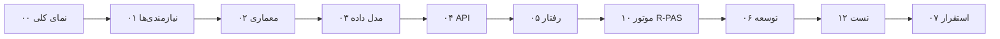

# مستندات سامانه‌ی رورشاخ

این پوشه، مستند مهندسی پروژه است: از نیازمندی‌ها تا معماری، مدل داده، قرارداد API،
رفتار زمان اجرا، استقرار و تست. **همه‌ی اسناد با کد پیاده‌سازی‌شده تطبیق داده شده‌اند**
و هر ادعایی در آن‌ها به یک فایل مشخص در مخزن ارجاع دارد.

> وضعیت اسناد: `as-built` — یعنی سند آنچه را که **ساخته شده** توصیف می‌کند، نه آنچه را که
> قرار بود ساخته شود. هر جا چیزی هنوز پیاده نشده، صریحاً با نشانه‌ی ⛔ یا در بخش
> «کارهای باقی‌مانده» آمده است.

## ترتیب مطالعه



برای **ارائه‌ی پروژه** کوتاه‌ترین مسیر این است: ۰۰ → ۰۲ → ۰۳ → ۱۰ → ۱۳.

## فهرست اسناد

| # | سند | موضوع |
|---|---|---|
| ۰۰ | [[00-overview]] | صورت مسئله، تصمیم‌های کلان، وضعیت واقعی پروژه در یک نگاه |
| ۰۱ | [[01-requirements]] | Actorها، Use Caseها، قواعد کسب‌وکار (BR)، نیازمندی‌های کارکردی (FR) و غیرکارکردی (NFR) |
| ۰۲ | [[02-architecture]] | معماری سیستم، لایه‌بندی، ماشین حالت، امنیت، تصمیم‌های معماری |
| ۰۳ | [[03-data-model-er]] | ERD واقعی + schema کامل هر ۲۱ جدول (ستون، نوع، constraint، index) |
| ۰۴ | [[04-api-design]] | مرجع کامل API: هر ۵۰ مسیر، دسترسی، بدنه‌ی درخواست و پاسخ، کدهای خطا |
| ۰۵ | [[05-sequence-diagrams]] | دیاگرام‌های توالی و ماشین‌های حالت، مطابق کد |
| ۰۶ | [[06-development-guide]] | ساختار کد، قواعد پیاده‌سازی، دستورها، محیط توسعه |
| ۰۷ | [[07-deployment-operations]] | Docker، پیکربندی محیط، لاگ، عملیات، آنچه برای production کم است |
| ۰۸ | [[08-frontend]] | معماری Angular، مسیرها، لایه‌ی API، Mock، طراحی رابط کاربری |
| ۰۹ | [[09-rorschach-analysis]] | مبانی نظری آزمون رورشاخ و سیستم‌های کدگذاری (سند دامنه) |
| ۱۰ | [[10-assessment-rpas]] | موتور اجرای آزمون به روش R-PAS: قواعد، مراحل، متغیرها، تفسیر |
| ۱۱ | [[11-backend-notes]] | یادداشت‌های پیاده‌سازی Backend و انحراف‌های آگاهانه از سند طراحی |
| ۱۲ | [[12-testing-and-quality]] | راهبرد تست، ۱۵۴ تست و نگاشت آن‌ها به نیازمندی‌ها، کیفیت کد |
| ۱۳ | [[13-traceability]] | ماتریس ردیابی: نیازمندی ← کد ← تست |
| ۱۴ | [[14-ai-content-words]] | تشخیص واژه‌های محتوای دور اول با هوش مصنوعی (واسط ایرانی) |

## قراردادهای سند

| نشانه | معنی |
|---|---|
| `BR-xx` | قاعده‌ی کسب‌وکار ([[01-requirements]] §۳) |
| `FR-xx` / `NFR-xx` | نیازمندی کارکردی / غیرکارکردی ([[01-requirements]] §۹ و §۱۰) |
| `D-xx` | انحراف آگاهانه از سند طراحی ([[11-backend-notes]] §۴) |
| ✅ | پیاده‌سازی و تست شده |
| ◐ | بخشی پیاده شده (جزئیات در همان سطر) |
| ⛔ | پیاده نشده — تصمیم یا کار باقی‌مانده |
| `[[...]]` | پیوند داخلی بین اسناد (سازگار با Obsidian) |

مسیرهای کد به‌صورت نسبت به ریشه‌ی مخزن نوشته می‌شوند، مثلاً
`backend/apps/assessments/services.py`.

## ارجاع به نسخه‌ی کد

این نسخه‌ی مستندات با کد مخزن در شاخه‌ی `main` (کامیت `10c22fe`، ۲۳ شهریور ۱۴۰۵) تطبیق
داده شده است. برای بررسی مجدد صحت اعداد گفته‌شده در اسناد:

```bash
cd backend && python -m pytest && python -m ruff check .
```
